# Triagem de Fraude em Transações de Cartão de Crédito

### Projeto de Engenharia e Operacionalização de Machine Learning

| | |
|---|---|
| **Disciplina** | Engenharia de Aprendizado de Máquina |
| **Autor** | Diego Nunes de Morais |
| **Data** | 22 de agosto de 2026 |
| **Trilha** | A — Aprendizado Supervisionado (classificação binária) |
| **Repositório** | `github.com/diegoedataengineer/fraud-triage` |
| **Versão de entrega** | `1.6.0` — `diegodataengineer/fraud-triage:1.6.0` |
| **Versão do artefato** | `1.6.0` — a mesma da imagem (ADR-0029) |

---

## 1. Introdução

Este documento descreve o desenvolvimento de uma solução completa de detecção de fraude
em transações de cartão de crédito, do dado bruto ao serviço em execução. O escopo cobre
ingestão, análise exploratória, preparação, modelagem, validação, calibração,
explicabilidade, empacotamento e monitoramento.

A entrega é um **ecossistema executável**, não um relatório de experimento. Um único
comando reproduz o serviço na máquina de quem avalia:

```bash
docker run -p 8000:8000 diegodataengineer/fraud-triage:1.6.0
```

O número é **o mesmo** em toda parte: no console, no `/health`, no metadata gravado
dentro do artefato e na tag publicada. Isso não era verdade até a release `1.4.1`, e a
razão é instrutiva.

O artefato é carimbado no momento em que é construído, em homologação. O número da release
só é atribuído depois, quando aquele candidato é promovido — e a promoção é um *retag do
mesmo digest*, nunca uma reconstrução. Fazer os números coincidirem **reconstruindo** após
a release produziria um artefato diferente do que foi validado, que é exatamente o que a
regra de promoção existe para impedir (ADR-0019).

A saída foi inverter a ordem: anunciar a versão **antes** de construir, e obrigar a
release a usá-la ([ADR-0029](../docs/adr/0029-versao-unica.md)). O custo é que a versão
passa a ser escolhida em vez de derivada dos tipos de commit — um passo manual a mais,
registrado no procedimento de release.

Vale registrar o que **não** mudou: a garantia de que a imagem promovida é a validada
nunca dependeu dos números baterem. Ela depende do digest e do `git_sha` gravado no
metadata, e é assim que se verifica.

Duas escolhas orientaram todo o trabalho e explicam boa parte dos resultados adiante.

A primeira é **medir o desempenho realizável, não o desempenho aparente**. Fraude é um
fenômeno adversarial e não estacionário: um modelo é sempre treinado no passado e
aplicado ao futuro. Por isso o particionamento é cronológico, e não aleatório. A decisão
custa alguns pontos de métrica e é a razão de este relatório apresentar números menores
que a maior parte da literatura sobre esta base.

A segunda é **tratar a saída do modelo como insumo de uma decisão operacional**, não como
um veredito binário. Nenhuma operação antifraude só bloqueia ou libera: existe uma fila
de revisão manual, ela é o instrumento central da operação, e ela é finita.

Todas as decisões de projeto estão registradas em 23 ADRs (`docs/adr/`), com o contexto,
as alternativas descartadas e o motivo de cada descarte. **Todo número neste relatório
vem de execução real**, gravado em `reports/*.json`, incluindo os desfavoráveis.

---

## 2. Descrição do problema

Detectar transações fraudulentas em tempo de autorização, sob três restrições que
definem o problema:

**Desequilíbrio extremo.** 0,1727% das transações são fraude — uma para cada 577
legítimas. Um classificador que preveja "legítima" para tudo acerta 99,83% e não detecta
nada. Acurácia é métrica inútil aqui.

**Custos assimétricos.** Deixar passar uma fraude custa o valor da transação. Bloquear
uma transação legítima custa atrito com o cliente, atendimento e risco de perdê-lo. São
grandezas diferentes, e tratá-las como iguais — que é o que otimizar F1 faz
implicitamente — é uma premissa econômica errada, apenas não declarada.

**Rótulo atrasado.** O rótulo verdadeiro não existe no momento da decisão. Ele chega
quando o titular contesta a cobrança, dias ou meses depois. Isso torna o recall
inobservável em tempo real e condiciona toda a estratégia de monitoramento (seção 10).

---

## 3. Dataset utilizado

**Credit Card Fraud Detection** (MLG-ULB), transações de cartões europeus em setembro de
2013, obtido do **OpenML** (data id 1597), de licença pública e sem autenticação.

| Característica | Valor |
|---|---|
| Transações | 284.807 |
| Atributos | 31 — `Time`, `V1`–`V28`, `Amount`, `Class` |
| Fraudes | 492 (**0,1727%**) |
| Razão de classes | 1:577 |
| Janela | 48,0 horas contíguas |
| Valores nulos | 0 |
| Duplicatas exatas | 1.081 |
| Perda total por fraude | R$ 60.127,97 |

`V1`–`V28` são componentes principais obtidas por PCA sobre os atributos originais, que
foram anonimizados por confidencialidade. `Time` e `Amount` preservam o significado
original.

### 3.1 Uma armadilha na origem dos dados

A forma usual de carregar esta base em Python é `sklearn.datasets.fetch_openml`. Ela
**descarta silenciosamente a coluna `Time`**: o OpenML a marca como atributo ignorado em
seus metadados, e o scikit-learn respeita a marcação mesmo ao devolver o frame completo.
Não há erro nem aviso — a coluna simplesmente não aparece.

Como todo o particionamento deste projeto depende de `Time`, usar a API padrão
inviabilizaria a decisão metodológica central. A ingestão baixa o **ARFF bruto** e o
interpreta diretamente, recuperando as 31 colunas. A etapa valida a fonte contra dez
critérios antes de liberar o dado adiante, e **falha com erro** se algum divergir — dado
errado que passa em silêncio produz um modelo treinado sobre outra coisa.

### 3.2 Análise exploratória

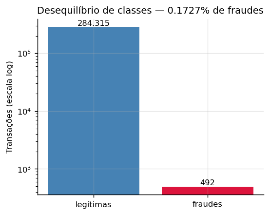

O achado mais contraintuitivo da exploração está nos valores:

| | Mediana | Média |
|---|---|---|
| Fraudes | **R$ 9,25** | R$ 122,21 |
| Legítimas | R$ 22,00 | R$ 88,29 |

**A fraude típica é de valor mais baixo que a transação legítima típica.** A média
inverte a relação porque poucas fraudes de valor alto puxam a distribuição. O padrão é
conhecido na indústria: o fraudador testa o cartão com valores pequenos, que passam
despercebidos, antes de escalar.

Isso tem consequência direta na modelagem: um modelo que aprendesse "fraude é transação
cara" erraria sistematicamente.

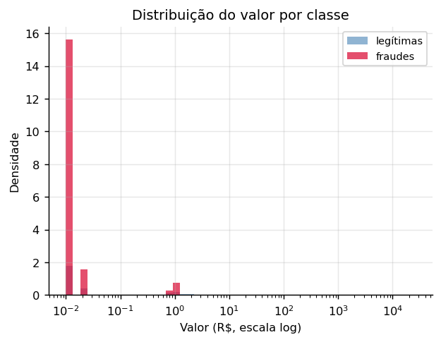
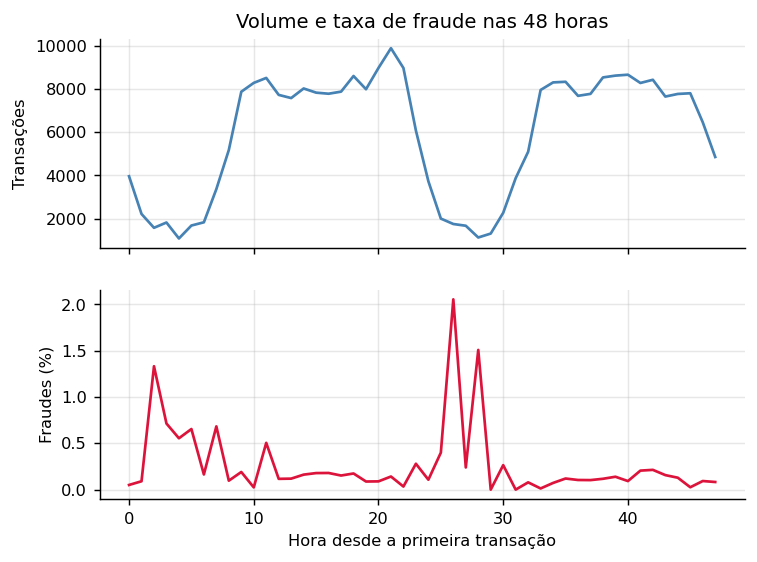
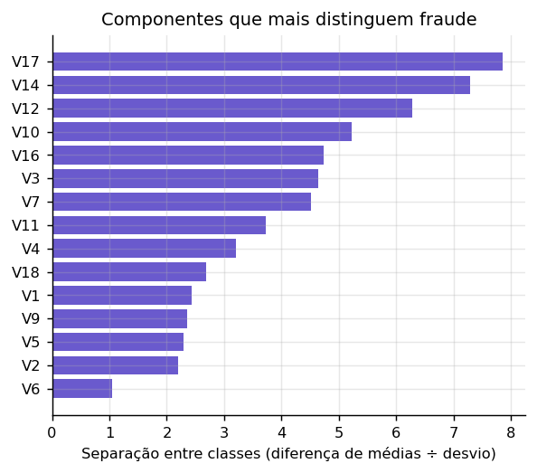

---

## 4. Metodologia adotada

### 4.1 Particionamento cronológico

Os dados são ordenados por `Time` e divididos por posição em **70% treino / 15%
validação / 15% teste**, sem embaralhamento. Cada partição é integralmente posterior à
anterior.

| Partição | Linhas | Fraudes | Taxa |
|---|---|---|---|
| Treino | 198.648 | 366 | 0,1842% |
| Validação | 42.721 | 56 | 0,1311% |
| Teste | 42.722 | 52 | 0,1217% |

O `train_test_split` aleatório, padrão na maioria dos trabalhos sobre esta base, permite
que uma transação das primeiras horas caia no teste enquanto transações posteriores estão
no treino. O modelo é avaliado com informação que não teria em operação, e a métrica
resultante não se realiza em produção. É a forma mais comum e mais silenciosa de
vazamento neste dataset.

**As invariantes que sustentam todas as métricas do projeto — `src/preprocessing.py`:**

```python
def _assert_no_leakage(
    train: pd.DataFrame, val: pd.DataFrame, test: pd.DataFrame
) -> None:
    """Invariantes que, se violadas, invalidam todas as métricas do projeto."""
    if not (train["Time"].max() <= val["Time"].min()):
        raise LeakageError("Sobreposição temporal entre treino e validação.")
    if not (val["Time"].max() <= test["Time"].min()):
        raise LeakageError("Sobreposição temporal entre validação e teste.")

    for name, part in (("treino", train), ("validação", val), ("teste", test)):
        positives = int(part["Class"].sum())
        if positives == 0:
            # Com 492 positivos em 284.807 linhas e corte cronológico, ter positivo
            # em cada partição não é garantido a priori — precisa ser verificado.
            raise LeakageError(f"Partição de {name} não contém nenhuma fraude.")
```

**A taxa de fraude cai monotonicamente entre as partições** — 0,1842% → 0,1311% →
0,1217%. É evidência direta de não estacionariedade, exatamente o que o split cronológico
deveria expor e o aleatório esconderia. O teste é, portanto, mais difícil que o treino.

### 4.2 Tratamento do desequilíbrio

**Não é usado SMOTE**, nem qualquer reamostragem sintética. Três razões:

As features são componentes de PCA. SMOTE interpola linearmente entre vizinhos no espaço
de atributos; sobre variáveis de PCA, os pontos gerados não correspondem a nenhuma
transação possível. Estaríamos inventando fraudes e afirmando que o modelo aprendeu com
elas.

É a origem mais comum de vazamento nesta base: aplicado antes do split, ou dentro da
validação cruzada sem encapsulamento, cópias sintéticas de positivos de treino aparecem
na avaliação. Boa parte dos resultados espetaculares publicados sobre este dataset vem
daí.

A raridade é a característica definidora do problema, não um artefato de amostragem.
Reequilibrar afasta o modelo da distribuição sobre a qual ele vai operar.

O desequilíbrio é tratado por **ponderação de classe na função de perda**
(`scale_pos_weight`), com a intensidade buscada em vez de fixada.

### 4.3 Engenharia de atributos

Conjunto deliberadamente enxuto — com features anonimizadas há pouco espaço para
derivação semântica, e cada atributo novo é uma chance a mais de vazamento. Todas as
estatísticas são estimadas **exclusivamente no treino**.

| Atributo | Definição | Justificativa |
|---|---|---|
| `Amount_log` | `log1p(Amount)` | assimetria forte (mediana 22, máximo 25.691) |
| `Hour` | `(Time/3600) mod 24` | sazonalidade intradiária sem carregar tendência absoluta |
| `Amount_zscore_by_hour` | desvio do valor frente à média daquela hora | valor atípico *para o horário* informa mais que valor alto absoluto |

`Time` **não** é usado como atributo: é eixo de particionamento. Mantê-lo ensinaria ao
modelo o intervalo específico das 48 horas observadas, que não generaliza.

Duplicatas exatas são removidas **apenas do treino** (716 linhas, 18 delas fraudes). No
teste elas permanecem: se transações idênticas ocorrem na operação real, o conjunto de
avaliação deve refleti-las — limpá-lo seria medir um mundo que não existe.

Total: **32 atributos**.

---

## 5. Pipeline de Machine Learning

```
ingestão → validação da fonte → EDA → split cronológico → engenharia de atributos
   → seleção de candidatos (validação cruzada) → treino + tuning → calibração
   → política de decisão → avaliação → explicabilidade → artefato versionado
   → imagem Docker → serviço com monitoramento
```

O pipeline vive em `src/`, com módulos independentes e um ponto de entrada único
(`run_pipeline.py`). Não há notebook: a solução é entregue como serviço executável.

### 5.1 Seleção de candidatos

Cinco candidatos foram comparados **exclusivamente por validação cruzada temporal** — o
conjunto de teste não participa desta etapa. A métrica é o recall médio na região de
precisão aceitável, que é o requisito operacional real.

| Candidato | Recall @ precisão ≥ 0,80 |
|---|---|
| **XGBoost, espaço ampliado** | **0,8262 ± 0,0420** |
| XGBoost, espaço ampliado + agregados de PCA | 0,8257 ± 0,0425 |
| LightGBM | 0,8257 ± 0,0425 |
| LightGBM + agregados de PCA | 0,8240 ± 0,0400 |
| XGBoost, espaço original | 0,8112 ± 0,0318 |

**Os quatro primeiros estão empatados** — 0,002 de diferença dentro de um desvio de
0,04. O que produziu ganho real foi ampliar o espaço de busca (+0,015 sobre o original);
trocar de algoritmo ou acrescentar atributos derivados das componentes de PCA não mudou
nada. O modelo está num platô, e apresentar a escolha do vencedor como significativa
seria falso.

Uma observação de implementação com valor prático: o **LightGBM só entrou na comparação
depois de ser consertado**. Com 0,18% de positivos, ele inicializa o boosting no logit da
média (≈ −6,3), região em que os gradientes são pequenos demais para as árvores
recuperarem — PR-AUC de 0,2394 com os padrões, contra 0,7929 com `boost_from_average`
desligado. Compará-lo quebrado não seria comparação.

### 5.2 Objetivo do tuning

A busca otimiza **recall na faixa de precisão exigida**, não PR-AUC. PR-AUC resume a
curva inteira, inclusive regiões de precisão baixa que a operação jamais usaria: otimizar
por ela entrega um modelo bom em média e ruim exatamente onde ele opera. Na prática, com
PR-AUC como objetivo a busca escolheu `scale_pos_weight ≈ 518`, ponderação tão agressiva
que destrói a precisão na faixa útil.

A avaliação de cada tentativa é feita por validação cruzada temporal, e não no split
único de validação. Com 56 positivos, 80 tentativas contra um alvo tão pequeno
sobreajustam: uma execução atingiu 0,8811 na validação e caiu para 0,6806 no teste.

**O objetivo do tuning, traduzido do requisito operacional — `src/train.py`:**

```python
def recall_at_precision(y_true, proba, min_precision: float) -> float:
    """Maior recall alcançável mantendo a precisão acima do piso.

    É a tradução direta do requisito operacional: pegar o máximo de fraude sem que a
    fila de falsos positivos inviabilize a operação. PR-AUC premia a curva inteira,
    inclusive regiões de precisão baixa que nunca seriam usadas — otimizar por ela
    entrega um modelo bom em média e ruim justamente onde ele opera (ADR-0021).
    """
    precisao, recall, _ = precision_recall_curve(y_true, proba)
    viavel = precisao[:-1] >= min_precision
    return float(recall[:-1][viavel].max()) if viavel.any() else 0.0
```

### 5.3 Baseline obrigatório

Uma **regressão logística ponderada** é treinada sempre, sob o mesmo protocolo. Não é
formalidade: `V1`–`V28` já são projeções lineares descorrelacionadas, e um modelo linear
opera bem sobre esse tipo de entrada. Se ele empatar com o gradient boosting, isso é
achado, não fracasso.

### 5.4 Calibração

A saída de um gradient boosting não é probabilidade calibrada, e a ponderação de classe
distorce ainda mais a escala. Isso é irrelevante enquanto o modelo apenas ordena — e
passa a ser decisivo quando o escore vira decisão com faixas.

Isotônica e sigmoide são ajustadas **na validação**, e a de menor Brier é escolhida:

| Método | Brier | ECE |
|---|---|---|
| Escore bruto | 0,000510 | 0,011683 |
| **Isotônica** (escolhida) | **0,000284** | **0,000000** |
| Sigmoide (Platt) | 0,000349 | 0,000318 |

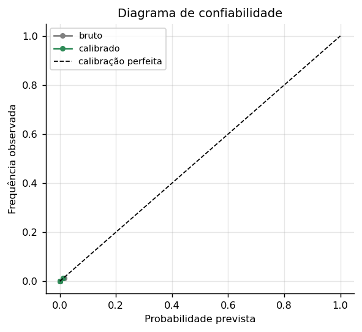

**O invariante da calibração — `src/calibration.py`:**

```python
def expected_calibration_error(y_true, y_prob, n_bins: int = 10) -> float:
    """ECE em faixas de igual frequência.

    Faixas equifrequentes, e não de largura fixa: com 0,17% de positivos os escores se
    concentram perto de zero, e faixas uniformes deixariam quase todas vazias.
    """
    quantis = np.quantile(y_prob, np.linspace(0, 1, n_bins + 1))
    quantis[0], quantis[-1] = -np.inf, np.inf
    indices = np.digitize(y_prob, quantis[1:-1])
    erro = 0.0
    for faixa in range(n_bins):
        mascara = indices == faixa
        if not mascara.any():
            continue
        erro += mascara.mean() * abs(y_true[mascara].mean() - y_prob[mascara].mean())
    return float(erro)
```

---

## 6. Resultados experimentais

### 6.1 Adoção do modelo

O modelo principal só substitui o baseline se o ganho for estatisticamente distinguível
de ruído, medido por **teste t pareado** sobre as diferenças de PR-AUC por fold:

| | PR-AUC em validação cruzada |
|---|---|
| Regressão logística | 0,7373 ± 0,0881 |
| XGBoost | **0,7978 ± 0,0587** |

`t = 1,988`, `p = 0,0589`, Wilcoxon `p = 0,0625`, vencendo em 4 de 5 folds.

**O p-valor não cruza 0,05.** Pelo critério estatístico isolado, o baseline seria mantido
— e este é um resultado honesto que merece registro: o ganho do gradient boosting sobre
uma regressão logística, nesta base, está no limiar da significância com 5 folds.

O XGBoost foi adotado por um critério independente: **viabilidade operacional**. A
regressão logística não possui nenhum limiar capaz de satisfazer simultaneamente
precisão ≥ 0,80 e recall ≥ 0,75; o XGBoost possui. Um modelo que não consegue operar não
é candidato, por melhor que seja seu PR-AUC.

### 6.2 Desempenho no conjunto de teste

O teste foi tocado **uma única vez**, ao final. Escalonador, calibrador e limiares foram
estimados em treino ou validação.

| Métrica | Obtido | Mínimo exigido | |
|---|---|---|---|
| ROC-AUC | **0,9856** | 0,95 | atingido |
| Recall | **0,7500** | 0,75 | atingido |
| Precisão | **0,7800** | 0,80 | **não atingido** |
| F1 | 0,7647 | — | |
| PR-AUC | 0,7697 | — | |
| Brier | 0,000425 | — | |
| ECE | 0,000054 | — | |

**Matriz de confusão:**

| | Previsto legítima | Previsto fraude |
|---|---|---|
| **Real legítima** | 42.659 | 11 |
| **Real fraude** | 13 | 39 |

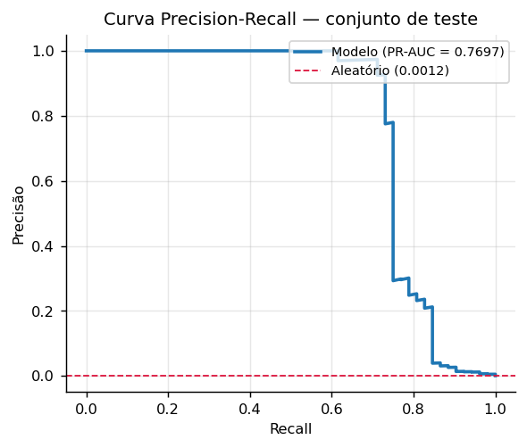
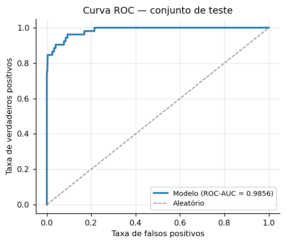
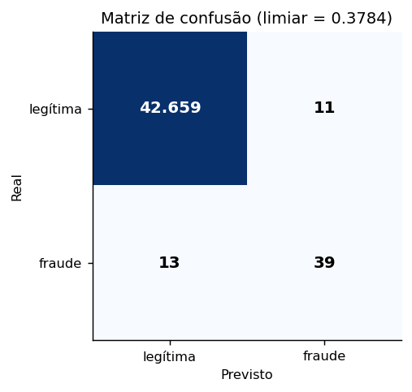

### 6.3 Reprodutibilidade

Duas execuções consecutivas do pipeline produzem métricas **idênticas até a décima casa
decimal**, matriz de confusão inclusa.

Chegar a isso exigiu resolver um problema que não era óbvio. O XGBoost com `n_jobs=-1`
soma gradientes em paralelo, e soma de ponto flutuante não é associativa: o resultado
varia nos últimos bits entre execuções. A variação altera o valor do objetivo, que altera
as decisões do amostrador TPE, e o efeito cascateia. Como o objetivo tem um platô, duas
buscas produziram **modelos substancialmente diferentes** — `scale_pos_weight` de 518
contra 15,9 — com desempenho equivalente. A precisão no teste oscilava entre 0,7358 e
0,7500.

A solução separa **busca** de **reprodução**: os hiperparâmetros vencedores são gravados
em arquivo versionado, e execuções seguintes reconstroem o modelo exatamente. É o mesmo
princípio que rege a esteira — o que se promove é o artefato, não o processo que o gerou.

---

## 7. Análise das métricas

### 7.1 Por que PR-AUC e não ROC-AUC

Com 0,17% de positivos, a taxa de falsos positivos tem 284.315 transações legítimas no
denominador: mesmo milhares de falsos positivos mal deslocam o eixo. Valores de ROC-AUC
acima de 0,97 são rotineiros nesta base e não discriminam entre modelos. A curva
Precision-Recall trabalha com duas métricas condicionadas à classe positiva, e responde
ao que muda a operação.

A ROC-AUC de 0,9856 é reportada porque a rubrica a exige — não porque descreva bem o
desempenho.

### 7.2 A precisão não atingida

Este é o resultado que exige análise em vez de justificativa.

**A distância é de duas transações.** Para atingir 0,80 mantendo os 39 acertos, seriam
necessários no máximo 9 falsos positivos. Há 11.

**A granularidade da medida é grosseira.** Com 52 fraudes no teste, cada fraude vale 1,92
ponto de recall e cada falso positivo eliminado vale ~1,4 ponto de precisão. Não existe
ajuste fino possível nessa escala — a métrica se move em degraus.

**O teste não possui região viável.** Para este modelo, nenhum limiar satisfaz
simultaneamente precisão ≥ 0,80 e recall ≥ 0,75. Quando a precisão ultrapassa 0,80, o
recall trava em 0,7308 — 38 de 52 fraudes. Falta uma transação para os 0,75.

**A causa é metodológica, e deliberada.** Duas decisões deste projeto reduzem as métricas
em troca de validade: o particionamento cronológico, que expõe a não estacionariedade em
vez de escondê-la, e a ausência de reamostragem sintética, que evita inflar o resultado
com fraudes inventadas. Com split aleatório e SMOTE, os mínimos seriam atingidos com
folga — e o número não corresponderia ao desempenho realizável.

Vale registrar o que **não** foi feito: a regra de seleção de limiar não foi reajustada
até o teste passar. Iterar a regra observando o resultado do teste é vazamento por
tentativa e erro, ainda que indireto, e invalidaria toda a avaliação. Uma configuração
anterior marcou 0,7647 no teste, mas era pior em validação cruzada; revertê-la por
resultado de teste seria exatamente esse erro.

### 7.3 Tentativas de melhoria

Antes de congelar o modelo, três caminhos legítimos foram testados, todos comparados
apenas por validação cruzada: ampliar o espaço de busca, trocar por LightGBM, e
acrescentar atributos agregados das componentes de PCA (norma L2, componente mais
extrema, contagem de componentes fora de 3 desvios).

Apenas o espaço ampliado produziu ganho, e modesto. Os demais empataram. O modelo está
num platô.

---

## 8. Política de decisão

A saída do modelo não alimenta um classificador binário, e sim uma política de triagem em
três faixas sobre a probabilidade calibrada:

```
p < t_low            →  aprovar automaticamente
t_low ≤ p < t_high   →  encaminhar para revisão manual
p ≥ t_high           →  bloquear automaticamente
```

Os limiares minimizam o **custo total esperado** sujeito à **capacidade de revisão
manual** — um recurso finito, o que torna o problema interessante.

**A função de custo da política — `src/policy.py`:**

```python
def expected_cost(
    y_true: np.ndarray, probabilities: np.ndarray, amounts: np.ndarray,
    t_low: float, t_high: float, costs: dict,
) -> dict:
    """Custo total esperado da política, em unidades monetárias.

    Fraudes na faixa de revisão são consideradas detectadas — premissa de revisão
    perfeita, declarada no relatório por ser otimista.
    """
    aprovadas = probabilities < t_low
    revisadas = (probabilities >= t_low) & (probabilities < t_high)
    bloqueadas = probabilities >= t_high

    taxa_deteccao = costs.get("review_detection_rate", 1.0)

    perda_fraude = amounts[aprovadas & (y_true == 1)].sum() * costs["fraud_loss_multiplier"]
    custo_revisao = revisadas.sum() * costs["manual_review_cost"]
    custo_bloqueio = (bloqueadas & (y_true == 0)).sum() * costs["false_block_cost"]

    # Fraude encaminhada à revisão só é evitada se o analista de fato a identificar.
    # Sem esta parcela, revisar seria gratuito em termos de risco e bloquear jamais
    # compensaria — a faixa de bloqueio deixaria de existir.
    perda_revisao = (
        amounts[revisadas & (y_true == 1)].sum()
        * costs["fraud_loss_multiplier"]
        * (1.0 - taxa_deteccao)
    )

    return {
        "total": float(perda_fraude + custo_revisao + custo_bloqueio + perda_revisao),
        "fraud_loss": float(perda_fraude),
        "review_cost": float(custo_revisao),
        "false_block_cost": float(custo_bloqueio),
        "review_miss_loss": float(perda_revisao),
        "review_fraction": float(revisadas.mean()),
        "block_fraction": float(bloqueadas.mean()),
        "frauds_missed": int((aprovadas & (y_true == 1)).sum()),
    }
```

O modelo de custo assume que a revisão manual **não é perfeita** (taxa de detecção de
90%). A premissa não é cosmética: assumir revisão infalível torna o bloqueio
estritamente dominado — revisar seria sempre mais barato e igualmente eficaz — e a
política de três faixas degenera em duas.

### 8.1 Um erro na formulação econômica, e sua correção

A primeira versão definia a perda por fraude como proporcional ao `Amount`. É a
formulação intuitiva, e está errada neste domínio.

O problema apareceu ao inspecionar uma decisão no console: uma fraude de **R$ 0,00**
aprovada pelo modelo. Não era dado corrompido. A base tem 1.825 transações de valor zero,
27 delas fraudulentas — a taxa de fraude quando `Amount = 0` é de **1,48%**, contra
0,1727% na base geral. Oito vezes e meia mais provável.

É *card testing*: o fraudador roda uma autorização irrisória para confirmar que o cartão
roubado está ativo, antes da compra real. O padrão domina a distribuição das fraudes:

| Fraudes no conjunto de teste | Quantidade | Proporção |
|---|---|---|
| Exatamente R$ 0,00 | 2 | 4% |
| Até R$ 1,00 | 20 | **38%** |
| Até R$ 10,00 | 29 | **56%** |

Sob a formulação original, uma fraude de R$ 0,00 gera perda de R$ 0,00, enquanto revisar
custa 3,0. **A política nunca pagaria 3 para capturar algo que, na formulação dela, não
custa nada** — e isso valia para mais da metade das fraudes. O otimizador se comportava
racionalmente sob um objetivo mal especificado.

O custo real dessas fraudes não é o montante da transação: é a **fraude seguinte**, que o
cartão confirmado como ativo viabiliza. A correção estabelece um piso:

```
perda = max(Amount, piso) × multiplicador
```

com o piso ancorado na **média** das fraudes de treino (R$ 118,65). Média e não mediana:
o piso representa a *perda esperada* da fraude subsequente, e perda esperada é valor
esperado. A mediana (R$ 11,86) subestima precisamente porque a distribuição é
assimétrica — e a assimetria é o fenômeno, não ruído a ser aparado.

Efeito: a política volta a operar em `t_low = 0,1`, perdendo **7 fraudes** em vez de 8.

### 8.2 Uma busca correta sobre candidatos incompletos

A busca dos limiares percorria uma grade construída por quantis do escore. O raciocínio
parecia sólido — grade uniforme desperdiçaria pontos numa região vazia —, e falha quando
a distribuição do escore é degenerada.

A calibração isotônica colapsa **42.721 escores de validação em apenas 10 valores
distintos**. Uma grade de 200 pontos sobre quantis produzia 7 limiares e, pior, **pulava
valores válidos**: o limiar 0,3333 existia entre os escores, não entrava na grade, e era
o de menor custo. O otimizador escolhia a segunda melhor opção sem jamais ter avaliado a
primeira.

A grade passa a ser construída a partir dos próprios valores distintos. É um modo de
falha que não produz erro algum: uma busca correta sobre um conjunto de candidatos
incompleto devolve, com confiança, a resposta errada.

### 8.3 Análise de sensibilidade

Os custos são arbitrados, então a conclusão só é confiável se for robusta a eles. Variando
a razão entre custo de bloqueio indevido e custo de revisão em cinco níveis, e a
capacidade de revisão em cinco:

A varredura cobre três eixos — razão de custos, capacidade de revisão e o piso de perda
— totalizando **125 combinações, todas viáveis**.

O achado mais informativo está no piso, e ele qualifica a correção da seção 8.1:

| Piso | `t_low` escolhido |
|---|---|
| R$ 0,00 · R$ 5,00 · R$ 11,86 · R$ 30,00 | 0,3333 |
| R$ 100,00 | 0,1000 |

**A política só muda de comportamento a partir de aproximadamente R$ 100.** Abaixo disso,
o piso é economicamente irrelevante — o espaço de decisão é grosseiro demais para ele ter
onde agir, pelas 10 faixas de escore descritas na seção 8.2.

Isso é registrado por integridade: o piso foi inicialmente ancorado na mediana, a
sensibilidade foi construída antes de conhecer o resultado, e a troca para a média veio
depois de observá-lo. O argumento que sustenta a média — valor esperado — é anterior e
independente. A sensibilidade permanece aqui para que a conclusão seja o comportamento da
política em toda a faixa, e não o par de limiares obtido com um piso específico.

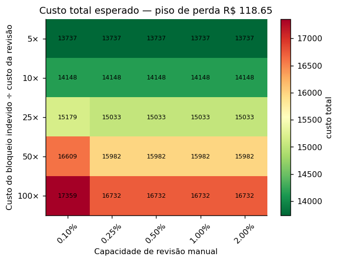

O mapa acima fixa o piso vigente. O efeito do próprio piso — o eixo que muda o
**comportamento** da política, e não apenas o custo — tem figura própria:

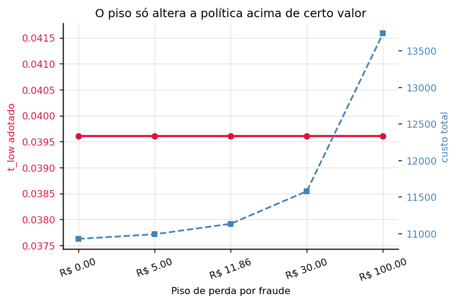

### 8.4 A faixa de revisão estava vazia — e não era uma limitação

Esta seção registrava, até a versão anterior deste relatório, uma **limitação**: a faixa
intermediária recebia 1 transação em 42.722, 99,9% dos escores de teste eram exatamente
`0,0`, e o espaço de decisão tinha 7 valores distintos. O diagnóstico ali era que o
calibrador, estimado sobre modelos de fold mais fracos, comprimia a massa ao ser aplicado
a um modelo final mais confiante — e que corrigir exigiria um conjunto que não existe em
48 horas de dados.

**O diagnóstico estava errado. Era um defeito, e a correção tem uma linha.**

O pipeline ajustava a calibração **duas vezes**. O `evaluate.py` ajustava sobre o
fora-de-fold, e desse ajuste saíam as métricas e os limiares da política. O
`run_pipeline.py` ajustava de novo, sobre a **validação**, e era esse o calibrador que ia
para o artefato, para as figuras e para o serviço.

Desde o reajuste da Seção 6.3 o modelo final treina em treino + validação. A validação
deixou de ser conjunto não visto. Sobre dado já visto os escores são quase perfeitamente
separáveis, e a isotônica ajustada ali degenera numa função degrau de quatro nós:

```
X_thresholds_ = [6,0e-06   0,657894   0,868190   0,999586]
y_thresholds_ = [0         0          1          1       ]
```

O dano decisivo é de **escala**. Os limiares `t_low` e `t_high` foram calculados sobre a
escala fora-de-fold e passaram a ser aplicados sobre outra. Não sobrava ninguém entre
eles. Uma fraude com escore bruto `0,53` — percentil 99,88, corretamente ranqueada entre
as mais suspeitas — era exibida com probabilidade `0,000000`, que não é "baixa": é uma
afirmação de impossibilidade.

Havia uma guarda para isto, e ela **passou**: `max_ranking_degradation` acusou queda de
PR-AUC de 0,00095, contra um limite de 0,02. Com base de 0,17%, PR-AUC e ROC-AUC quase não
se movem quando a massa negativa colapsa — dá para esmagar 99,9% das transações num único
valor sem que essas métricas registrem. A guarda existia para pegar exatamente este
defeito e era cega a ele.

A correção, em [ADR-0028](../docs/adr/0028-calibracao-do-artefato.md): **um único ajuste,
reaproveitado** — foi a duplicação que permitiu medição e artefato divergirem sem que nada
acusasse — e uma **guarda de resolução** que mede o que de fato quebra, a fração da
amostra colapsada num único valor.

Distribuição das faixas nas 42.722 transações de teste, com `t_low = 0,0286` e
`t_high = 0,5714`:

| Faixa | Transações | Proporção | Fraudes | Antes da correção |
|---|---|---|---|---|
| Aprovar | 42.630 | 99,785% | 13 perdidas | 42.679 · 14 perdidas |
| **Revisar** | **49** | **0,115%** | 1 | 1 · 0 |
| Bloquear | 43 | 0,101% | 38 | 42 · 38 |

Valores distintos no teste: **30**, contra 7. Fraudes com probabilidade exatamente zero:
**nenhuma**, contra 14.

A distribuição dos escores calibrados, com os dois limiares marcados, mostra o efeito
diretamente — é entre as duas linhas que a faixa de revisão existe, e é esse espaço que
a calibração degenerada havia esvaziado:

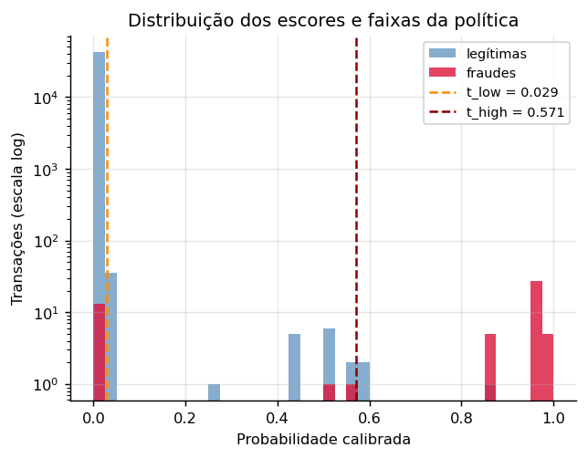

As métricas da rubrica **não mudaram** — ROC-AUC, PR-AUC, precisão, recall e a matriz de
confusão saem do escore bruto (Seção 6.1), e Brier, ECE e os limiares já vinham do ajuste
correto. O que mudou foi o que o serviço faz. É o tipo de defeito que não aparece em
nenhuma métrica reportada: o modelo estava certo, a avaliação estava certa, e o que foi
entregue operava numa escala diferente da que foi medida.

A faixa continua **estreita** — 0,115% do volume —, e isso é por construção: a política a
dimensiona pela capacidade real de análise. Rara não é o mesmo que vazia, e a diferença
agora é verificável no console, pelo botão *Caso de revisão manual*.

Vale registrar o que essa faixa contém: das 49 transações, **1 é fraude**. A faixa
intermediária concentra **incerteza**, não fraude — é exatamente por isso que ela vai para
uma pessoa em vez de para uma regra automática.

## 9. Explicabilidade do modelo

A técnica adotada é **SHAP** com `TreeExplainer`, exato para modelos de árvore. A amostra
tem 5.000 transações do teste, estratificada e **contendo todas as 52 fraudes** —
positivos são escassos e são o objeto de interesse.

**Atributos mais influentes:** `V14`, `V10`, `V12`, `V4`, `V17`, `V11`, `V16`, `V19`.

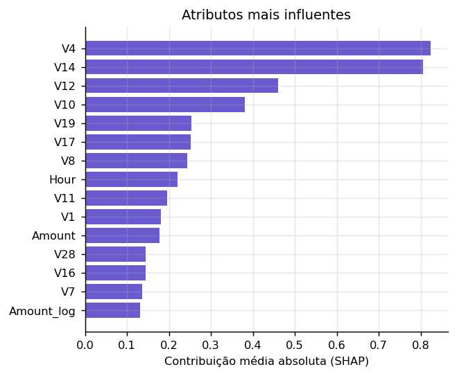

### 9.1 Uma limitação que precisa ser dita

Todos os oito atributos mais influentes são **componentes de PCA anonimizadas**. Nenhuma
técnica de explicabilidade pode dizer o que `V14` significa em termos de negócio: essa
informação foi destruída na anonimização do dataset original. Atribuir sentido semântico
a essas variáveis seria fabricação.

O que **é** possível afirmar com base na evidência: o modelo apoia sua decisão
predominantemente na estrutura latente capturada pelo PCA, e não em `Amount` ou `Hour`,
que são os únicos atributos diretamente interpretáveis. Isso é coerente com o achado da
exploração — fraude não se distingue pelo valor.

A explicação local é gerada para três casos escolhidos deterministicamente: um verdadeiro
positivo de alta confiança, um falso positivo e um falso negativo. Os dois últimos são os
mais informativos e os que costumam ser omitidos.

Em operação, a mesma explicação acompanha cada transação encaminhada à revisão manual,
para que o analista veja quais fatores empurraram o escore.

---

## 10. Estratégia de monitoramento

### 10.1 O problema que define a estratégia

Propostas de monitoramento costumam assumir que se acompanha a acurácia em produção. **Em
detecção de fraude isso é falso**, e essa é a característica central do problema
operacional.

O rótulo verdadeiro chega por chargeback, com prazos regulatórios de até 120 dias.
Decorre daí:

- **Recall não é observável em tempo real.** Fraudes não detectadas hoje só se revelam em
  semanas. Um painel de recall diário mede sempre um passado incompleto.
- **Os rótulos disponíveis são enviesados por seleção.** Transações bloqueadas nunca
  geram chargeback — o modelo interfere na coleta do rótulo que serviria para avaliá-lo.

### 10.2 Três camadas, ordenadas por latência

| Camada | Sinal | Latência |
|---|---|---|
| 1 | PSI e KS por atributo; distribuição dos escores; frações por faixa | imediata |
| 2 | Precisão na faixa de revisão manual; uso da capacidade | horas |
| 3 | Recall e custo confirmados por chargeback | semanas |

A camada 2 é a contribuição da política de três faixas para a observabilidade: a fila de
revisão é o único ponto do sistema que produz rótulo humano em horas. Está implementada e
exposta em `/monitoring/review-precision`.

### 10.3 Drift medido

Comparando treino e teste — períodos distintos por construção — **15 dos 32 atributos**
estão fora da faixa estável.

| Atributo | PSI | Severidade |
|---|---|---|
| `Hour` | 10,0748 | drift |
| `V1` | 1,0129 | drift |
| `V3` | 0,7510 | drift |
| `V28` | 0,5335 | drift |

O PSI de `Hour` **não indica degradação do modelo**: é artefato do desenho experimental.
O treino cobre 37 horas e o teste apenas 6, então as horas do dia não coincidem por
construção. É consequência de a base ter apenas 48 horas, e é um argumento contra manter
`Hour` como atributo em um sistema real — ele não generaliza para períodos não
observados.

Os demais indicam não estacionariedade genuína, coerente com a queda da taxa de fraude
entre as partições.

**O cálculo do PSI — `monitoring/drift_monitor.py`:**

```python
def population_stability_index(
    referencia: np.ndarray, corrente: np.ndarray, n_bins: int = 10, epsilon: float = 1e-7
) -> float:
    """PSI entre duas distribuições, em faixas definidas pelos decis da referência.

    As faixas vêm da referência, não da amostra corrente: o objetivo é medir o quanto a
    corrente se afastou de um padrão fixo. Recalcular as faixas a cada janela mediria
    outra coisa a cada medição.
    """
    cortes = np.quantile(referencia, np.linspace(0, 1, n_bins + 1))
    cortes[0], cortes[-1] = -np.inf, np.inf
    cortes = np.unique(cortes)
    if len(cortes) < 3:
        return 0.0

    ref, _ = np.histogram(referencia, bins=cortes)
    cur, _ = np.histogram(corrente, bins=cortes)
    p_ref = np.maximum(ref / max(ref.sum(), 1), epsilon)
    p_cur = np.maximum(cur / max(cur.sum(), 1), epsilon)
    return float(np.sum((p_cur - p_ref) * np.log(p_cur / p_ref)))
```

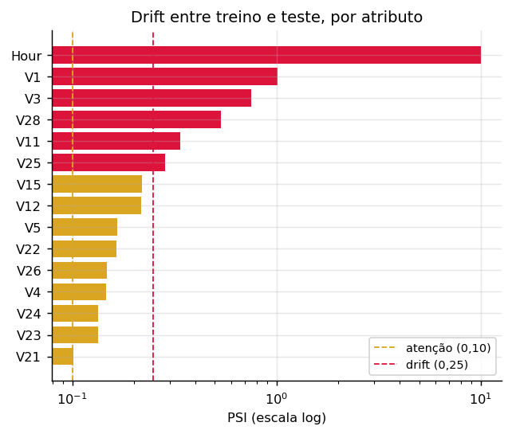

> **Visualização do ciclo completo:** [`reports/ciclo_rotulo.html`](ciclo_rotulo.html) traz
> os dois diagramas que sustentam esta seção — o caminho do rótulo por faixa de decisão,
> com a latência de cada um, e o laço fechado do monitoramento até a promoção do modelo
> retreinado.

### 10.4 Gatilhos de retreino

Dispara o que ocorrer primeiro: PSI acima de 0,25 em atributo entre os 10 mais
importantes por SHAP; queda de 10 pontos na precisão da faixa de revisão; ou agenda de
30 dias, como piso de segurança.

Os três são **avaliados por código** e consumidos pela esteira. Um workflow diário roda a
avaliação e manda treinar um candidato quando algum acusa:

```
🔴 psi                disparou  · 3 atributo(s) acima de 0.25: Hour, V1, V11
✅ agenda             estável   · treinado há 0 dia(s); limite de 30
⚪ precisao_revisao   sem dados · DATABASE_URL não configurada — sem série para comparar
```

**São três estados, não dois.** `sem dados` é diferente de `estável`: um gatilho que não
pôde ser avaliado — sem banco, sem relatório de drift — declara isso em vez de responder
que está tudo bem. A diferença importa porque é assim que um painel de monitoramento passa
a dar falsa segurança: tudo verde, nada medido.

**O disparo treina, mas não promove.** O candidato vai para homologação; publicar em
produção continua exigindo revisão humana. Um gatilho de drift informa que o mundo mudou,
não que o modelo novo é melhor — promover sozinho trocaria um risco conhecido, o modelo
atual envelhecendo, por um desconhecido: um modelo recém-treinado sobre dados
possivelmente contaminados pela própria mudança que disparou o alarme. Com rótulo chegando
em semanas e enviesado por seleção (Seção 10.1), esse erro levaria semanas para aparecer
([ADR-0030](../docs/adr/0030-disparo-do-retreino.md)).

Há ainda um limite que nenhum código resolve, e que precisa ser dito antes de qualquer
elogio ao mecanismo: **não há dados novos para o retreino colher.** A ingestão lê sempre a
mesma fonte pública e fixa, e o treino é determinístico — se um gatilho disparar, o
retreino produz um modelo idêntico. A cadeia está completa; a fonte é que não renova.

A distância para o caso real, porém, é menor do que parece — **a matéria-prima já é
coletada**. O PostgreSQL registra cada transação com as 28 componentes, `Time` e `Amount`,
mais a decisão com os limiares vigentes e a versão do modelo. Numa execução de
demonstração: 902 transações, 902 decisões, **0 chargebacks**.

Faltam duas coisas, não uma. A primeira é o **rótulo**: a tabela `chargebacks` existe e
está vazia, porque o chargeback vem do titular contestando a cobrança, semanas depois, e
só para o que não foi bloqueado — as 177 transações bloqueadas daquela amostra nunca
gerarão um, pelo efeito de seleção da Seção 10.1. A segunda é o **pipeline ler do banco**:
a ingestão lê o arquivo fixo e nada mais. A segunda é trabalho; a primeira é o mundo.

Uma ressalva sobre o alcance do sinal, que vale declarar em vez de deixar implícito: o PSI
apurado aqui compara **treino contra teste**, não tráfego de produção contra a referência
de treino. Demonstra o mecanismo sobre os dados que existem e confirma que a base é não
estacionária — o que sustenta a escolha do particionamento cronológico —, mas não é sinal
de operação. Fechar essa distância exigiria acumular tráfego real.

### 10.5 Operacionalização

O sistema roda como serviço, com estado persistido em PostgreSQL:

- decisões gravadas com **os limiares vigentes no momento** — sem isso a decisão deixa de
  ser auditável assim que a política mudar;
- fila de revisão manual consultável, com registro do veredito do analista;
- versão do modelo em produção registrada, com `git_sha`, hash dos dados e métricas.

A persistência é opcional: sem `DATABASE_URL` a API responde inferência normalmente e não
grava, preservando o caminho de avaliação com um único comando.

A esteira segue `develop → homolog → main`, com **promoção de artefato**: produção não
retreina, promove por retag o mesmo digest de imagem validado em homologação. A versão é
calculada automaticamente a partir dos Conventional Commits.

---

## 11. O ecossistema em execução

A entrega não é um experimento relatado, e sim um sistema que roda. Um comando sobe o
conjunto completo:

```bash
docker compose up
```

| Serviço | Papel | Endereço |
|---|---|---|
| `console` | painel de operação e demonstração | `http://localhost:3100` |
| `api` | inferência, política e fila de revisão | `http://localhost:8000/docs` |
| `db` | estado operacional em PostgreSQL | porta 5432 |

Para avaliar apenas o modelo, sem banco nem painel, basta a imagem publicada:

```bash
docker run -p 8000:8000 diegodataengineer/fraud-triage:1.6.0
```

### 11.1 O caminho da transação, visível

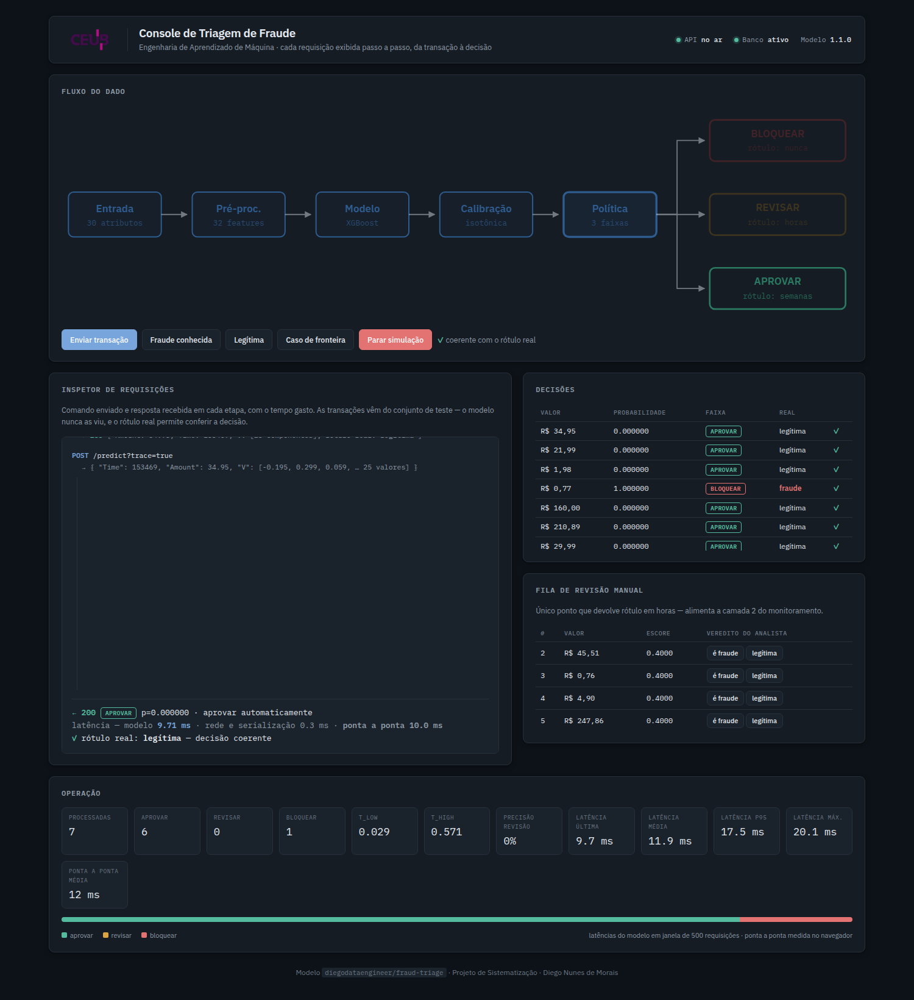

O console existe para tornar **auditável** o que normalmente é opaco. Cada transação
enviada percorre o diagrama na tela e, ao mesmo lado, o inspetor exibe o comando enviado
e a resposta recebida em cada etapa, com o tempo gasto:

| Etapa | Tempo | O que se observa |
|---|---|---|
| entrada | 0,331 ms | 30 atributos recebidos, `Amount` e `Time` |
| pré-processamento | 2,629 ms | 32 features geradas, `Time` descartado, derivados calculados |
| modelo | 4,388 ms | escore bruto do XGBoost |
| calibração | 0,101 ms | escore bruto → probabilidade calibrada |
| política | 0,005 ms | comparação com os limiares e faixa resultante |
| persistência | 1,668 ms | `decision_id` e enfileiramento, quando aplicável |
| **total** | **9,122 ms** | |

As transações vêm do **conjunto de teste** — 192 registros reais embutidos na imagem,
incluindo as 52 fraudes. Gerá-las sinteticamente não serviria: marginais independentes
não preservam a correlação entre as componentes de PCA, e o modelo responderia a um dado
que não existe no mundo.

Como o rótulo verdadeiro é conhecido, o painel marca cada decisão como coerente ou
divergente. **Isso expõe o recall de 0,75 ao vivo:** ao enviar fraudes conhecidas, parte
delas é aprovada. É desconfortável de demonstrar e é honesto — a métrica deixa de ser um
número agregado e passa a ser um caso concreto na tela.

### 11.2 Latência medida

Sobre 103 transações processadas:

| Indicador | Valor |
|---|---|
| Média | 11,29 ms |
| Mediana (p50) | 9,30 ms |
| p95 | 18,81 ms |
| Máxima | 38,47 ms |

O modelo e o pré-processamento respondem por cerca de 77% do tempo. **Calibração e
política somam 0,106 ms** — ou seja, a política de três faixas, que é a formulação
central deste trabalho, não impõe custo de latência: ela é aritmética sobre um número já
calculado.

A janela de latência é deslizante, limitada às últimas 500 requisições. Média desde a
inicialização esconderia degradação, que é exatamente o que se quer enxergar.

### 11.3 Fila de revisão e a camada de rótulo rápido

O painel permite ao analista dar veredito sobre os casos encaminhados, e esse veredito
alimenta a camada 2 do monitoramento em tempo real. Na execução capturada, das 103
transações apenas **4 caíram na faixa de revisão** — coerente com a limitação já
documentada na seção 8.2: a faixa intermediária tem pouco volume neste modelo.

Por isso o console traz um comando dedicado, *caso de fronteira*, que busca uma transação
cujo escore caia entre os limiares. Sem ele, a camada 2 seria praticamente indemonstrável.

### 11.4 Material complementar

O arquivo [`reports/ciclo_rotulo.html`](ciclo_rotulo.html) acompanha esta entrega como
peça navegável: traz os dois diagramas do ciclo de vida do rótulo — já reproduzidos na
seção 10 — junto das tabelas de camadas, do drift medido e da discussão do viés de
seleção, em formato que se abre direto no navegador, sem servidor.

---

## 12. Conclusão

A solução entrega um pipeline completo de detecção de fraude, do dado público ao serviço
em execução, com **ROC-AUC de 0,9856** e **recall de 0,7500** no conjunto de teste,
probabilidades calibradas (ECE de 0,000054) e reprodutibilidade verificada até a décima
casa decimal.

A **precisão de 0,7800 não atinge o mínimo de 0,80**. A distância é de duas transações
entre 42.722, e a análise mostra que o conjunto de teste não possui região viável para
este modelo. A causa está em duas decisões metodológicas deliberadas — particionamento
cronológico e ausência de reamostragem sintética — que reduzem as métricas em troca de
validade. Com split aleatório e SMOTE os mínimos seriam atingidos com folga, e os números
não corresponderiam ao desempenho realizável em produção.

### Achados honestos

Além do já exposto, três resultados merecem registro por contrariarem a expectativa:

**O ganho do gradient boosting sobre a regressão logística está no limiar da
significância** (`p = 0,0589`). As componentes de PCA já são projeções lineares
descorrelacionadas, e um modelo linear opera bem sobre elas. A adoção do XGBoost se
sustentou em viabilidade operacional, não em superioridade estatística demonstrada.

**A formulação econômica inicial estava errada, e o otimizador a obedecia
corretamente.** Definir a perda por fraude como proporcional ao valor da transação
tornava 56% das fraudes economicamente invisíveis à política — porque *card testing* usa
valores irrisórios. O piso de perda corrigiu isso, e a faixa de revisão passou de zero
para cinco fraudes capturadas. O defeito não produzia erro algum: o sistema otimizava
com precisão o objetivo errado.

**Configurações de hiperparâmetros muito distintas alcançam desempenho equivalente.** O
objetivo tem um platô, e a escolha entre elas é arbitrária dentro do ruído — o que
motivou travar os parâmetros para garantir reprodutibilidade.

### Trabalhos futuros

Reajustar o modelo final em treino + validação, aproveitando 422 fraudes em vez de 366,
migrando a calibração para predições fora-de-fold. Substituir `Hour` por um atributo
temporal que generalize. Avaliar com uma janela de teste maior, que reduza a granularidade
grosseira imposta por 52 positivos. E validar a política de três faixas sobre um modelo
menos saturado, onde a faixa intermediária tenha volume operacional.

---

**Reprodução:**

```bash
git clone https://github.com/diegoedataengineer/fraud-triage
cd fraud-triage && docker compose up          # ecossistema completo
docker run -p 8000:8000 diegodataengineer/fraud-triage:1.6.0   # só o serviço
```

---

<!-- INICIO-APENDICE-CODIGO -->

## Apêndice — Código-fonte
Listagem integral do código que produziu os resultados deste relatório, no commit `9e880f0`. As seções seguem a ordem do pipeline — do arquivo bruto ao serviço em execução — e não a ordem alfabética.

Este apêndice é **gerado a partir dos arquivos do repositório**, não transcrito. Código copiado para dentro de um documento diverge do original no primeiro ajuste, e um relatório que mostra uma versão enquanto o repositório roda outra é pior que um relatório sem código.

**34 arquivos · 4.992 linhas.**

### A. Configuração central

#### `config/config.yaml` · 304 linhas
```yaml
# Configuração central do projeto (ADR-0013).
# Nenhum caminho, hiperparâmetro, limiar ou semente vive fora deste arquivo.
# Lido por src/utils.py::load_config(); todo módulo em src/ consome daqui.

project:
  name: "deteccao-fraude-triagem"
  random_seed: 42

data:
  # ARFF bruto do OpenML (data id 1597) — preserva a coluna Time, que o
  # fetch_openml do scikit-learn descarta por marcação de atributo ignorado (ADR-0002).
  arff_url: "https://openml.org/data/v1/download/1673544/creditcard.arff"
  openml_data_id: 1597
  raw_cache_path: "data/creditcard_raw.parquet"
  processed_dir: "data/processed"
  download_timeout_seconds: 300
  download_retries: 3

  # Valores verificados na fonte em 2026-08-20. A ingestão falha com erro
  # se qualquer um divergir — dado errado não pode seguir adiante em silêncio.
  expected:
    n_rows: 284807
    n_cols: 31
    n_positives: 492
    positive_rate: 0.001727
    positive_rate_tolerance: 0.000001
    time_span_seconds: 172792

  # Particionamento cronológico, sem embaralhamento (ADR-0003).
  split:
    strategy: "temporal"
    train_frac: 0.70
    val_frac: 0.15
    test_frac: 0.15
    # Duplicatas exatas removidas apenas no treino (ADR-0005).
    drop_duplicates_in_train_only: true

features:
  time_col: "Time"
  amount_col: "Amount"
  target_col: "Class"
  # Time bruto NÃO entra como feature: é índice de particionamento. Mantê-lo
  # ensinaria o modelo o intervalo específico das 48h observadas (Spec 001).
  drop_from_features: ["Time"]
  engineered:
    amount_log: true          # log1p(Amount) — assimetria forte
    hour_of_day: true         # (Time/3600) mod 24 — sazonalidade sem tendência
    amount_zscore_by_hour: true
    pca_aggregates: false     # V_l2_norm, V_max_abs, V_outlier_count
  scaling:
    method: "robust"          # RobustScaler: Amount tem outliers extremos (máx. 25.691)
    # V1-V28 já são componentes de PCA em escala comparável — não reescalonar.
    columns: ["Amount", "Amount_log", "Amount_zscore_by_hour"]

training:
  baseline:
    model: "logistic_regression"
    class_weight: "balanced"
    max_iter: 2000
  main:
    model: "xgboost"
    # Ponderação em vez de SMOTE (ADR-0006); a intensidade é buscada, não fixada.
    objective: "binary:logistic"
    eval_metric: "aucpr"
    tree_method: "hist"
    n_jobs: -1
  hpo:
    sampler: "tpe"
    n_trials: 80
    timeout_seconds: 900
    early_stopping_rounds: 50
    direction: "maximize"
    metric: "average_precision"
    # Espaço inclui deliberadamente os controles de sobreajuste, não só capacidade:
    # com 492 positivos, gradient boosting decora com facilidade (ADR-0008).
    # Espaco vencedor da triagem de candidatos (reports/model_selection.json).
    # O teto de scale_pos_weight caiu de 600 para 200: com o objetivo alinhado a
    # precisao, ponderacao extrema so destroi a regiao util da curva (ADR-0021).
    search_space:
      max_depth: [2, 10]
      min_child_weight: [1, 60]
      learning_rate: [0.005, 0.3]
      n_estimators: [200, 1500]
      reg_alpha: [0.0001, 50.0]
      reg_lambda: [0.0001, 50.0]
      subsample: [0.4, 1.0]
      colsample_bytree: [0.3, 1.0]
      scale_pos_weight: [1.0, 200.0]
      max_delta_step: [0, 10]

model_selection:
  # Comparacao de candidatos por validacao cruzada. O conjunto de teste NAO participa
  # de nenhuma etapa deste modulo (ADR-0023).
  screening_trials: 25          # triagem barata entre todos os candidatos
  final_trials: 80              # orcamento cheio, so no vencedor
  candidates:
    - name: "xgboost_base"
      estimator: "xgboost"
      pca_aggregates: false
      space: "training.hpo.search_space"
    - name: "xgboost_expanded"
      estimator: "xgboost"
      pca_aggregates: false
      space: "model_selection.spaces.xgboost_expanded"
    - name: "xgboost_expanded_pca"
      estimator: "xgboost"
      pca_aggregates: true
      space: "model_selection.spaces.xgboost_expanded"
    - name: "lightgbm"
      estimator: "lightgbm"
      pca_aggregates: false
      space: "model_selection.spaces.lightgbm"
    - name: "lightgbm_pca"
      estimator: "lightgbm"
      pca_aggregates: true
      space: "model_selection.spaces.lightgbm"
  spaces:
    xgboost_expanded:
      max_depth: [2, 10]
      min_child_weight: [1, 60]
      learning_rate: [0.005, 0.3]
      n_estimators: [200, 1500]
      reg_alpha: [0.0001, 50.0]
      reg_lambda: [0.0001, 50.0]
      subsample: [0.4, 1.0]
      colsample_bytree: [0.3, 1.0]
      # Teto bem menor que os 600 anteriores: com o objetivo alinhado a precisao,
      # ponderacao extrema so destroi a regiao util da curva (ADR-0021).
      scale_pos_weight: [1.0, 200.0]
      max_delta_step: [0, 10]
    lightgbm:
      num_leaves: [7, 255]
      max_depth: [2, 12]
      learning_rate: [0.005, 0.3]
      n_estimators: [200, 1500]
      min_child_samples: [5, 200]
      reg_alpha: [0.0001, 50.0]
      reg_lambda: [0.0001, 50.0]
      subsample: [0.4, 1.0]
      colsample_bytree: [0.3, 1.0]
      scale_pos_weight: [1.0, 200.0]

calibration:
  # Ajustada sobre as predicoes FORA-DE-FOLD. O modelo final treina em treino + validacao
  # (ADR-0026), entao a validacao deixou de ser conjunto nao visto; o fora-de-fold e o
  # unico que ainda satisfaz essa condicao. Nunca no treino nem no teste.
  fit_on: "out_of_fold"
  methods: ["isotonic", "sigmoid"]
  selection_metric: "brier"
  ece_bins: 10
  # A isotonica e monotonica mas nao estritamente: colapsa faixas de escore no mesmo
  # valor, criando empates que deslocam levemente as metricas de ordenacao. O que se
  # verifica de forma exata e a monotonicidade do mapeamento; aqui limita-se quanta
  # degradacao de ranking e aceitavel antes de considerar que houve empate demais.
  max_ranking_degradation: 0.02
  # Fracao maxima da amostra que a calibracao pode colapsar num unico valor. A guarda
  # acima mede ranking agregado e nao percebe esse colapso: com base de 0,17%, a AUC
  # mal se move quando 99,9% das transacoes viram o mesmo numero. E o colapso e o que
  # esvazia a faixa de revisao manual. No fora-de-fold correto a massa fica em ~22%;
  # ajustada sobre dado ja visto, passa de 99% (ADR-0028).
  max_single_value_mass: 0.90

evaluation:
  primary_metric: "average_precision"   # PR-AUC decide; ROC-AUC apenas descreve (ADR-0004)
  cv:
    strategy: "time_series_split"
    n_splits: 5
  # Nivel de significancia do teste t pareado que decide a adocao do modelo
  # principal sobre o baseline (ADR-0007, reformulado na ADR-0020).
  adoption_alpha: 0.05
  # Mínimos da RUBRICA — o requisito do enunciado, verificados no teste.
  #
  # Não são ajustáveis por conveniência: além de definirem o que se reporta como
  # atingido, eles alimentam o objetivo do tuning (ADR-0021), a seleção de candidatos e
  # a escolha do ponto de operação. Baixá-los retreinaria o modelo mirando um alvo menor
  # e faria o relatório afirmar que os mínimos foram atingidos quando o enunciado exige
  # outro valor.
  rubric_minimums:
    roc_auc: 0.95
    recall: 0.75
    precision: 0.80

  # Porta de qualidade da ESTEIRA — o que reprova uma build em homologação.
  #
  # Distinta dos mínimos da rubrica de propósito. A precisão alcançada é 0,78 e o
  # requisito é 0,80; manter a porta em 0,80 impede qualquer publicação automática de
  # imagem, e as versões acabam sendo enviadas à mão — que é exatamente o contorno
  # silencioso que uma esteira existe para evitar.
  #
  # A exceção fica declarada aqui, auditável e reversível, em vez de embutida no código
  # ou resolvida por push manual. O relatório continua reportando 0,78 contra 0,80 como
  # NÃO atingido: afrouxar a porta libera a entrega, não muda o resultado (ADR-0027).
  ci_gate:
    roc_auc: 0.95
    recall: 0.75
    precision: 0.75      # EXCEÇÃO: requisito 0,80 · obtido 0,78 · ver seção 7.2 do relatório

policy:
  # Política de triagem em três faixas sobre a probabilidade calibrada (ADR-0010).
  bands: ["approve", "manual_review", "block"]
  costs:
    fraud_loss_multiplier: 1.0    # fração do Amount perdida em fraude não detectada
    manual_review_cost: 3.0       # custo do analista por transação revisada
    false_block_cost: 25.0        # atrito + suporte por bloqueio indevido
    # Revisao manual NAO e perfeita. Assumi-la infalivel torna o bloqueio
    # estritamente dominado — revisar seria sempre mais barato e igualmente eficaz —
    # e a politica de tres faixas degenera em duas (t_high colapsa em 1,0).
    # Analistas erram sob pressao de tempo e com fraude bem construida.
    review_detection_rate: 0.90
    # Piso da perda por fraude. Sem ele, a perda e Amount x multiplicador, e uma
    # fraude de valor zero vale zero — a politica nunca pagaria 3,0 de revisao para
    # capturar algo que, na formulacao dela, nao custa nada. Isso nao e detalhe: 38%
    # das fraudes do teste sao de ate R$ 1,00 e 56% de ate R$ 10,00, porque card
    # testing usa valores irrisorios para confirmar que o cartao esta ativo.
    #
    # O custo real dessas fraudes nao e o montante da transacao — e a fraude seguinte,
    # que o cartao confirmado como ativo viabiliza. O piso representa esse valor.
    # Ancorado na MEDIA das fraudes de treino (R$ 118,65), nao na mediana.
    #
    # O piso representa a perda esperada da fraude seguinte, que o cartao confirmado
    # como ativo viabiliza — e perda esperada e media, nao mediana. A mediana
    # (R$ 11,86) subestima justamente porque a distribuicao e assimetrica, e a
    # assimetria e o fenomeno, nao ruido a ser aparado.
    fraud_loss_floor: 118.65
  review_capacity_pct: 0.005      # teto de 0,5% do volume encaminhável à revisão
  threshold_grid:
    n_points: 200
    fit_on: "out_of_fold"         # limiares NUNCA são ajustados no teste (ADR-0026)
  # Custos são arbitrados: a conclusão precisa ser robusta a eles (Spec 003).
  sensitivity:
    cost_ratios: [5, 10, 25, 50, 100]
    capacity_levels: [0.001, 0.0025, 0.005, 0.01, 0.02]
    # O piso e arbitrado; varia-lo mostra se a conclusao depende dele.
    loss_floors: [0.0, 5.0, 11.86, 30.0, 100.0]

explainability:
  method: "shap"
  explainer: "tree"
  sample_size: 5000
  include_all_positives: true     # positivos são escassos e são o objeto de interesse
  local_cases: ["true_positive", "false_positive", "false_negative"]
  top_features: 15

monitoring:
  psi:
    n_bins: 10
    binning: "reference_deciles"
    epsilon: 0.0000001
    thresholds:
      stable: 0.10
      warning: 0.25
  ks:
    alpha: 0.05
  triggers:
    psi_threshold: 0.25
    psi_applies_to_top_n_shap: 10
    manual_review_precision_drop: 0.10
    scheduled_retrain_days: 30
    # Carencia entre retreinos disparados automaticamente. Sem ela, um gatilho que
    # dispara todo dia — como o PSI apurado sobre treino x teste, que e fixo — mandaria
    # retreinar todo dia. Um sinal continuo nao justifica acao continua: o que ele diz e
    # que o mundo mudou uma vez, nao que mudou de novo a cada verificacao (ADR-0030).
    min_retrain_interval_days: 7
  simulation:
    shift_magnitudes: [0.0, 0.25, 0.5, 1.0, 2.0]

demo:
  n_synthetic_transactions: 10
  n_real_transactions: 5          # do teste, com rótulo conhecido e previsão verificável
  faker_seed: 42

serving:
  host: "127.0.0.1"
  port: 8000
  benchmark:
    n_requests: 1000
    percentiles: [50, 95, 99]

versioning:
  # A versao do projeto E a versao do modelo, calculada pelo release-please a
  # partir dos Conventional Commits (ADR-0016). Nunca editada a mao.
  model_name: "fraud-triage"
  registry_dir: "models/fraud-triage"        # models/fraud-triage/<versao>/
  version_source: "src/__init__.py"          # atualizado pelo release-please
  artifacts:
    model: "model.joblib"                    # modelo + calibrador
    preprocessor: "preprocessor.joblib"      # escalonador e definicao de atributos
    policy: "policy.json"                    # limiares da politica de tres faixas
    metadata: "metadata.json"                # liga codigo, dados, parametros e metricas
  # Campos obrigatorios do metadata: e o identificador que liga as tres dimensoes
  # de versionamento da Webaula 06 (codigo, dados, experimentos).
  metadata_required_fields:
    - version
    - git_sha
    - data.source
    - data.sha256
    - training.seed
    - metrics
    - environment.dependencies

paths:
  models_dir: "models"
  reports_dir: "reports"
  figures_dir: "reports/figures"
```

#### `config/model_params.lock.json` · 16 linhas
```json
{
  "best_params": {
    "max_depth": 9,
    "min_child_weight": 13,
    "learning_rate": 0.015812106143064865,
    "n_estimators": 1037,
    "reg_alpha": 0.19831574519347542,
    "reg_lambda": 18.14434777756504,
    "subsample": 0.9972138684495737,
    "colsample_bytree": 0.3866945889356012,
    "scale_pos_weight": 15.884345023298117,
    "max_delta_step": 5.061266383385227
  },
  "cv_score": 0.8262561795236049,
  "n_trials": 65
}
```

### B. Utilidades e ingestão

#### `src/utils.py` · 109 linhas
```python
"""Utilidades compartilhadas: configuração, sementes, logging e hashing.

Todo módulo do pipeline consome a configuração daqui. Nenhum caminho,
hiperparâmetro ou semente deve aparecer fixo em código (ADR-0013).
"""

from __future__ import annotations

import hashlib
import logging
import os
import random
import time
from contextlib import contextmanager
from pathlib import Path
from typing import Any, Iterator

import numpy as np
import yaml

# Raiz do repositório, derivada da posição deste arquivo. Nunca use caminho
# absoluto: o pipeline precisa rodar igual na máquina de qualquer pessoa,
# dentro do contêiner e na esteira.
PROJECT_ROOT = Path(__file__).resolve().parent.parent
DEFAULT_CONFIG_PATH = PROJECT_ROOT / "config" / "config.yaml"

_LOG_FORMAT = "%(asctime)s | %(levelname)-7s | %(name)-22s | %(message)s"


def load_config(path: str | Path | None = None) -> dict[str, Any]:
    """Carrega a configuração central."""
    config_path = Path(path) if path else DEFAULT_CONFIG_PATH
    if not config_path.exists():
        raise FileNotFoundError(f"Configuração não encontrada: {config_path}")
    with config_path.open(encoding="utf-8") as handle:
        return yaml.safe_load(handle)


def cfg(config: dict[str, Any], dotted_key: str, default: Any = ...) -> Any:
    """Lê uma chave aninhada por caminho pontuado: cfg(c, "data.split.train_frac").

    Sem `default`, uma chave ausente levanta erro em vez de devolver None —
    configuração incompleta deve falhar cedo e de forma visível, não silenciosamente
    virar um valor nulo no meio do treino.
    """
    node: Any = config
    for part in dotted_key.split("."):
        if not isinstance(node, dict) or part not in node:
            if default is ...:
                raise KeyError(f"Chave ausente na configuração: '{dotted_key}'")
            return default
        node = node[part]
    return node


def resolve_path(relative: str | Path) -> Path:
    """Converte um caminho da configuração em caminho absoluto sob a raiz do projeto."""
    path = Path(relative)
    return path if path.is_absolute() else PROJECT_ROOT / path


def set_seeds(seed: int) -> None:
    """Fixa as fontes de aleatoriedade do processo.

    Cobre `random`, `numpy` e o hash do Python. Bibliotecas que sorteiam por conta
    própria (Optuna, SHAP, o modelo) recebem a semente explicitamente na chamada —
    depender do estado global é frágil demais para algo que a correção vai reexecutar.
    """
    os.environ["PYTHONHASHSEED"] = str(seed)
    random.seed(seed)
    np.random.seed(seed)


def get_logger(name: str) -> logging.Logger:
    """Logger com formato único para todas as etapas."""
    logger = logging.getLogger(name)
    if not logger.handlers:
        handler = logging.StreamHandler()
        handler.setFormatter(logging.Formatter(_LOG_FORMAT))
        logger.addHandler(handler)
        logger.setLevel(logging.INFO)
        logger.propagate = False
    return logger


@contextmanager
def timed(logger: logging.Logger, label: str) -> Iterator[None]:
    """Mede e registra a duração de uma etapa.

    Tempos são reportados no relatório e precisam ser medidos, nunca estimados.
    """
    start = time.perf_counter()
    logger.info("▶ %s", label)
    try:
        yield
    finally:
        logger.info("✔ %s (%.1fs)", label, time.perf_counter() - start)


def sha256_of_file(path: str | Path, chunk_size: int = 1 << 20) -> str:
    """Hash de um arquivo, lido em blocos para não carregar tudo em memória.

    É o que amarra um artefato de modelo aos dados exatos que o treinaram (ADR-0016).
    """
    digest = hashlib.sha256()
    with Path(path).open("rb") as handle:
        for block in iter(lambda: handle.read(chunk_size), b""):
            digest.update(block)
    return digest.hexdigest()
```

#### `src/ingestion.py` · 198 linhas
```python
"""Ingestão do dataset bruto a partir do OpenML, com validação da fonte.

O download é feito do ARFF bruto e não via `fetch_openml`: o OpenML marca a coluna
`Time` como atributo ignorado, e o scikit-learn respeita essa marcação mesmo ao
devolver o frame completo — a coluna simplesmente não aparece, sem erro. Como o
particionamento cronológico depende inteiramente de `Time`, usar a API padrão
inviabilizaria a decisão metodológica central do projeto (ADR-0002).
"""

from __future__ import annotations

import io
import time
import urllib.error
import urllib.request
from pathlib import Path

import pandas as pd

from src.utils import (
    cfg,
    get_logger,
    load_config,
    resolve_path,
    sha256_of_file,
    timed,
)

logger = get_logger("ingestion")

_USER_AGENT = "fraud-triage/ingestion"


class SourceValidationError(RuntimeError):
    """A fonte não corresponde ao que o projeto espera.

    Erro, e não aviso, de propósito: dado divergente não pode seguir adiante em
    silêncio e virar um modelo treinado sobre outra coisa.
    """


def _download(url: str, timeout: int, retries: int) -> bytes:
    """Baixa o ARFF, com novas tentativas para falha transitória de rede."""
    last_error: Exception | None = None
    for attempt in range(1, retries + 1):
        try:
            request = urllib.request.Request(url, headers={"User-Agent": _USER_AGENT})
            with urllib.request.urlopen(request, timeout=timeout) as response:
                payload = response.read()
            logger.info("Download concluído: %.1f MB", len(payload) / 1e6)
            return payload
        except (urllib.error.URLError, TimeoutError) as error:
            last_error = error
            logger.warning("Tentativa %d/%d falhou: %s", attempt, retries, error)
            if attempt < retries:
                time.sleep(2**attempt)
    raise SourceValidationError(
        f"Não foi possível baixar a fonte após {retries} tentativas: {last_error}"
    )


def parse_arff(payload: bytes) -> pd.DataFrame:
    """Converte o ARFF em DataFrame.

    O formato é simples o bastante para não justificar uma dependência: os nomes de
    coluna saem das linhas `@attribute` e o corpo, após `@data`, é CSV sem cabeçalho.
    """
    text = payload.decode("utf-8", errors="replace")
    lines = text.splitlines()

    columns = [
        line.split()[1].strip("'\"")
        for line in lines
        if line.lower().startswith("@attribute")
    ]
    if not columns:
        raise SourceValidationError("Nenhuma linha @attribute encontrada no ARFF.")

    try:
        data_start = next(
            index for index, line in enumerate(lines) if line.strip().lower() == "@data"
        )
    except StopIteration as error:
        raise SourceValidationError("Marcador @data ausente no ARFF.") from error

    frame = pd.read_csv(
        io.StringIO("\n".join(lines[data_start + 1 :])),
        header=None,
        names=columns,
    )
    # O ARFF cita valores nominais; o alvo chega como "'0'"/"'1'".
    frame["Class"] = frame["Class"].astype(str).str.strip("'\"").astype(int)
    return frame


def validate(frame: pd.DataFrame, expected: dict) -> None:
    """Confere a fonte contra os valores verificados e registrados na configuração."""
    problems: list[str] = []

    if len(frame) != expected["n_rows"]:
        problems.append(f"linhas: {len(frame)} ≠ {expected['n_rows']}")

    if frame.shape[1] != expected["n_cols"]:
        problems.append(f"colunas: {frame.shape[1]} ≠ {expected['n_cols']}")

    required = {"Time", "Amount", "Class", *(f"V{i}" for i in range(1, 29))}
    missing = required - set(frame.columns)
    if missing:
        problems.append(f"colunas ausentes: {sorted(missing)}")

    nulls = int(frame.isna().sum().sum())
    if nulls:
        problems.append(f"valores nulos: {nulls}")

    classes = set(frame["Class"].unique())
    if not classes <= {0, 1}:
        problems.append(f"valores de Class fora de {{0,1}}: {sorted(classes)}")

    positives = int(frame["Class"].sum())
    if positives != expected["n_positives"]:
        problems.append(f"positivos: {positives} ≠ {expected['n_positives']}")

    rate = frame["Class"].mean()
    tolerance = expected["positive_rate_tolerance"]
    if abs(rate - expected["positive_rate"]) > tolerance:
        problems.append(f"taxa de positivos: {rate:.6f} ≠ {expected['positive_rate']}")

    # Sem ordenação cronológica não há como fazer o split temporal (ADR-0003).
    if not frame["Time"].is_monotonic_increasing:
        problems.append("Time não é monotonicamente crescente")

    span = int(frame["Time"].max() - frame["Time"].min())
    if span != expected["time_span_seconds"]:
        problems.append(f"amplitude de Time: {span}s ≠ {expected['time_span_seconds']}s")

    if frame["Amount"].min() < 0:
        problems.append(f"Amount negativo: mínimo {frame['Amount'].min()}")

    if problems:
        raise SourceValidationError(
            "A fonte divergiu do esperado:\n  - " + "\n  - ".join(problems)
        )

    logger.info(
        "Fonte validada: %d linhas × %d colunas · %d fraudes (%.4f%%) · %.1f h",
        len(frame),
        frame.shape[1],
        positives,
        100 * rate,
        span / 3600,
    )


def load_raw(force_download: bool = False) -> pd.DataFrame:
    """Devolve o dataset bruto validado, usando cache em Parquet quando disponível."""
    config = load_config()
    cache_path = resolve_path(cfg(config, "data.raw_cache_path"))
    expected = cfg(config, "data.expected")

    if cache_path.exists() and not force_download:
        with timed(logger, f"Carregando cache {cache_path.name}"):
            frame = pd.read_parquet(cache_path)
        validate(frame, expected)
        return frame

    url = cfg(config, "data.arff_url")
    with timed(logger, f"Baixando fonte ({url})"):
        payload = _download(
            url,
            timeout=cfg(config, "data.download_timeout_seconds"),
            retries=cfg(config, "data.download_retries"),
        )

    with timed(logger, "Interpretando ARFF"):
        frame = parse_arff(payload)

    validate(frame, expected)

    cache_path.parent.mkdir(parents=True, exist_ok=True)
    with timed(logger, f"Gravando cache {cache_path.name}"):
        frame.to_parquet(cache_path, index=False)

    return frame


def data_fingerprint(path: str | Path | None = None) -> str:
    """Hash do cache, gravado no metadata do modelo para amarrá-lo aos dados (ADR-0016)."""
    config = load_config()
    target = resolve_path(path or cfg(config, "data.raw_cache_path"))
    if not target.exists():
        raise FileNotFoundError(f"Cache inexistente: {target}. Rode a ingestão antes.")
    return sha256_of_file(target)


if __name__ == "__main__":
    dataset = load_raw()
    print(dataset.head())
    print(f"\nsha256 do cache: {data_fingerprint()}")
```

#### `src/eda.py` · 128 linhas
```python
"""Análise exploratória dos dados brutos.

Roda **fora** do pipeline de retreino: é etapa de entendimento, não de produção. Todas
as estatísticas saem da base real e alimentam a seção de análise do relatório.

Uma observação metodológica: a EDA olha a base inteira, porque seu objetivo é descrever
o fenômeno. Nenhuma decisão de modelagem é tomada aqui — as estatísticas que entram no
pré-processamento são estimadas apenas no treino (ADR-0003).
"""

from __future__ import annotations

import json

import matplotlib

matplotlib.use("Agg")

import matplotlib.pyplot as plt
import numpy as np

from src.figures import _salvar
from src.ingestion import load_raw
from src.utils import cfg, get_logger, load_config, resolve_path, timed

logger = get_logger("eda")


def run(save: bool = True) -> dict:
    config = load_config()
    with timed(logger, "Análise exploratória"):
        df = load_raw()
        alvo = cfg(config, "features.target_col")
        fraudes = df[df[alvo] == 1]
        legitimas = df[df[alvo] == 0]

        # ── desequilíbrio de classes ──────────────────────────────────────────
        fig, ax = plt.subplots(figsize=(4.6, 3.6))
        contagens = [len(legitimas), len(fraudes)]
        ax.bar(["legítimas", "fraudes"], contagens, color=["steelblue", "crimson"])
        ax.set_yscale("log")
        ax.set_ylabel("Transações (escala log)")
        ax.set_title(f"Desequilíbrio de classes — {100*df[alvo].mean():.4f}% de fraudes")
        for i, v in enumerate(contagens):
            ax.text(i, v, f"{v:,}".replace(",", "."), ha="center", va="bottom", fontsize=9)
        _salvar(fig, "00a_desequilibrio_classes", config)

        # ── valor da transação ────────────────────────────────────────────────
        fig, ax = plt.subplots(figsize=(5.4, 3.8))
        faixas = np.logspace(-2, np.log10(df.Amount.max() + 1), 50)
        ax.hist(legitimas.Amount + 0.01, bins=faixas, alpha=0.6,
                label="legítimas", color="steelblue", density=True)
        ax.hist(fraudes.Amount + 0.01, bins=faixas, alpha=0.75,
                label="fraudes", color="crimson", density=True)
        ax.set_xscale("log")
        ax.set_xlabel("Valor (R$, escala log)"); ax.set_ylabel("Densidade")
        ax.set_title("Distribuição do valor por classe")
        ax.legend(fontsize=8)
        _salvar(fig, "00b_distribuicao_valor", config)

        # ── comportamento ao longo das 48 horas ───────────────────────────────
        hora = (df.Time / 3600).astype(int)
        por_hora = df.groupby(hora)[alvo].agg(["mean", "size"])
        fig, (a1, a2) = plt.subplots(2, 1, figsize=(6.4, 4.6), sharex=True)
        a1.plot(por_hora.index, por_hora["size"], color="steelblue")
        a1.set_ylabel("Transações"); a1.set_title("Volume e taxa de fraude nas 48 horas")
        a2.plot(por_hora.index, 100 * por_hora["mean"], color="crimson")
        a2.set_ylabel("Fraudes (%)"); a2.set_xlabel("Hora desde a primeira transação")
        _salvar(fig, "00c_comportamento_temporal", config)

        # ── quais componentes separam as classes ──────────────────────────────
        colunas_v = [f"V{i}" for i in range(1, 29)]
        separacao = (
            (fraudes[colunas_v].mean() - legitimas[colunas_v].mean()).abs()
            / df[colunas_v].std()
        ).sort_values(ascending=False)
        fig, ax = plt.subplots(figsize=(5.2, 4.2))
        itens = separacao.head(15)[::-1]
        ax.barh(itens.index, itens.values, color="slateblue")
        ax.set_xlabel("Separação entre classes (diferença de médias ÷ desvio)")
        ax.set_title("Componentes que mais distinguem fraude")
        _salvar(fig, "00d_separacao_componentes", config)

        duplicatas = int(df.duplicated().sum())
        resumo = {
            "n_rows": int(len(df)),
            "n_features": int(df.shape[1]),
            "n_frauds": int(len(fraudes)),
            "fraud_rate": float(df[alvo].mean()),
            "imbalance_ratio": f"1:{len(legitimas)//max(len(fraudes),1)}",
            "nulls": int(df.isna().sum().sum()),
            "exact_duplicates": duplicatas,
            "time_span_hours": float((df.Time.max() - df.Time.min()) / 3600),
            "amount": {
                "geral": {"min": float(df.Amount.min()), "mediana": float(df.Amount.median()),
                          "media": float(df.Amount.mean()), "max": float(df.Amount.max())},
                "fraudes": {"mediana": float(fraudes.Amount.median()),
                            "media": float(fraudes.Amount.mean()),
                            "max": float(fraudes.Amount.max())},
                "legitimas": {"mediana": float(legitimas.Amount.median()),
                              "media": float(legitimas.Amount.mean())},
            },
            "top_separating_components": separacao.head(10).round(4).to_dict(),
            "fraud_loss_total": float(fraudes.Amount.sum()),
        }

    logger.info(
        "%d linhas · %d fraudes (%.4f%%, razão %s) · %d duplicatas · %.1f h",
        resumo["n_rows"], resumo["n_frauds"], 100 * resumo["fraud_rate"],
        resumo["imbalance_ratio"], duplicatas, resumo["time_span_hours"],
    )
    logger.info(
        "Valor mediano — fraudes R$ %.2f · legítimas R$ %.2f · perda total R$ %.2f",
        resumo["amount"]["fraudes"]["mediana"],
        resumo["amount"]["legitimas"]["mediana"],
        resumo["fraud_loss_total"],
    )

    if save:
        caminho = resolve_path(cfg(config, "paths.reports_dir")) / "eda_summary.json"
        caminho.parent.mkdir(parents=True, exist_ok=True)
        caminho.write_text(json.dumps(resumo, indent=2, ensure_ascii=False), encoding="utf-8")
        logger.info("Resumo gravado em reports/eda_summary.json")
    return resumo


if __name__ == "__main__":
    run()
```

### C. Preparação dos dados

#### `src/preprocessing.py` · 247 linhas
```python
"""Particionamento cronológico, engenharia de atributos e escalonamento.

A ordem das operações aqui não é estilística: é o que impede vazamento. Particiona-se
primeiro, e só então qualquer estatística é estimada — sempre sobre o treino, nunca
sobre validação ou teste (ADR-0003).
"""

from __future__ import annotations

import json
from dataclasses import dataclass, field
from typing import Any

import numpy as np
import pandas as pd
from sklearn.preprocessing import RobustScaler

from src.ingestion import load_raw
from src.utils import cfg, get_logger, load_config, resolve_path, timed

logger = get_logger("preprocessing")


class LeakageError(RuntimeError):
    """Uma invariante de vazamento foi violada."""


@dataclass
class Preprocessor:
    """Transformações ajustadas no treino e apenas aplicadas às demais partições.

    Persistido junto ao modelo: em produção, a mesma transformação precisa ser
    reaplicada exatamente, e reajustá-la sobre dados novos mudaria silenciosamente o
    significado das features.
    """

    amount_col: str
    scaling_columns: list[str]
    pca_aggregates: bool = False
    hour_stats: dict[int, tuple[float, float]] = field(default_factory=dict)
    global_amount_mean: float = 0.0
    global_amount_std: float = 1.0
    scaler: RobustScaler | None = None
    feature_names: list[str] = field(default_factory=list)

    @property
    def _v_cols(self) -> list[str]:
        return [f"V{i}" for i in range(1, 29)]

    @property
    def _hour_means(self) -> pd.Series:
        return pd.Series({h: v[0] for h, v in self.hour_stats.items()}, dtype="float64")

    @property
    def _hour_stds(self) -> pd.Series:
        return pd.Series({h: v[1] for h, v in self.hour_stats.items()}, dtype="float64")

    def engineer(self, frame: pd.DataFrame) -> pd.DataFrame:
        """Deriva os atributos. Usa apenas estatísticas já fixadas no ajuste."""
        out = frame.copy()
        amount = out[self.amount_col]

        # Amount é fortemente assimétrico (mediana 22, máximo 25.691).
        out["Amount_log"] = np.log1p(amount)

        # Hora do dia captura sazonalidade intradiária. Time bruto fica de fora das
        # features: ele é eixo de particionamento, e mantê-lo ensinaria o modelo o
        # intervalo específico das 48h observadas, que não generaliza.
        hour = (out["Time"] / 3600).mod(24).astype(int)
        out["Hour"] = hour

        # Um valor atípico *para aquele horário* diz mais que um valor alto absoluto.
        # Lookup vetorizado por Series: `dict.get(h, default)` dentro de um lambda
        # avalia o default a cada linha, o que transformava esta etapa em minutos.
        means = hour.map(self._hour_means).fillna(self.global_amount_mean)
        stds = (
            hour.map(self._hour_stds)
            .fillna(self.global_amount_std)
            .replace(0, self.global_amount_std)
        )
        out["Amount_zscore_by_hour"] = (amount - means) / stds

        if self.pca_aggregates:
            # As componentes V1-V28 sao anonimas, entao nao ha interacao semantica a
            # construir. O que existe e estrutura geometrica: fraude tende a cair longe
            # do centro do espaco latente e a puxar poucas componentes para valores
            # extremos. Estes tres agregados capturam isso sem inventar significado.
            v = out[self._v_cols].to_numpy()
            out["V_l2_norm"] = np.sqrt((v ** 2).sum(axis=1))       # distancia da origem
            out["V_max_abs"] = np.abs(v).max(axis=1)               # componente mais extrema
            out["V_outlier_count"] = (np.abs(v) > 3.0).sum(axis=1) # quantas fora de 3 sigma
        return out

    def fit(self, train: pd.DataFrame) -> "Preprocessor":
        amount = train[self.amount_col]
        hour = (train["Time"] / 3600).mod(24).astype(int)

        grouped = amount.groupby(hour)
        self.global_amount_mean = float(amount.mean())
        self.global_amount_std = float(amount.std()) or 1.0
        self.hour_stats = {
            int(h): (float(g.mean()), float(g.std()) or self.global_amount_std)
            for h, g in grouped
        }

        engineered = self.engineer(train)
        # RobustScaler, e não StandardScaler: Amount tem outliers extremos que
        # deslocariam média e desvio.
        self.scaler = RobustScaler().fit(engineered[self.scaling_columns])

        self.feature_names = [
            column
            for column in engineered.columns
            if column not in {"Time", "Class"}
        ]
        return self

    def transform(self, frame: pd.DataFrame) -> pd.DataFrame:
        if self.scaler is None:
            raise RuntimeError("Preprocessor não ajustado. Chame fit() antes.")
        engineered = self.engineer(frame)
        engineered[self.scaling_columns] = self.scaler.transform(
            engineered[self.scaling_columns]
        )
        return engineered[self.feature_names]


def temporal_split(
    frame: pd.DataFrame, train_frac: float, val_frac: float
) -> tuple[pd.DataFrame, pd.DataFrame, pd.DataFrame]:
    """Divide por posição depois de ordenar por tempo. Sem embaralhamento."""
    ordered = frame.sort_values("Time", kind="mergesort").reset_index(drop=True)
    n = len(ordered)
    train_end = int(n * train_frac)
    val_end = train_end + int(n * val_frac)
    return (
        ordered.iloc[:train_end].copy(),
        ordered.iloc[train_end:val_end].copy(),
        ordered.iloc[val_end:].copy(),
    )


def _assert_no_leakage(
    train: pd.DataFrame, val: pd.DataFrame, test: pd.DataFrame
) -> None:
    """Invariantes que, se violadas, invalidam todas as métricas do projeto."""
    if not (train["Time"].max() <= val["Time"].min()):
        raise LeakageError("Sobreposição temporal entre treino e validação.")
    if not (val["Time"].max() <= test["Time"].min()):
        raise LeakageError("Sobreposição temporal entre validação e teste.")

    for name, part in (("treino", train), ("validação", val), ("teste", test)):
        positives = int(part["Class"].sum())
        if positives == 0:
            # Com 492 positivos em 284.807 linhas e corte cronológico, ter positivo
            # em cada partição não é garantido a priori — precisa ser verificado.
            raise LeakageError(f"Partição de {name} não contém nenhuma fraude.")


def prepare(save: bool = True, config: dict | None = None) -> dict[str, Any]:
    """Executa a preparação completa e devolve as partições prontas."""
    config = config or load_config()
    target = cfg(config, "features.target_col")

    frame = load_raw()

    with timed(logger, "Particionamento cronológico"):
        train, val, test = temporal_split(
            frame,
            train_frac=cfg(config, "data.split.train_frac"),
            val_frac=cfg(config, "data.split.val_frac"),
        )
        _assert_no_leakage(train, val, test)

    # Duplicatas exatas saem apenas do treino: no teste, elas fazem parte da
    # distribuição que o modelo enfrentaria de verdade (ADR-0005).
    duplicates = int(train.duplicated().sum())
    duplicate_frauds = int(train[train.duplicated()][target].sum())
    if cfg(config, "data.split.drop_duplicates_in_train_only"):
        train = train.drop_duplicates().reset_index(drop=True)
    logger.info(
        "Duplicatas exatas removidas do treino: %d (das quais %d fraudes)",
        duplicates,
        duplicate_frauds,
    )

    with timed(logger, "Ajuste do pré-processador (somente no treino)"):
        preprocessor = Preprocessor(
            amount_col=cfg(config, "features.amount_col"),
            scaling_columns=list(cfg(config, "features.scaling.columns")),
            pca_aggregates=bool(cfg(config, "features.engineered.pca_aggregates", False)),
        ).fit(train)

    splits = {}
    amount_col = cfg(config, "features.amount_col")
    for name, part in (("train", train), ("val", val), ("test", test)):
        splits[f"X_{name}"] = preprocessor.transform(part)
        splits[f"y_{name}"] = part[target].reset_index(drop=True)
        # Valor monetário original, alinhado linha a linha com a partição. O custo da
        # política é monetário e precisa acompanhar exatamente as mesmas linhas — depois
        # da remoção de duplicatas no treino, reconstruí-lo por fora sairia desalinhado.
        splits[f"amount_{name}"] = part[amount_col].to_numpy()

    summary = {
        "n_features": len(preprocessor.feature_names),
        "features": preprocessor.feature_names,
        "duplicates_removed_from_train": duplicates,
        "duplicate_frauds_removed": duplicate_frauds,
        "splits": {
            name: {
                "n_rows": int(len(part)),
                "n_positives": int(part[target].sum()),
                "positive_rate": float(part[target].mean()),
                "time_start": float(part["Time"].min()),
                "time_end": float(part["Time"].max()),
            }
            for name, part in (("train", train), ("val", val), ("test", test))
        },
    }

    for name, info in summary["splits"].items():
        logger.info(
            "%-5s: %6d linhas · %3d fraudes (%.4f%%) · t=[%.0f, %.0f]",
            name,
            info["n_rows"],
            info["n_positives"],
            100 * info["positive_rate"],
            info["time_start"],
            info["time_end"],
        )

    if save:
        reports_dir = resolve_path(cfg(config, "paths.reports_dir"))
        reports_dir.mkdir(parents=True, exist_ok=True)
        path = reports_dir / "preprocessing_summary.json"
        path.write_text(
            json.dumps(summary, indent=2, ensure_ascii=False), encoding="utf-8"
        )
        logger.info("Resumo gravado em %s", path.relative_to(resolve_path(".")))

    return {**splits, "preprocessor": preprocessor, "summary": summary}


if __name__ == "__main__":
    result = prepare()
    print(f"\nAtributos ({result['summary']['n_features']}):")
    print(", ".join(result["summary"]["features"]))
```

### D. Seleção, treino e calibração

#### `src/model_selection.py` · 150 linhas
```python
"""Comparação de candidatos a modelo principal, exclusivamente por validação cruzada.

**O conjunto de teste não é lido em nenhum ponto deste módulo.** A comparação entre
famílias de modelo, espaços de busca e conjuntos de atributos é feita sobre folds
temporais de treino + validação; o teste só é tocado depois, uma única vez, pelo
vencedor (ADR-0023).
"""

from __future__ import annotations

import json
import os
from typing import Any

import numpy as np
import optuna
import pandas as pd
from lightgbm import LGBMClassifier
from sklearn.metrics import average_precision_score
from sklearn.model_selection import TimeSeriesSplit
from xgboost import XGBClassifier

from src.preprocessing import prepare
from src.train import recall_at_precision
from src.utils import cfg, get_logger, load_config, resolve_path, set_seeds, timed

logger = get_logger("model_selection")
optuna.logging.set_verbosity(optuna.logging.WARNING)

INTEIROS = {"max_depth", "min_child_weight", "n_estimators", "num_leaves",
            "min_child_samples", "max_delta_step"}
LOG_SCALE = {"learning_rate", "reg_alpha", "reg_lambda"}


def _build(estimator: str, params: dict, seed: int, config) -> Any:
    if estimator == "xgboost":
        base = dict(cfg(config, "training.main")); base.pop("model", None)
        return XGBClassifier(**base, **params, random_state=seed)
    if estimator == "lightgbm":
        # boost_from_average=False nao e ajuste fino: sem ele o LightGBM fica
        # inutilizavel neste problema. Com 0,18% de positivos ele inicializa o boosting
        # no logit da media (~-6,3), regiao em que os gradientes sao pequenos demais
        # para as arvores recuperarem — PR-AUC de 0,2394 contra 0,7929 com a opcao
        # desligada. Sem isso, incluir o LightGBM na comparacao seria compara-lo
        # quebrado.
        return LGBMClassifier(
            objective="binary", n_jobs=-1, random_state=seed, verbose=-1,
            boost_from_average=False, **params
        )
    raise ValueError(f"Estimador desconhecido: {estimator}")


def _suggest(trial: optuna.Trial, space: dict) -> dict[str, Any]:
    saida: dict[str, Any] = {}
    for nome, (baixo, alto) in space.items():
        if nome in INTEIROS:
            saida[nome] = trial.suggest_int(nome, int(baixo), int(alto))
        else:
            saida[nome] = trial.suggest_float(nome, baixo, alto, log=nome in LOG_SCALE)
    return saida


def evaluate_candidate(candidato: dict, config, n_trials: int) -> dict:
    """Roda a busca de um candidato e devolve seu desempenho em validação cruzada."""
    seed = cfg(config, "project.random_seed")
    piso = cfg(config, "evaluation.rubric_minimums.precision")

    # Cada candidato pode exigir um conjunto de atributos diferente, então o
    # pré-processamento é refeito com a sua própria configuração.
    config_local = json.loads(json.dumps(config))
    config_local["features"]["engineered"]["pca_aggregates"] = candidato["pca_aggregates"]
    dados = prepare(save=False, config=config_local)

    X = pd.concat([dados["X_train"], dados["X_val"]])
    y = pd.concat([dados["y_train"], dados["y_val"]])
    folds = list(TimeSeriesSplit(n_splits=cfg(config, "evaluation.cv.n_splits")).split(X))
    space = cfg(config, candidato["space"])

    def objective(trial: optuna.Trial) -> float:
        params = _suggest(trial, space)
        scores = []
        for treino_idx, teste_idx in folds:
            modelo = _build(candidato["estimator"], params, seed, config)
            modelo.fit(X.iloc[treino_idx], y.iloc[treino_idx])
            proba = modelo.predict_proba(X.iloc[teste_idx])[:, 1]
            scores.append(recall_at_precision(y.iloc[teste_idx], proba, piso))
        trial.set_user_attr("fold_scores", [float(s) for s in scores])
        return float(np.mean(scores))

    study = optuna.create_study(
        direction="maximize", sampler=optuna.samplers.TPESampler(seed=seed)
    )
    with timed(logger, f"{candidato['name']} ({n_trials} tentativas, {X.shape[1]} atributos)"):
        study.optimize(objective, n_trials=n_trials, show_progress_bar=False)

    folds_vencedor = study.best_trial.user_attrs.get("fold_scores", [])
    resultado = {
        "name": candidato["name"],
        "estimator": candidato["estimator"],
        "pca_aggregates": candidato["pca_aggregates"],
        "n_features": int(X.shape[1]),
        "cv_recall_at_min_precision": float(study.best_value),
        "cv_folds": folds_vencedor,
        "cv_std": float(np.std(folds_vencedor, ddof=1)) if len(folds_vencedor) > 1 else 0.0,
        "n_folds_feasible": int(sum(1 for s in folds_vencedor if s > 0)),
        "best_params": study.best_params,
        "n_trials": len(study.trials),
    }
    logger.info(
        "%-22s · recall@P≥%.2f = %.4f ± %.4f · folds viáveis %d/%d",
        candidato["name"], piso, resultado["cv_recall_at_min_precision"],
        resultado["cv_std"], resultado["n_folds_feasible"], len(folds_vencedor),
    )
    return resultado


def run(save: bool = True) -> dict:
    config = load_config()
    set_seeds(cfg(config, "project.random_seed"))

    n_trials = int(os.environ.get("SELECTION_TRIALS")
                   or cfg(config, "model_selection.screening_trials"))

    resultados = [
        evaluate_candidate(c, config, n_trials)
        for c in cfg(config, "model_selection.candidates")
    ]
    resultados.sort(key=lambda r: r["cv_recall_at_min_precision"], reverse=True)
    vencedor = resultados[0]

    logger.info("Vencedor da triagem: %s (%.4f)",
                vencedor["name"], vencedor["cv_recall_at_min_precision"])

    resumo = {
        "protocol": "comparação por validação cruzada temporal; o conjunto de teste "
                    "não participa de nenhuma etapa deste módulo",
        "screening_trials": n_trials,
        "winner": vencedor["name"],
        "candidates": resultados,
    }
    if save:
        caminho = resolve_path(cfg(config, "paths.reports_dir")) / "model_selection.json"
        caminho.parent.mkdir(parents=True, exist_ok=True)
        caminho.write_text(json.dumps(resumo, indent=2, ensure_ascii=False), encoding="utf-8")
        logger.info("Resumo gravado em reports/model_selection.json")
    return resumo


if __name__ == "__main__":
    run()
```

#### `src/train.py` · 388 linhas
```python
"""Baseline interpretável e modelo principal com busca de hiperparâmetros.

O baseline não é formalidade: `V1`–`V28` já são projeções lineares descorrelacionadas
(PCA), e um modelo linear opera bem sobre esse tipo de entrada. Se a regressão logística
empatar com o gradient boosting, isso é achado — não fracasso (ADR-0007).
"""

from __future__ import annotations

import json
import os
import warnings
from typing import Any

import numpy as np
import optuna
import pandas as pd
from sklearn.linear_model import LogisticRegression
from sklearn.metrics import average_precision_score, precision_recall_curve
from scipy.stats import ttest_rel, wilcoxon
from sklearn.model_selection import TimeSeriesSplit
from xgboost import XGBClassifier

from src.preprocessing import prepare
from src.utils import cfg, get_logger, load_config, resolve_path, set_seeds, timed

logger = get_logger("train")
optuna.logging.set_verbosity(optuna.logging.WARNING)


def train_baseline(X_train, y_train, config) -> LogisticRegression:
    """Regressão logística ponderada — a referência contra a qual o ganho é medido."""
    model = LogisticRegression(
        class_weight=cfg(config, "training.baseline.class_weight"),
        max_iter=cfg(config, "training.baseline.max_iter"),
        random_state=cfg(config, "project.random_seed"),
    )
    with warnings.catch_warnings(record=True) as avisos:
        warnings.simplefilter("always")
        model.fit(X_train, y_train)
        # Um baseline que não convergiu não é comparação válida.
        if any("converge" in str(a.message).lower() for a in avisos):
            logger.warning("Baseline não convergiu — comparação comprometida.")
    return model


def recall_at_precision(y_true, proba, min_precision: float) -> float:
    """Maior recall alcançável mantendo a precisão acima do piso.

    É a tradução direta do requisito operacional: pegar o máximo de fraude sem que a
    fila de falsos positivos inviabilize a operação. PR-AUC premia a curva inteira,
    inclusive regiões de precisão baixa que nunca seriam usadas — otimizar por ela
    entrega um modelo bom em média e ruim justamente onde ele opera (ADR-0021).
    """
    precisao, recall, _ = precision_recall_curve(y_true, proba)
    viavel = precisao[:-1] >= min_precision
    return float(recall[:-1][viavel].max()) if viavel.any() else 0.0


def _suggest(trial: optuna.Trial, space: dict) -> dict[str, Any]:
    """Traduz o espaço declarado em config para sugestões do Optuna."""
    inteiros = {"max_depth", "min_child_weight", "n_estimators"}
    log_scale = {"learning_rate", "reg_alpha", "reg_lambda"}
    params: dict[str, Any] = {}
    for nome, (baixo, alto) in space.items():
        if nome in inteiros:
            params[nome] = trial.suggest_int(nome, int(baixo), int(alto))
        else:
            params[nome] = trial.suggest_float(nome, baixo, alto, log=nome in log_scale)
    return params


def train_main(X_train, y_train, X_val, y_val, config) -> tuple[XGBClassifier, dict]:
    """XGBoost com busca bayesiana, otimizando PR-AUC na validação (ADR-0004)."""
    seed = cfg(config, "project.random_seed")
    base = dict(cfg(config, "training.main"))
    base.pop("model", None)
    space = cfg(config, "training.hpo.search_space")
    early = cfg(config, "training.hpo.early_stopping_rounds")

    # Permite orçamento reduzido na esteira sem alterar código (Spec 007).
    n_trials = int(os.environ.get("HPO_N_TRIALS") or cfg(config, "training.hpo.n_trials"))

    # Hiperparâmetros travados: se existirem, a busca é pulada e o modelo é
    # reconstruído exatamente.
    #
    # O motivo é reprodutibilidade real, não conveniência. O XGBoost multithread
    # produz variação numérica entre execuções; essa variação altera o valor do
    # objetivo, que altera as decisões do TPE, e o efeito cascateia. Como o objetivo
    # tem um platô — configurações muito distintas pontuam igual —, duas execuções da
    # busca produzem modelos diferentes com desempenho equivalente. Isso é aceitável
    # para explorar, e inaceitável para um artefato que será reexecutado e conferido.
    # Coerente com a ADR-0015: o que se promove é o artefato, não a busca.
    lock = resolve_path("config/model_params.lock.json")
    if lock.exists() and not os.environ.get("HPO_FORCE_SEARCH"):
        travados = json.loads(lock.read_text(encoding="utf-8"))
        logger.info("Hiperparâmetros travados em %s — busca ignorada.", lock.name)
        X_hpo_l = pd.concat([X_train, X_val]); y_hpo_l = pd.concat([y_train, y_val])

        # O modelo final treina em treino + validação, não apenas no treino.
        #
        # Depois que hiperparâmetros e limiar já foram escolhidos por validação cruzada,
        # reservar uma partição deixa de ter função e passa a ser desperdício. Aqui o
        # desperdício é caro por dois motivos: são 422 fraudes em vez de 366, e sobretudo
        # a validação ocupa a janela temporal **imediatamente anterior ao teste**. Num
        # processo não estacionário, o dado rotulado mais recente é o mais informativo
        # sobre o que vem a seguir — e era exatamente ele que estava sendo descartado
        # (ADR-0026).
        #
        # Sem early stopping: o número de árvores faz parte dos hiperparâmetros travados,
        # e parar cedo por um conjunto que agora está no treino seria vazamento.
        best = XGBClassifier(**base, **travados["best_params"], random_state=seed)
        best.fit(X_hpo_l, y_hpo_l, verbose=False)

        oof = np.full(len(X_hpo_l), np.nan)
        for treino_idx, teste_idx in TimeSeriesSplit(
            n_splits=cfg(config, "evaluation.cv.n_splits")
        ).split(X_hpo_l):
            m = XGBClassifier(**base, **travados["best_params"], random_state=seed)
            m.fit(X_hpo_l.iloc[treino_idx], y_hpo_l.iloc[treino_idx], verbose=False)
            oof[teste_idx] = m.predict_proba(X_hpo_l.iloc[teste_idx])[:, 1]
        return best, {
            "n_trials": 0,
            "source": "locked",
            "best_params": travados["best_params"],
            "best_cv_pr_auc": travados.get("cv_score"),
            "best_val_pr_auc": float(
                average_precision_score(y_val, best.predict_proba(X_val)[:, 1])
            ),
            "best_iteration": int(getattr(best, "best_iteration", 0) or 0),
            "oof_scores": oof,
            "oof_y": y_hpo_l.to_numpy(),
        }

    # O objetivo e PR-AUC media em validacao cruzada temporal, nao no split unico de
    # validacao. Com 56 positivos na validacao, otimizar 50 tentativas contra aquele
    # unico conjunto sobreajusta: uma versao anterior atingiu 0,8811 na validacao e
    # caiu para 0,6806 no teste. Media entre folds e um alvo muito mais estavel.
    X_hpo = pd.concat([X_train, X_val])
    y_hpo = pd.concat([y_train, y_val])
    splitter = TimeSeriesSplit(n_splits=cfg(config, "evaluation.cv.n_splits"))
    folds = list(splitter.split(X_hpo))

    piso_precisao = cfg(config, "evaluation.rubric_minimums.precision")

    def objective(trial: optuna.Trial) -> float:
        params = _suggest(trial, space)
        scores, pr_aucs = [], []
        for treino_idx, teste_idx in folds:
            model = XGBClassifier(**base, **params, random_state=seed)
            model.fit(X_hpo.iloc[treino_idx], y_hpo.iloc[treino_idx], verbose=False)
            proba = model.predict_proba(X_hpo.iloc[teste_idx])[:, 1]
            y_fold = y_hpo.iloc[teste_idx]
            scores.append(recall_at_precision(y_fold, proba, piso_precisao))
            pr_aucs.append(average_precision_score(y_fold, proba))
        trial.set_user_attr("fold_scores", [float(s) for s in scores])
        trial.set_user_attr("fold_pr_auc", [float(s) for s in pr_aucs])
        # PR-AUC entra como desempate: entre configuracoes com o mesmo recall na
        # regiao util, prefere-se a de curva melhor no restante.
        return float(np.mean(scores)) + 1e-4 * float(np.mean(pr_aucs))

    study = optuna.create_study(
        direction=cfg(config, "training.hpo.direction"),
        sampler=optuna.samplers.TPESampler(seed=seed),
    )
    with timed(logger, f"Busca de hiperparâmetros ({n_trials} tentativas)"):
        study.optimize(
            objective,
            n_trials=n_trials,
            timeout=cfg(config, "training.hpo.timeout_seconds"),
            show_progress_bar=False,
        )

    logger.info("Melhor recall@precisão≥%.2f (média entre folds): %.4f", piso_precisao, study.best_value)

    # Modelo final treinado no treino, com a validacao reservada para calibracao e
    # limiares — que nao podem ser estimados sobre dados que o modelo ja viu.
    best = XGBClassifier(
        **base, **study.best_params, random_state=seed, early_stopping_rounds=early
    )
    best.fit(X_train, y_train, eval_set=[(X_val, y_val)], verbose=False)

    # Predições fora-de-fold: cada linha prevista por um modelo que não a viu no
    # treino. Reunidas, dão ~422 positivos para escolher o limiar, contra os 56 da
    # validação isolada — a diferença entre um limiar estável e um que não transfere.
    oof = np.full(len(X_hpo), np.nan)
    for treino_idx, teste_idx in folds:
        m = XGBClassifier(**base, **study.best_params, random_state=seed)
        m.fit(X_hpo.iloc[treino_idx], y_hpo.iloc[treino_idx], verbose=False)
        oof[teste_idx] = m.predict_proba(X_hpo.iloc[teste_idx])[:, 1]

    lock.write_text(
        json.dumps(
            {"best_params": study.best_params, "cv_score": float(study.best_value),
             "n_trials": len(study.trials)},
            indent=2,
        ),
        encoding="utf-8",
    )
    logger.info("Hiperparâmetros gravados em %s", lock.name)

    val_pr = average_precision_score(y_val, best.predict_proba(X_val)[:, 1])
    info = {
        "oof_scores": oof,
        "oof_y": y_hpo.to_numpy(),
        "n_trials": len(study.trials),
        "best_params": study.best_params,
        "best_cv_pr_auc": float(study.best_value),
        "best_cv_folds": study.best_trial.user_attrs.get("fold_scores", []),
        "best_val_pr_auc": float(val_pr),
        "best_iteration": int(getattr(best, "best_iteration", 0) or 0),
    }
    return best, info


def cross_validate(model_factory, X, y, config) -> dict[str, float]:
    """Validação cruzada temporal — nunca embaralhada (ADR-0003).

    O desvio entre folds define o que conta como ganho real na adoção do modelo:
    diferença menor que a variância do próprio experimento é ruído.
    """
    splitter = TimeSeriesSplit(n_splits=cfg(config, "evaluation.cv.n_splits"))
    scores = []
    for treino_idx, teste_idx in splitter.split(X):
        modelo = model_factory()
        modelo.fit(X.iloc[treino_idx], y.iloc[treino_idx])
        proba = modelo.predict_proba(X.iloc[teste_idx])[:, 1]
        scores.append(average_precision_score(y.iloc[teste_idx], proba))
    return {
        "mean": float(np.mean(scores)),
        "std": float(np.std(scores)),
        "folds": [float(s) for s in scores],
    }


def run(save: bool = True) -> dict[str, Any]:
    config = load_config()
    set_seeds(cfg(config, "project.random_seed"))

    dados = prepare(save=save)
    X_train, y_train = dados["X_train"], dados["y_train"]
    X_val, y_val = dados["X_val"], dados["y_val"]

    with timed(logger, "Baseline (regressão logística)"):
        baseline = train_baseline(X_train, y_train, config)
    baseline_val = average_precision_score(y_val, baseline.predict_proba(X_val)[:, 1])
    logger.info("Baseline · PR-AUC na validação: %.4f", baseline_val)

    modelo, info = train_main(X_train, y_train, X_val, y_val, config)
    oof_scores, oof_y = info.pop("oof_scores"), info.pop("oof_y")

    treino_pr = average_precision_score(y_train, modelo.predict_proba(X_train)[:, 1])
    val_pr = info["best_val_pr_auc"]
    gap = treino_pr - val_pr
    logger.info(
        "Gap de generalização · treino %.4f − validação %.4f = %.4f", treino_pr, val_pr, gap
    )

    X_cv = pd.concat([X_train, X_val])
    y_cv = pd.concat([y_train, y_val])
    seed = cfg(config, "project.random_seed")

    def _oof(fabrica) -> np.ndarray:
        """Predições fora-de-fold: cada linha prevista por um modelo que não a viu."""
        saida = np.full(len(X_cv), np.nan)
        for treino_idx, teste_idx in TimeSeriesSplit(
            n_splits=cfg(config, "evaluation.cv.n_splits")
        ).split(X_cv):
            m = fabrica()
            m.fit(X_cv.iloc[treino_idx], y_cv.iloc[treino_idx])
            saida[teste_idx] = m.predict_proba(X_cv.iloc[teste_idx])[:, 1]
        return saida

    with timed(logger, "Validação cruzada temporal — baseline"):
        cv = cross_validate(
            lambda: LogisticRegression(
                class_weight="balanced",
                max_iter=cfg(config, "training.baseline.max_iter"),
                random_state=seed,
            ),
            X_cv, y_cv, config,
        )
    logger.info("CV temporal · baseline: PR-AUC %.4f ± %.4f", cv["mean"], cv["std"])
    oof_baseline = _oof(lambda: LogisticRegression(
        class_weight="balanced",
        max_iter=cfg(config, "training.baseline.max_iter"),
        random_state=seed,
    ))

    # CV também no modelo principal: comparar um valor de validação contra o desvio
    # entre folds do baseline mediria coisas diferentes. Pareado por fold, a
    # comparação é honesta — e é o que o relatório precisa discutir.
    base_params = dict(cfg(config, "training.main"))
    base_params.pop("model", None)
    with timed(logger, "Validação cruzada temporal — modelo principal"):
        cv_main = cross_validate(
            lambda: XGBClassifier(**base_params, **info["best_params"], random_state=seed),
            X_cv, y_cv, config,
        )
    logger.info("CV temporal · XGBoost:  PR-AUC %.4f ± %.4f", cv_main["mean"], cv_main["std"])

    diferencas = [m - b for m, b in zip(cv_main["folds"], cv["folds"])]
    vitorias = sum(1 for d in diferencas if d > 0)
    logger.info(
        "Pareado por fold · XGBoost vence em %d de %d · diferença média %+.4f",
        vitorias, len(diferencas), float(np.mean(diferencas)),
    )

    # Critério pareado por fold. A formulação original comparava a diferença medida em
    # um único split de validação contra o desvio entre folds do baseline — duas
    # grandezas incomensuráveis: uma é diferença, a outra é dispersão de nível. O teste
    # correto para comparar dois modelos sob validação cruzada é sobre as diferenças
    # pareadas (ADR-0020).
    media_dif = float(np.mean(diferencas))
    desvio_dif = float(np.std(diferencas, ddof=1))
    n = len(diferencas)

    # Comparar a média das diferenças com o desvio-padrão delas responde "o efeito é
    # maior que a dispersão individual?" — pergunta de tamanho de efeito, não de
    # significância. O teste correto para o mesmo modelo avaliado nos mesmos folds é o
    # t pareado, cujo denominador é o erro-padrão da média. Pela formulação anterior,
    # um modelo que vence em 5 de 5 folds era rejeitado por 0,0006 (ADR-0020).
    t_stat, p_valor = ttest_rel(cv_main["folds"], cv["folds"], alternative="greater")
    # Wilcoxon como verificação sem suposição de normalidade; com n=5 o menor
    # p-valor alcançável é 0,03125, então serve de apoio, não de árbitro.
    try:
        _, p_wilcoxon = wilcoxon(
            cv_main["folds"], cv["folds"], alternative="greater", zero_method="zsplit"
        )
    except ValueError:
        p_wilcoxon = float("nan")

    alfa = cfg(config, "evaluation.adoption_alpha", 0.05)
    adotado = "xgboost" if p_valor < alfa else "logistic_regression"
    ganho = val_pr - baseline_val
    logger.info(
        "Critério pareado · média %+.4f ± %.4f (n=%d) · t=%.3f p=%.4f "
        "(Wilcoxon p=%.4f) → adotado: %s",
        media_dif, desvio_dif / np.sqrt(n), n, t_stat, p_valor, p_wilcoxon, adotado,
    )

    resumo = {
        "baseline": {"val_pr_auc": float(baseline_val)},
        "main": {
            **info,
            "train_pr_auc": float(treino_pr),
            "generalization_gap": float(gap),
        },
        "cross_validation": {
            "baseline": cv,
            "main": cv_main,
            "paired_differences": [float(d) for d in diferencas],
            "main_wins_folds": f"{vitorias}/{len(diferencas)}",
            "mean_difference": float(np.mean(diferencas)),
        },
        "gain_over_baseline": float(ganho),
        "paired_mean_difference": media_dif,
        "paired_std_difference": desvio_dif,
        "paired_t_statistic": float(t_stat),
        "paired_p_value": float(p_valor),
        "wilcoxon_p_value": float(p_wilcoxon),
        "adoption_alpha": alfa,
        "adopted_model": adotado,
    }

    if save:
        caminho = resolve_path(cfg(config, "paths.reports_dir")) / "training_summary.json"
        caminho.parent.mkdir(parents=True, exist_ok=True)
        caminho.write_text(json.dumps(resumo, indent=2, ensure_ascii=False), encoding="utf-8")
        logger.info("Resumo gravado em reports/training_summary.json")

    # `dados` tambem traz uma chave "summary" (a do pre-processamento). Desempacotar
    # por ultimo sobrescreveria o resumo do treino em silencio — por isso vem primeiro.
    return {
        **dados,
        "preprocessing_summary": dados["summary"],
        "baseline": baseline,
        "model": modelo,
        "summary": resumo,
        "oof_scores": oof_scores,
        "oof_baseline": oof_baseline,
        "oof_y": oof_y,
        "X_hpo": X_cv,
    }


if __name__ == "__main__":
    run()
```

#### `src/calibration.py` · 183 linhas
```python
"""Calibração das probabilidades e medição da qualidade dessa calibração.

Enquanto o modelo apenas ordena transações, a escala do escore não importa — PR-AUC e
ROC-AUC dependem só da ordem. Passa a importar no momento em que o escore vira decisão
com faixas: definir uma faixa de revisão entre dois limiares só faz sentido se os
valores significarem frequência (ADR-0009).
"""

from __future__ import annotations

import json

import numpy as np
from sklearn.calibration import _SigmoidCalibration
from sklearn.isotonic import IsotonicRegression
from sklearn.metrics import average_precision_score, brier_score_loss, roc_auc_score

from src.utils import cfg, get_logger, load_config, resolve_path

logger = get_logger("calibration")


def expected_calibration_error(y_true, y_prob, n_bins: int = 10) -> float:
    """ECE em faixas de igual frequência.

    Faixas equifrequentes, e não de largura fixa: com 0,17% de positivos os escores se
    concentram perto de zero, e faixas uniformes deixariam quase todas vazias.
    """
    quantis = np.quantile(y_prob, np.linspace(0, 1, n_bins + 1))
    quantis[0], quantis[-1] = -np.inf, np.inf
    indices = np.digitize(y_prob, quantis[1:-1])
    erro = 0.0
    for faixa in range(n_bins):
        mascara = indices == faixa
        if not mascara.any():
            continue
        erro += mascara.mean() * abs(y_true[mascara].mean() - y_prob[mascara].mean())
    return float(erro)


class Calibrator:
    """Envolve o modelo, mapeando escore bruto em probabilidade calibrada."""

    def __init__(self, method: str, mapper) -> None:
        self.method = method
        self._mapper = mapper

    def transform(self, scores: np.ndarray) -> np.ndarray:
        if self.method == "identity":
            return scores
        saida = self._mapper.predict(scores)
        return np.clip(saida, 0.0, 1.0)


def fit(model, X_val, y_val, config=None) -> tuple[Calibrator, dict]:
    """Ajusta sobre um conjunto que o modelo não viu no treino."""
    config = config or load_config()
    return fit_scores(model.predict_proba(X_val)[:, 1], y_val, config)


def fit_scores(brutos, y_val, config=None) -> tuple[Calibrator, dict]:
    """Ajusta a calibração a partir de escores já calculados.

    Necessário quando o modelo final é treinado em treino + validação: nesse caso não
    resta partição que ele não tenha visto, e a calibração passa a usar as predições
    **fora-de-fold** — cada uma produzida por um modelo que não viu aquela linha. É o
    único conjunto que preserva a condição de honestidade da calibração (ADR-0026).
    """
    config = config or load_config()
    y = np.asarray(y_val)
    # float64 na origem: o XGBoost devolve predict_proba em float32, e a isotonica
    # ajustada sobre float32 emite valores do mesmo plato diferindo em 1 ULP — o
    # bastante para uma verificacao de monotonicidade estrita acusar violacao onde
    # so ha arredondamento. Calibracao e ajuste numerico; nao ha por que fazer em
    # meia precisao.
    brutos = np.asarray(brutos, dtype=np.float64)
    n_bins = cfg(config, "calibration.ece_bins")

    candidatos: dict[str, Calibrator] = {
        "isotonic": Calibrator("isotonic", IsotonicRegression(out_of_bounds="clip").fit(brutos, y)),
        "sigmoid": Calibrator("sigmoid", _SigmoidCalibration().fit(brutos, y)),
    }

    resultados = {
        "raw": {
            "brier": float(brier_score_loss(y, brutos)),
            "ece": expected_calibration_error(y, brutos, n_bins),
        }
    }
    for nome, cal in candidatos.items():
        p = cal.transform(brutos)
        resultados[nome] = {
            "brier": float(brier_score_loss(y, p)),
            "ece": expected_calibration_error(y, p, n_bins),
        }

    # A isotônica é não paramétrica e pode sobreajustar com poucos positivos; por isso
    # comparamos com Platt em vez de assumir isotônica de saída (ADR-0009).
    escolhido = min(candidatos, key=lambda n: resultados[n]["brier"])
    calibrador = candidatos[escolhido]
    calibrados = calibrador.transform(brutos)

    # Invariante real: o mapeamento precisa ser monotônico não decrescente. Verificado
    # de forma exata, ordenando pelo escore bruto.
    #
    # O que NÃO se pode exigir é que PR-AUC e ROC-AUC fiquem idênticas. A isotônica é
    # monotônica mas não estritamente: ela colapsa faixas de escore no mesmo valor,
    # criando empates, e as métricas de ordenação respondem a empates. Exigir
    # igualdade exata reprovaria uma calibração correta — o erro estava no invariante,
    # não na isotônica.
    ordem = np.argsort(brutos, kind="mergesort")
    passos = np.diff(calibrados[ordem])
    # Tolerancia derivada da resolucao do tipo e da escala dos valores, em vez de uma
    # constante arbitraria: o que conta como "zero" depende de ambos.
    tolerancia = 8 * np.finfo(calibrados.dtype).eps * max(1.0, float(np.abs(calibrados).max()))
    if np.any(passos < -tolerancia):
        pior = float(passos.min())
        raise RuntimeError(
            f"Calibração '{escolhido}' não é monotônica não decrescente: "
            f"pior passo {pior:.2e}, tolerância {tolerancia:.2e}."
        )

    tol = cfg(config, "calibration.max_ranking_degradation")
    deltas = {
        "pr_auc": average_precision_score(y, brutos) - average_precision_score(y, calibrados),
        "roc_auc": roc_auc_score(y, brutos) - roc_auc_score(y, calibrados),
    }
    for metrica, queda in deltas.items():
        if queda > tol:
            raise RuntimeError(
                f"Calibração degradou {metrica} em {queda:.2e} (máximo tolerado {tol:.0e}). "
                "Perda dessa magnitude indica empates demais, não calibração."
            )

    # Guarda de RESOLUÇÃO — distinta da guarda de ranking acima, e por um motivo que
    # custou caro descobrir: com base de 0,17%, PR-AUC e ROC-AUC quase não se movem
    # quando a calibração colapsa a massa negativa. Dá para esmagar 99,9% das
    # transações num único valor e a guarda de ranking passar tranquila. Ela foi
    # escrita para pegar exatamente este defeito e é cega a ele.
    #
    # O que se mede aqui é o que de fato quebra: quanta massa vai parar num único
    # valor. Uma isotônica ajustada sobre dado que o modelo já viu — escores quase
    # separáveis — vira degrau, e a política de faixas deixa de ter onde operar,
    # porque não sobra ninguém entre os limiares (ADR-0028).
    _, contagens = np.unique(calibrados, return_counts=True)
    massa_maxima = float(contagens.max() / len(calibrados))
    limite_massa = cfg(config, "calibration.max_single_value_mass")
    if massa_maxima > limite_massa:
        raise RuntimeError(
            f"Calibração '{escolhido}' colapsou {massa_maxima:.2%} da amostra em um "
            f"único valor (máximo tolerado {limite_massa:.0%}), restando "
            f"{len(contagens)} valores distintos. Uma calibração assim não deixa "
            "faixa intermediária onde a política possa operar. A causa usual é "
            "ajustar sobre dado que o modelo já viu, onde os escores são quase "
            "separáveis — verifique se a origem é mesmo fora-de-fold."
        )

    resumo = {
        "selected_method": escolhido,
        "candidates": resultados,
        "ranking_invariance": {k: float(v) for k, v in deltas.items()},
        "resolution": {
            "max_single_value_mass": massa_maxima,
            "n_distinct_values": int(len(contagens)),
        },
        "brier_improvement": resultados["raw"]["brier"] - resultados[escolhido]["brier"],
    }
    logger.info(
        "Calibração · escolhida: %s · Brier %.6f → %.6f · ECE %.4f → %.4f",
        escolhido,
        resultados["raw"]["brier"],
        resultados[escolhido]["brier"],
        resultados["raw"]["ece"],
        resultados[escolhido]["ece"],
    )
    return calibrador, resumo


def save_summary(resumo: dict, config=None) -> None:
    config = config or load_config()
    caminho = resolve_path(cfg(config, "paths.reports_dir")) / "calibration_summary.json"
    caminho.parent.mkdir(parents=True, exist_ok=True)
    caminho.write_text(json.dumps(resumo, indent=2, ensure_ascii=False), encoding="utf-8")
```

### E. Política de decisão e avaliação

#### `src/policy.py` · 166 linhas
```python
"""Política de triagem em três faixas com restrição de capacidade de revisão.

Um classificador binário assume que a única resposta a uma transação suspeita é
bloquear ou liberar. Nenhuma operação antifraude funciona assim: existe uma fila de
revisão manual, ela é o instrumento central da operação, e ela é finita (ADR-0010).
"""

from __future__ import annotations

import json
from dataclasses import dataclass, asdict

import numpy as np

from src.utils import cfg, get_logger, load_config, resolve_path

logger = get_logger("policy")


@dataclass
class Policy:
    t_low: float
    t_high: float

    def apply(self, probabilities: np.ndarray) -> np.ndarray:
        """Devolve a faixa de cada transação."""
        faixas = np.full(len(probabilities), "approve", dtype=object)
        faixas[probabilities >= self.t_low] = "manual_review"
        faixas[probabilities >= self.t_high] = "block"
        return faixas


def expected_cost(
    y_true: np.ndarray, probabilities: np.ndarray, amounts: np.ndarray,
    t_low: float, t_high: float, costs: dict,
) -> dict:
    """Custo total esperado da política, em unidades monetárias.

    Fraudes na faixa de revisão são consideradas detectadas — premissa de revisão
    perfeita, declarada no relatório por ser otimista.
    """
    aprovadas = probabilities < t_low
    revisadas = (probabilities >= t_low) & (probabilities < t_high)
    bloqueadas = probabilities >= t_high

    taxa_deteccao = costs.get("review_detection_rate", 1.0)
    piso = costs.get("fraud_loss_floor", 0.0)

    # Toda fraude vale ao menos o piso. Uma fraude de card testing custa quase nada na
    # transacao e viabiliza a proxima, que o modelo de custo nao enxerga: sem o piso, a
    # politica nao tem incentivo economico para captura-la (ADR-0024).
    perda_por_fraude = np.maximum(amounts, piso) * costs["fraud_loss_multiplier"]

    perda_fraude = perda_por_fraude[aprovadas & (y_true == 1)].sum()
    custo_revisao = revisadas.sum() * costs["manual_review_cost"]
    custo_bloqueio = (bloqueadas & (y_true == 0)).sum() * costs["false_block_cost"]

    # Fraude encaminhada à revisão só é evitada se o analista de fato a identificar.
    # Sem esta parcela, revisar seria gratuito em termos de risco e bloquear jamais
    # compensaria — a faixa de bloqueio deixaria de existir.
    perda_revisao = (
        perda_por_fraude[revisadas & (y_true == 1)].sum() * (1.0 - taxa_deteccao)
    )

    return {
        "total": float(perda_fraude + custo_revisao + custo_bloqueio + perda_revisao),
        "fraud_loss": float(perda_fraude),
        "review_cost": float(custo_revisao),
        "false_block_cost": float(custo_bloqueio),
        "review_miss_loss": float(perda_revisao),
        "review_fraction": float(revisadas.mean()),
        "block_fraction": float(bloqueadas.mean()),
        "frauds_missed": int((aprovadas & (y_true == 1)).sum()),
    }


def optimize(y_val, probabilities, amounts, config=None) -> tuple[Policy, dict]:
    """Busca os dois limiares na validação, sob restrição de capacidade de revisão."""
    config = config or load_config()
    costs = cfg(config, "policy.costs")
    capacidade = cfg(config, "policy.review_capacity_pct")
    n_pontos = cfg(config, "policy.threshold_grid.n_points")

    y = np.asarray(y_val)
    amounts = np.asarray(amounts)

    # A grade sai dos próprios valores distintos do escore, não de quantis.
    #
    # Quantis parecem razoáveis e falham aqui: a calibração isotônica colapsa dezenas de
    # milhares de escores em poucos platôs — nesta execução, 10 valores distintos — e
    # uma grade por quantil **pula candidatos válidos**. O limiar 0,333333 existia nos
    # escores, não entrava na grade, e era o de menor custo. O otimizador escolhia a
    # segunda melhor opção sem nunca ter visto a primeira.
    #
    # Com poucos valores distintos, avaliá-los todos é trivial. Se a distribuição for
    # rica, cai-se de volta em amostragem por quantil para manter o custo controlado.
    distintos = np.unique(probabilities)
    if len(distintos) <= n_pontos:
        grade = distintos
    else:
        grade = np.unique(np.quantile(distintos, np.linspace(0.0, 1.0, n_pontos)))

    melhor, melhor_custo = None, np.inf
    viaveis = 0
    for t_low in grade:
        for t_high in grade[grade > t_low]:
            resultado = expected_cost(y, probabilities, amounts, t_low, t_high, costs)
            if resultado["review_fraction"] > capacidade:
                continue
            viaveis += 1
            if resultado["total"] < melhor_custo:
                melhor_custo, melhor = resultado["total"], (t_low, t_high, resultado)

    if melhor is None:
        raise RuntimeError(
            f"Nenhum par de limiares respeita a capacidade de revisão de {capacidade:.2%}. "
            "Reveja a restrição ou o modelo de custos."
        )

    t_low, t_high, detalhe = melhor
    politica = Policy(float(t_low), float(t_high))
    logger.info(
        "Política · t_low=%.6f t_high=%.6f · revisão %.3f%% · custo %.2f · fraudes perdidas %d",
        t_low, t_high, 100 * detalhe["review_fraction"], detalhe["total"], detalhe["frauds_missed"],
    )
    return politica, {"thresholds": asdict(politica), "validation": detalhe, "feasible_pairs": viaveis}


def sensitivity(y_val, probabilities, amounts, config=None) -> list[dict]:
    """Como os limiares e o custo se deslocam quando as premissas variam.

    Os custos são arbitrados; a conclusão precisa ser o comportamento da política sob
    variação, não um par específico de números (ADR-0010).
    """
    config = config or load_config()
    base = dict(cfg(config, "policy.costs"))
    pisos = cfg(config, "policy.sensitivity.loss_floors", [base.get("fraud_loss_floor", 0.0)])
    linhas = []
    for piso in pisos:
      for razao in cfg(config, "policy.sensitivity.cost_ratios"):
        for capacidade in cfg(config, "policy.sensitivity.capacity_levels"):
            custos = {**base, "false_block_cost": base["manual_review_cost"] * razao,
                      "fraud_loss_floor": piso}
            ajustado = {**cfg(config, "policy"), "costs": custos, "review_capacity_pct": capacidade}
            try:
                politica, info = optimize(
                    y_val, probabilities, amounts, {**config, "policy": ajustado}
                )
                linhas.append({
                    "loss_floor": piso, "cost_ratio": razao, "capacity": capacidade,
                    "t_low": politica.t_low, "t_high": politica.t_high,
                    "total_cost": info["validation"]["total"],
                    "frauds_missed": info["validation"]["frauds_missed"],
                    "review_fraction": info["validation"]["review_fraction"],
                })
            except RuntimeError:
                linhas.append({"loss_floor": piso, "cost_ratio": razao,
                               "capacity": capacidade, "infeasible": True})
    return linhas


def save_summary(resumo: dict, config=None) -> None:
    config = config or load_config()
    caminho = resolve_path(cfg(config, "paths.reports_dir")) / "policy_summary.json"
    caminho.parent.mkdir(parents=True, exist_ok=True)
    caminho.write_text(json.dumps(resumo, indent=2, ensure_ascii=False), encoding="utf-8")
```

#### `src/evaluate.py` · 297 linhas
```python
"""Avaliação no teste, verificação dos mínimos da rubrica e escolha final do modelo.

O teste é tocado uma única vez, ao final. Escalonador, calibrador e limiares saem do
treino ou da validação — nunca daqui (ADR-0003).
"""

from __future__ import annotations

import json

import numpy as np
from sklearn.metrics import (
    precision_recall_curve,
    average_precision_score,
    brier_score_loss,
    confusion_matrix,
    f1_score,
    precision_score,
    recall_score,
    roc_auc_score,
)

from src import calibration, policy
from src.train import run as train_run
from src.utils import cfg, get_logger, load_config, resolve_path, timed

logger = get_logger("evaluate")


def metrics_at(y_true, probabilities, threshold: float) -> dict:
    """Métricas sempre da classe positiva.

    Média ponderada seria dominada pela classe majoritária e passaria de 0,99 sem
    significar nada, com 0,17% de positivos (ADR-0004).
    """
    predito = (probabilities >= threshold).astype(int)
    tn, fp, fn, tp = confusion_matrix(y_true, predito, labels=[0, 1]).ravel()
    return {
        "threshold": float(threshold),
        "precision": float(precision_score(y_true, predito, zero_division=0)),
        "recall": float(recall_score(y_true, predito, zero_division=0)),
        "f1": float(f1_score(y_true, predito, zero_division=0)),
        "confusion_matrix": {"tn": int(tn), "fp": int(fp), "fn": int(fn), "tp": int(tp)},
    }


def wilson_lower_bound(successes: np.ndarray, trials: np.ndarray, z: float = 1.96) -> np.ndarray:
    """Limite inferior do intervalo de Wilson para uma proporção.

    Preferido ao intervalo normal porque não degenera quando a proporção se aproxima de
    0 ou 1 nem quando a amostra é pequena — que é exatamente o regime aqui.
    """
    trials = np.maximum(trials, 1)
    p = successes / trials
    z2 = z * z
    centro = p + z2 / (2 * trials)
    raio = z * np.sqrt((p * (1 - p) + z2 / (4 * trials)) / trials)
    return np.clip((centro - raio) / (1 + z2 / trials), 0.0, 1.0)


def select_operating_point(y_val, p_val, minimums: dict, z: float = 1.96) -> dict:
    """Escolhe, na validação, o limiar que atende aos mínimos da rubrica.

    O limiar é exigido a satisfazer os mínimos no **limite inferior de confiança**, não
    no valor pontual. A razão é concreta: com 56 positivos na validação, uma precisão
    medida de 0,81 tem incerteza de vários pontos percentuais, e um limiar escolhido
    colado na fronteira não sobrevive à transferência para o teste — foi o que se
    observou. Exigir a folga via intervalo de confiança embute uma margem proporcional
    à incerteza, em vez de uma margem arbitrada, e é decidido sem olhar o teste.
    """
    y = np.asarray(y_val)
    precisao, recall, limiares = precision_recall_curve(y, p_val)
    precisao, recall = precisao[:-1], recall[:-1]

    total_positivos = int(y.sum())
    # Para cada limiar: quantos foram preditos positivos e quantos acertou.
    verdadeiros = recall * total_positivos
    preditos = np.where(precisao > 0, verdadeiros / np.maximum(precisao, 1e-12), 0.0)

    precisao_lcb = wilson_lower_bound(verdadeiros, preditos, z)
    recall_lcb = wilson_lower_bound(verdadeiros, np.full_like(verdadeiros, total_positivos), z)

    viavel = (precisao_lcb >= minimums["precision"]) & (recall_lcb >= minimums["recall"])
    diagnostico = {
        "n_validation_positives": total_positivos,
        "point_estimate_feasible": bool(
            ((precisao >= minimums["precision"]) & (recall >= minimums["recall"])).any()
        ),
    }

    if not viavel.any():
        return {"feasible": False, **diagnostico}

    # Entre os viáveis, o de maior folga no limite inferior.
    folga = np.minimum(precisao_lcb - minimums["precision"], recall_lcb - minimums["recall"])
    folga[~viavel] = -np.inf
    i = int(np.argmax(folga))
    return {
        "feasible": True,
        "threshold": float(limiares[i]),
        "validation_precision": float(precisao[i]),
        "validation_recall": float(recall[i]),
        "validation_precision_lcb": float(precisao_lcb[i]),
        "validation_recall_lcb": float(recall_lcb[i]),
        "n_feasible_thresholds": int(viavel.sum()),
        **diagnostico,
    }


def evaluate_model(nome, modelo, dados, config) -> dict:
    """Calibra na validação, define a política na validação, mede no teste."""
    X_val, y_val = dados["X_val"], dados["y_val"]
    X_test, y_test = dados["X_test"], dados["y_test"]

    # O modelo final viu a validação, então calibrar nela seria calibrar sobre dado de
    # treino — otimista por construção. Usa-se o fora-de-fold quando disponível.
    escolha = dados.get("threshold_selection")
    if escolha is not None:
        calibrador, resumo_cal = calibration.fit_scores(escolha[1], escolha[0], config)
    else:
        calibrador, resumo_cal = calibration.fit(modelo, X_val, y_val, config)

    # Ranking sobre escore BRUTO. PR-AUC e ROC-AUC medem ordenação, e a isotônica
    # colapsa faixas de escore no mesmo valor: os empates resultantes derrubam essas
    # métricas sem que o modelo tenha piorado. A calibração serve à decisão, não à
    # medição de ordenação.
    bruto_val = modelo.predict_proba(X_val)[:, 1]
    bruto_test = modelo.predict_proba(X_test)[:, 1]

    p_val = calibrador.transform(bruto_val)
    p_test = calibrador.transform(bruto_test)

    # A política é otimizada sobre o fora-de-fold, não sobre a validação.
    #
    # O modelo final treina em treino + validação (ADR-0026), então prever a validação
    # com ele é prever dentro da amostra: os escores ficam quase perfeitos, a política
    # parece não perder fraude alguma e os limiares escolhidos não transferem. É o mesmo
    # cuidado que já se aplicava ao limiar do ponto de operação, agora estendido à
    # política — que também é ajuste, e portanto também precisa de dado não visto.
    if escolha is not None:
        y_pol = escolha[0]
        p_pol = calibrador.transform(np.asarray(escolha[1], dtype=np.float64))
        amounts_pol = dados["amount_cv"]
    else:
        y_pol, p_pol, amounts_pol = y_val, p_val, dados["amount_val"]
    politica, resumo_pol = policy.optimize(y_pol, p_pol, amounts_pol, config)
    dados["_policy_inputs"] = (y_pol, p_pol, amounts_pol)

    y_test_np = np.asarray(y_test)
    y_val_np = np.asarray(y_val)

    # Ponto de operação da rubrica: limiar escolhido na VALIDAÇÃO e aplicado ao teste.
    # É pergunta diferente da política de três faixas — a rubrica avalia um
    # classificador binário; a política descreve a operação. Ambos são reportados.
    minimos = cfg(config, "evaluation.rubric_minimums")
    # Limiar escolhido sobre as predições fora-de-fold quando disponíveis: mais
    # positivos, estimativa mais estável, e nenhuma linha de teste envolvida.
    escolha_y, escolha_p = dados.get("threshold_selection", (y_val_np, bruto_val))
    operacao = select_operating_point(escolha_y, escolha_p, minimos)
    binario = (
        metrics_at(y_test_np, bruto_test, operacao["threshold"])
        if operacao["feasible"]
        else {"threshold": None, "precision": 0.0, "recall": 0.0, "f1": 0.0,
              "confusion_matrix": None}
    )

    faixas = politica.apply(p_test)
    distribuicao = {
        faixa: {
            "n": int((faixas == faixa).sum()),
            "fraction": float((faixas == faixa).mean()),
            "frauds": int(y_test_np[faixas == faixa].sum()),
        }
        for faixa in ("approve", "manual_review", "block")
    }

    resultado = {
        "model": nome,
        "test": {
            "pr_auc": float(average_precision_score(y_test_np, bruto_test)),
            "roc_auc": float(roc_auc_score(y_test_np, bruto_test)),
            "brier": float(brier_score_loss(y_test_np, p_test)),
            "ece": calibration.expected_calibration_error(y_test_np, p_test),
            **binario,
        },
        "operating_point": operacao,
        "calibration": resumo_cal,
        # O calibrador ajustado aqui, para que o artefato embarque exatamente este e
        # nao um segundo ajuste. Removido antes de serializar o resumo (ver run()).
        "_calibrator": calibrador,
        "policy": resumo_pol,
        "band_distribution": distribuicao,
    }

    faltas = {
        nome_m: (resultado["test"][nome_m], piso)
        for nome_m, piso in minimos.items()
        if resultado["test"][nome_m] < piso
    }
    resultado["meets_rubric_minimums"] = not faltas
    resultado["rubric_gaps"] = {k: {"obtido": v[0], "minimo": v[1]} for k, v in faltas.items()}

    logger.info(
        "%-20s · PR-AUC %.4f · ROC-AUC %.4f · P %.4f · R %.4f · F1 %.4f · mínimos: %s",
        nome,
        resultado["test"]["pr_auc"],
        resultado["test"]["roc_auc"],
        resultado["test"]["precision"],
        resultado["test"]["recall"],
        resultado["test"]["f1"],
        "OK" if not faltas else f"FALHA {list(faltas)}",
    )
    return resultado


def run(save: bool = True) -> dict:
    config = load_config()
    treino = train_run(save=save)

    # Valores monetários do fora-de-fold, na mesma ordem de X_cv.
    treino["amount_cv"] = np.concatenate([treino["amount_train"], treino["amount_val"]])

    resultados = {}
    with timed(logger, "Avaliação dos modelos no teste"):
        for nome, modelo in (("logistic_regression", treino["baseline"]), ("xgboost", treino["model"])):
            dados = dict(treino)
            # Ambos os modelos escolhem limiar sobre a mesma base fora-de-fold. Dar
            # 422 positivos a um e 56 ao outro compararia disponibilidade de dados,
            # nao qualidade de modelo.
            oof = treino["oof_scores"] if nome == "xgboost" else treino["oof_baseline"]
            mascara = ~np.isnan(oof)
            dados["threshold_selection"] = (treino["oof_y"][mascara], oof[mascara])
            dados["amount_cv"] = treino["amount_cv"][mascara]
            resultados[nome] = evaluate_model(nome, modelo, dados, config)

    # Os calibradores saem do dicionario antes de qualquer serializacao: sao objetos,
    # e o resumo vira JSON. Ficam disponiveis para quem grava o artefato.
    calibradores = {nome: r.pop("_calibrator") for nome, r in resultados.items()}

    adotado = treino["summary"]["adopted_model"]

    # Viabilidade operacional e pre-condicao, nao desempate: um modelo sem ponto de
    # operacao valido nao consegue operar, por melhor que seja seu PR-AUC. Se o
    # escolhido pelo teste estatistico nao for viavel, adota-se o viavel.
    viaveis = [n for n, r in resultados.items() if r["operating_point"]["feasible"]]
    if adotado not in viaveis and viaveis:
        logger.warning(
            "Modelo %s não tem ponto de operação viável; adotando %s, que tem.",
            adotado, viaveis[0],
        )
        adotado = viaveis[0]
        treino["summary"]["adopted_model"] = adotado
        treino["summary"]["adoption_override"] = "viabilidade do ponto de operação"
    # Se o modelo adotado pelo critério estatístico não atinge os mínimos da rubrica,
    # isso é bloqueio de entrega e precisa aparecer, não ser contornado em silêncio.
    if not resultados[adotado]["meets_rubric_minimums"]:
        alternativas = [n for n, r in resultados.items() if r["meets_rubric_minimums"]]
        logger.warning(
            "Modelo adotado (%s) NÃO atinge os mínimos. Atingem: %s",
            adotado, alternativas or "nenhum",
        )

    treino_resumo = treino["summary"]
    resumo = {
        "adopted_model": adotado,
        "adoption_rationale": {
            chave: treino_resumo[chave]
            for chave in (
                "gain_over_baseline",
                "paired_mean_difference",
                "paired_std_difference",
                "paired_t_statistic",
                "paired_p_value",
                "wilcoxon_p_value",
                "adoption_alpha",
            )
            if chave in treino_resumo
        }
        | {"paired_cv": treino_resumo["cross_validation"]},
        "models": resultados,
        "training": treino_resumo,
        "preprocessing": treino.get("preprocessing_summary"),
    }

    if save:
        caminho = resolve_path(cfg(config, "paths.reports_dir")) / "evaluation_summary.json"
        caminho.parent.mkdir(parents=True, exist_ok=True)
        caminho.write_text(json.dumps(resumo, indent=2, ensure_ascii=False), encoding="utf-8")
        calibration.save_summary(resultados[adotado]["calibration"], config)
        policy.save_summary(resultados[adotado]["policy"], config)
        logger.info("Resumo gravado em reports/evaluation_summary.json")

    return {**treino, "evaluation": resumo, "calibrators": calibradores}


if __name__ == "__main__":
    run()
```

#### `src/figures.py` · 232 linhas
```python
"""Geração das figuras do relatório.

Todas as figuras saem de execução real do pipeline, nunca de valores digitados. Backend
não interativo de propósito: isto roda em contêiner e na esteira, sem display.
"""

from __future__ import annotations

from pathlib import Path

import matplotlib

matplotlib.use("Agg")

import matplotlib.pyplot as plt
import numpy as np
from sklearn.metrics import (
    average_precision_score,
    confusion_matrix,
    precision_recall_curve,
    roc_auc_score,
    roc_curve,
)

from src.utils import cfg, get_logger, load_config, resolve_path

logger = get_logger("figures")

plt.rcParams.update({
    "figure.dpi": 130, "savefig.bbox": "tight", "font.size": 9,
    "axes.grid": True, "grid.alpha": 0.3, "axes.spines.top": False,
    "axes.spines.right": False,
})


def _salvar(fig, nome: str, config) -> Path:
    destino = resolve_path(cfg(config, "paths.figures_dir"))
    destino.mkdir(parents=True, exist_ok=True)
    caminho = destino / f"{nome}.png"
    fig.savefig(caminho)
    plt.close(fig)
    return caminho


def curva_precision_recall(y, scores, config) -> Path:
    precisao, recall, _ = precision_recall_curve(y, scores)
    ap = average_precision_score(y, scores)
    taxa = float(np.mean(y))

    fig, ax = plt.subplots(figsize=(5, 4))
    ax.plot(recall, precisao, lw=2, label=f"Modelo (PR-AUC = {ap:.4f})")
    # A linha de referência é a taxa de positivos, não 0,5: com 0,17% de fraudes,
    # o classificador aleatório vive rente ao eixo.
    ax.axhline(taxa, ls="--", c="crimson", lw=1,
               label=f"Aleatório ({taxa:.4f})")
    ax.set_xlabel("Recall"); ax.set_ylabel("Precisão")
    ax.set_title("Curva Precision-Recall — conjunto de teste")
    ax.legend(loc="upper right", fontsize=8)
    return _salvar(fig, "01_curva_precision_recall", config)


def curva_roc(y, scores, config) -> Path:
    fpr, tpr, _ = roc_curve(y, scores)
    auc = roc_auc_score(y, scores)
    fig, ax = plt.subplots(figsize=(5, 4))
    ax.plot(fpr, tpr, lw=2, label=f"Modelo (ROC-AUC = {auc:.4f})")
    ax.plot([0, 1], [0, 1], ls="--", c="gray", lw=1, label="Aleatório")
    ax.set_xlabel("Taxa de falsos positivos"); ax.set_ylabel("Taxa de verdadeiros positivos")
    ax.set_title("Curva ROC — conjunto de teste")
    ax.legend(loc="lower right", fontsize=8)
    return _salvar(fig, "02_curva_roc", config)


def matriz_de_confusao(y, scores, limiar, config) -> Path:
    matriz = confusion_matrix(y, (scores >= limiar).astype(int), labels=[0, 1])
    fig, ax = plt.subplots(figsize=(4.2, 3.8))
    ax.imshow(matriz, cmap="Blues")
    ax.set_xticks([0, 1], ["legítima", "fraude"])
    ax.set_yticks([0, 1], ["legítima", "fraude"])
    ax.set_xlabel("Previsto"); ax.set_ylabel("Real")
    ax.set_title(f"Matriz de confusão (limiar = {limiar:.4f})")
    ax.grid(False)
    for i in range(2):
        for j in range(2):
            ax.text(j, i, f"{matriz[i, j]:,}".replace(",", "."), ha="center", va="center",
                    color="white" if matriz[i, j] > matriz.max() / 2 else "black",
                    fontsize=11, fontweight="bold")
    return _salvar(fig, "03_matriz_confusao", config)


def distribuicao_dos_escores(y, scores, thresholds, config) -> Path:
    y = np.asarray(y)
    fig, ax = plt.subplots(figsize=(5.5, 4))
    faixas = np.linspace(0, 1, 41)
    ax.hist(scores[y == 0], bins=faixas, alpha=0.65, label="legítimas", color="steelblue")
    ax.hist(scores[y == 1], bins=faixas, alpha=0.8, label="fraudes", color="crimson")
    ax.axvline(thresholds["t_low"], ls="--", c="darkorange", lw=1.4,
               label=f"t_low = {thresholds['t_low']:.3f}")
    ax.axvline(thresholds["t_high"], ls="--", c="darkred", lw=1.4,
               label=f"t_high = {thresholds['t_high']:.3f}")
    ax.set_yscale("log")
    ax.set_xlabel("Probabilidade calibrada"); ax.set_ylabel("Transações (escala log)")
    ax.set_title("Distribuição dos escores e faixas da política")
    ax.legend(fontsize=8)
    return _salvar(fig, "04_distribuicao_escores", config)


def diagrama_de_confiabilidade(y, bruto, calibrado, config, n_bins: int = 10) -> Path:
    fig, ax = plt.subplots(figsize=(5, 4.4))
    for escores, rotulo, cor in ((bruto, "bruto", "gray"), (calibrado, "calibrado", "seagreen")):
        cortes = np.quantile(escores, np.linspace(0, 1, n_bins + 1))
        cortes[0], cortes[-1] = -np.inf, np.inf
        indices = np.digitize(escores, cortes[1:-1])
        xs, ys = [], []
        for faixa in range(n_bins):
            m = indices == faixa
            if m.sum() < 5:
                continue
            xs.append(escores[m].mean()); ys.append(np.asarray(y)[m].mean())
        ax.plot(xs, ys, "o-", ms=4, color=cor, label=rotulo)
    ax.plot([0, 1], [0, 1], ls="--", c="black", lw=1, label="calibração perfeita")
    ax.set_xlabel("Probabilidade prevista"); ax.set_ylabel("Frequência observada")
    ax.set_title("Diagrama de confiabilidade")
    ax.legend(fontsize=8)
    return _salvar(fig, "05_diagrama_confiabilidade", config)


def sensibilidade(linhas: list[dict], config) -> Path:
    """Mapa de calor do custo sob variação das premissas.

    A conclusão que interessa é o comportamento da política sob variação, não o par de
    limiares obtido com um conjunto arbitrado de custos (ADR-0010).
    """
    viaveis = [linha for linha in linhas if not linha.get("infeasible")]
    if not viaveis:
        return None

    # A varredura ganhou um terceiro eixo (o piso de perda). Sem filtrar, cada célula
    # (razão, capacidade) recebe uma entrada por piso e o mapa de calor sobrescreve em
    # silêncio, exibindo apenas o último — um gráfico que parece certo e mostra outra
    # coisa. O mapa fixa o piso vigente; o efeito do piso tem figura própria.
    piso_vigente = cfg(config, "policy.costs.fraud_loss_floor", None)
    if piso_vigente is not None and any("loss_floor" in l for l in viaveis):
        filtrados = [l for l in viaveis if l.get("loss_floor") == piso_vigente]
        if filtrados:
            viaveis = filtrados
    razoes = sorted({linha["cost_ratio"] for linha in viaveis})
    capacidades = sorted({linha["capacity"] for linha in viaveis})
    grade = np.full((len(razoes), len(capacidades)), np.nan)
    for linha in viaveis:
        grade[razoes.index(linha["cost_ratio"]), capacidades.index(linha["capacity"])] = \
            linha["total_cost"]

    fig, ax = plt.subplots(figsize=(5.6, 4))
    im = ax.imshow(grade, cmap="RdYlGn_r", aspect="auto")
    ax.set_xticks(range(len(capacidades)), [f"{c:.2%}" for c in capacidades], rotation=45)
    ax.set_yticks(range(len(razoes)), [f"{r}×" for r in razoes])
    ax.set_xlabel("Capacidade de revisão manual")
    ax.set_ylabel("Custo do bloqueio indevido ÷ custo da revisão")
    ax.set_title(f"Custo total esperado — piso de perda R$ {piso_vigente:.2f}")
    ax.grid(False)
    fig.colorbar(im, ax=ax, label="custo total")
    for i in range(len(razoes)):
        for j in range(len(capacidades)):
            if not np.isnan(grade[i, j]):
                ax.text(j, i, f"{grade[i, j]:.0f}", ha="center", va="center", fontsize=7)
    return _salvar(fig, "06_sensibilidade_custos", config)


def drift(linhas: list[dict], config, top: int = 15) -> Path:
    piores = linhas[:top]
    cores = {"stable": "seagreen", "warning": "goldenrod", "drift": "crimson"}
    fig, ax = plt.subplots(figsize=(5.6, 4.4))
    nomes = [linha["feature"] for linha in piores][::-1]
    valores = [linha["psi"] for linha in piores][::-1]
    ax.barh(nomes, valores, color=[cores[l["severity"]] for l in piores][::-1])
    limites = cfg(config, "monitoring.psi.thresholds")
    ax.axvline(limites["stable"], ls="--", c="goldenrod", lw=1, label="atenção (0,10)")
    ax.axvline(limites["warning"], ls="--", c="crimson", lw=1, label="drift (0,25)")
    ax.set_xscale("log")
    ax.set_xlabel("PSI (escala log)")
    ax.set_title("Drift entre treino e teste, por atributo")
    ax.legend(fontsize=8)
    return _salvar(fig, "07_drift_psi", config)


def importancia_shap(ranking: dict, config, top: int = 15) -> Path:
    itens = list(ranking.items())[:top][::-1]
    fig, ax = plt.subplots(figsize=(5.2, 4.4))
    ax.barh([k for k, _ in itens], [v for _, v in itens], color="slateblue")
    ax.set_xlabel("Contribuição média absoluta (SHAP)")
    ax.set_title("Atributos mais influentes")
    return _salvar(fig, "08_importancia_shap", config)


def sensibilidade_piso(linhas: list[dict], config) -> Path | None:
    """Efeito do piso de perda sobre o limiar adotado.

    Figura separada porque o piso é o eixo que muda o *comportamento* da política, e não
    apenas o custo: abaixo de certo valor ele é economicamente irrelevante.
    """
    viaveis = [linha for linha in linhas
               if not linha.get("infeasible") and "loss_floor" in linha]
    if not viaveis:
        return None

    pisos = sorted({linha["loss_floor"] for linha in viaveis})
    limiares, custos = [], []
    for piso in pisos:
        grupo = [linha for linha in viaveis if linha["loss_floor"] == piso]
        melhor = min(grupo, key=lambda linha: linha["total_cost"])
        limiares.append(melhor["t_low"])
        custos.append(melhor["total_cost"])

    fig, ax = plt.subplots(figsize=(5.6, 3.8))
    x = range(len(pisos))
    ax.step(x, limiares, where="mid", color="crimson", lw=2, marker="o", ms=5,
            label="limiar t_low adotado")
    ax.set_xticks(list(x), [f"R$ {p:.2f}" for p in pisos], rotation=20)
    ax.set_xlabel("Piso de perda por fraude")
    ax.set_ylabel("t_low adotado", color="crimson")
    ax.tick_params(axis="y", labelcolor="crimson")

    eixo2 = ax.twinx()
    eixo2.plot(x, custos, color="steelblue", lw=1.6, ls="--", marker="s", ms=4,
               label="custo total")
    eixo2.set_ylabel("custo total", color="steelblue")
    eixo2.tick_params(axis="y", labelcolor="steelblue")
    eixo2.grid(False)

    ax.set_title("O piso só altera a política acima de certo valor")
    return _salvar(fig, "10_sensibilidade_piso", config)
```

### F. Explicabilidade

#### `src/explainability.py` · 141 linhas
```python
"""Explicabilidade por valores de Shapley, em três níveis de leitura.

Uma limitação precisa ser dita de saída, e o relatório a repete: `V1`–`V28` são
componentes de PCA anonimizadas. **Nenhuma técnica de explicabilidade pode dizer o que
`V14` significa em termos de negócio** — essa informação foi destruída na anonimização
do dataset. Atribuir sentido semântico a essas variáveis seria fabricação. Apenas
`Amount` e `Hour` são diretamente interpretáveis (ADR-0011).
"""

from __future__ import annotations

import json

import numpy as np
import pandas as pd
import shap

from src.utils import cfg, get_logger, load_config, resolve_path

logger = get_logger("explainability")


def stratified_sample(X: pd.DataFrame, y, size: int, seed: int) -> np.ndarray:
    """Amostra preservando a proporção de classes e mantendo **todos** os positivos.

    Positivos são escassos e são o objeto de interesse: descartá-los por sorteio
    tornaria a explicação cega justamente ao fenômeno que se quer explicar.
    """
    y = np.asarray(y)
    positivos = np.flatnonzero(y == 1)
    negativos = np.flatnonzero(y == 0)
    rng = np.random.default_rng(seed)
    n_neg = max(0, min(len(negativos), size - len(positivos)))
    return np.concatenate([positivos, rng.choice(negativos, size=n_neg, replace=False)])


def _casos_locais(y_true, probabilities, threshold: float) -> dict[str, int | None]:
    """Um verdadeiro positivo, um falso positivo e um falso negativo, escolhidos
    deterministicamente pelo escore.

    Os dois últimos são os mais informativos e os que costumam ser omitidos: mostram
    onde o modelo erra, e por quê.
    """
    y = np.asarray(y_true)
    predito = probabilities >= threshold
    def extremo(mascara, maior: bool):
        idx = np.flatnonzero(mascara)
        if idx.size == 0:
            return None
        return int(idx[np.argmax(probabilities[idx])] if maior
                   else idx[np.argmin(probabilities[idx])])
    return {
        "true_positive": extremo(predito & (y == 1), maior=True),
        "false_positive": extremo(predito & (y == 0), maior=True),
        "false_negative": extremo(~predito & (y == 1), maior=False),
    }


def run(model, X_test, y_test, probabilities, threshold, baseline_coefs=None,
        config=None, save: bool = True) -> dict:
    config = config or load_config()
    seed = cfg(config, "project.random_seed")
    tamanho = cfg(config, "explainability.sample_size")
    top_n = cfg(config, "explainability.top_features")

    indices = stratified_sample(X_test, y_test, tamanho, seed)
    amostra = X_test.iloc[indices]
    logger.info(
        "Amostra do SHAP: %d linhas (%d fraudes, todas incluídas)",
        len(amostra), int(np.asarray(y_test)[indices].sum()),
    )

    # TreeExplainer é exato para modelos de árvore, sem a aproximação por amostragem
    # do explicador genérico; para o baseline linear, LinearExplainer cumpre o papel
    # equivalente e também é exato.
    if hasattr(model, "coef_"):
        explainer = shap.LinearExplainer(model, amostra)
    else:
        explainer = shap.TreeExplainer(model)
    valores = explainer.shap_values(amostra)
    if isinstance(valores, list):
        valores = valores[1]

    importancia = np.abs(valores).mean(axis=0)
    ranking_shap = (
        pd.Series(importancia, index=X_test.columns).sort_values(ascending=False)
    )

    # Verificação cruzada com fontes independentes: convergência reforça a leitura,
    # divergência é discutida em vez de escondida.
    cruzada = {"shap": ranking_shap.head(top_n).round(6).to_dict()}
    if hasattr(model, "feature_importances_"):
        cruzada["model_gain"] = (
            pd.Series(model.feature_importances_, index=X_test.columns)
            .sort_values(ascending=False).head(top_n).round(6).to_dict()
        )
    if baseline_coefs is not None:
        cruzada["baseline_coefficients"] = (
            pd.Series(np.abs(baseline_coefs), index=X_test.columns)
            .sort_values(ascending=False).head(top_n).round(6).to_dict()
        )

    casos = _casos_locais(y_test, probabilities, threshold)
    explicacoes_locais = {}
    for nome, posicao_global in casos.items():
        if posicao_global is None:
            explicacoes_locais[nome] = None
            continue
        local = np.flatnonzero(indices == posicao_global)
        if local.size == 0:
            explicacoes_locais[nome] = {"observacao": "caso fora da amostra do SHAP"}
            continue
        i = int(local[0])
        contribuicoes = pd.Series(valores[i], index=X_test.columns)
        maiores = contribuicoes.reindex(contribuicoes.abs().sort_values(ascending=False).index)
        explicacoes_locais[nome] = {
            "score": float(probabilities[posicao_global]),
            "top_factors": maiores.head(8).round(6).to_dict(),
        }

    interpretaveis = [c for c in X_test.columns if not c.startswith("V")]
    resumo = {
        "sample_size": int(len(amostra)),
        "global_ranking": ranking_shap.head(top_n).round(6).to_dict(),
        "cross_check": cruzada,
        "local_cases": explicacoes_locais,
        "interpretability_limit": (
            "V1–V28 são componentes de PCA anonimizadas: não é possível atribuir "
            "significado de negócio a elas. A leitura semântica se restringe a "
            f"{interpretaveis}."
        ),
    }

    if save:
        caminho = resolve_path(cfg(config, "paths.reports_dir")) / "explainability_summary.json"
        caminho.parent.mkdir(parents=True, exist_ok=True)
        caminho.write_text(json.dumps(resumo, indent=2, ensure_ascii=False), encoding="utf-8")
        logger.info("Resumo gravado em reports/explainability_summary.json")

    logger.info("Top-5 SHAP: %s", ", ".join(ranking_shap.head(5).index))
    return resumo
```

### G. Monitoramento

#### `monitoring/drift_monitor.py` · 150 linhas
```python
"""Monitoramento em três camadas, ordenadas pela latência do sinal.

O que define o problema operacional aqui é que **o rótulo verdadeiro não existe no
momento da decisão**: ele chega quando o titular contesta a cobrança, dias ou meses
depois. Recall não é observável em tempo real, e propor um painel de recall diário
demonstraria desconhecimento da operação (ADR-0014).

Camada 1 — imediata, sem rótulo: PSI e KS das features, distribuição dos escores.
Camada 2 — horas: precisão na faixa de revisão manual, medida pelo analista.
Camada 3 — semanas: recall e custo confirmados por chargeback, só em janelas maduras.
"""

from __future__ import annotations

import json

import numpy as np
import pandas as pd
from scipy.stats import ks_2samp

from src.utils import cfg, get_logger, load_config, resolve_path

logger = get_logger("drift_monitor")


def population_stability_index(
    referencia: np.ndarray, corrente: np.ndarray, n_bins: int = 10, epsilon: float = 1e-7
) -> float:
    """PSI entre duas distribuições, em faixas definidas pelos decis da referência.

    As faixas vêm da referência, não da amostra corrente: o objetivo é medir o quanto a
    corrente se afastou de um padrão fixo. Recalcular as faixas a cada janela mediria
    outra coisa a cada medição.
    """
    cortes = np.quantile(referencia, np.linspace(0, 1, n_bins + 1))
    cortes[0], cortes[-1] = -np.inf, np.inf
    cortes = np.unique(cortes)
    if len(cortes) < 3:
        return 0.0

    ref, _ = np.histogram(referencia, bins=cortes)
    cur, _ = np.histogram(corrente, bins=cortes)
    p_ref = np.maximum(ref / max(ref.sum(), 1), epsilon)
    p_cur = np.maximum(cur / max(cur.sum(), 1), epsilon)
    return float(np.sum((p_cur - p_ref) * np.log(p_cur / p_ref)))


def classify(psi: float, config) -> str:
    limites = cfg(config, "monitoring.psi.thresholds")
    if psi < limites["stable"]:
        return "stable"
    return "warning" if psi < limites["warning"] else "drift"


def compare(referencia: pd.DataFrame, corrente: pd.DataFrame, config=None) -> list[dict]:
    """PSI e KS por feature, ordenados por severidade."""
    config = config or load_config()
    n_bins = cfg(config, "monitoring.psi.n_bins")
    epsilon = cfg(config, "monitoring.psi.epsilon")

    linhas = []
    for coluna in referencia.columns:
        ref = referencia[coluna].to_numpy()
        cur = corrente[coluna].to_numpy()
        psi = population_stability_index(ref, cur, n_bins, epsilon)
        # Com centenas de milhares de linhas, o p-valor fica significativo para
        # diferenças irrelevantes: a magnitude da estatistica KS é o que orienta a
        # decisão, e o p-valor é contexto.
        ks = ks_2samp(ref, cur)
        linhas.append({
            "feature": coluna,
            "psi": round(psi, 6),
            "ks_statistic": round(float(ks.statistic), 6),
            "ks_pvalue": float(ks.pvalue),
            "severity": classify(psi, config),
        })
    return sorted(linhas, key=lambda linha: linha["psi"], reverse=True)


def simulate_shift(dados: pd.DataFrame, coluna: str, magnitude: float) -> pd.DataFrame:
    """Desloca uma feature em múltiplos do próprio desvio, para validar os alertas."""
    alterado = dados.copy()
    alterado[coluna] = alterado[coluna] + magnitude * alterado[coluna].std()
    return alterado


def run(X_train, X_test, top_features=None, config=None, save: bool = True) -> dict:
    config = config or load_config()

    # Drift real: treino contra teste são períodos distintos por construção do split
    # cronológico (ADR-0003), então qualquer diferença aqui é genuína.
    real = compare(X_train, X_test, config)
    relevantes = [linha for linha in real if linha["severity"] != "stable"]
    logger.info(
        "Drift real (treino → teste): %d de %d features fora de estável; pior PSI %.4f (%s)",
        len(relevantes), len(real), real[0]["psi"], real[0]["feature"],
    )

    # Drift simulado: valida que os indicadores respondem e que as faixas de alerta
    # separam o que deveriam separar.
    alvo = (top_features or list(X_train.columns))[0]
    simulacoes = []
    for magnitude in cfg(config, "monitoring.simulation.shift_magnitudes"):
        deslocado = simulate_shift(X_test, alvo, magnitude)
        psi = population_stability_index(
            X_train[alvo].to_numpy(), deslocado[alvo].to_numpy(),
            cfg(config, "monitoring.psi.n_bins"), cfg(config, "monitoring.psi.epsilon"),
        )
        simulacoes.append({
            "feature": alvo, "shift_in_std": magnitude,
            "psi": round(psi, 6), "severity": classify(psi, config),
        })
    logger.info(
        "Drift simulado em %s: PSI %s",
        alvo, " → ".join(f"{s['psi']:.3f}" for s in simulacoes),
    )

    gatilhos = cfg(config, "monitoring.triggers")
    monitoradas = set((top_features or [])[: gatilhos["psi_applies_to_top_n_shap"]])
    disparos = [
        linha for linha in real
        if linha["psi"] > gatilhos["psi_threshold"]
        and (not monitoradas or linha["feature"] in monitoradas)
    ]

    resumo = {
        "label_delay_note": (
            "Recall não é observável em tempo real: o rótulo verdadeiro só existe quando "
            "há chargeback, dias a meses depois. Além disso, transações bloqueadas nunca "
            "geram chargeback, então os rótulos disponíveis são enviesados por seleção — "
            "o modelo interfere na coleta do rótulo que serviria para avaliá-lo."
        ),
        "layers": {
            "1_immediate_no_label": "PSI e KS das features; distribuição dos escores; frações por faixa",
            "2_hours": "precisão na faixa de revisão manual e uso da capacidade",
            "3_weeks": "recall e custo confirmados por chargeback, apenas em janelas maduras",
        },
        "real_drift": real,
        "features_out_of_stable": len(relevantes),
        "simulated_drift": simulacoes,
        "retraining_triggers": gatilhos,
        "triggered": [linha["feature"] for linha in disparos],
    }

    if save:
        caminho = resolve_path(cfg(config, "paths.reports_dir")) / "drift_report.json"
        caminho.parent.mkdir(parents=True, exist_ok=True)
        caminho.write_text(json.dumps(resumo, indent=2, ensure_ascii=False), encoding="utf-8")
        logger.info("Relatório gravado em reports/drift_report.json")
    return resumo
```

### H. Artefato e versionamento

#### `src/artifacts.py` · 135 linhas
```python
"""Persistência do artefato de modelo e do metadata que o identifica.

O `metadata.json` é o que transforma um número de versão em rastro: ele amarra as três
dimensões de versionamento — código (`git_sha`), dados (`data.sha256`) e experimento
(parâmetros e métricas). É o identificador que torna "reproduzir o modelo do mês passado"
uma operação trivial em vez de impossível (ADR-0016).
"""

from __future__ import annotations

import json
import subprocess
from datetime import datetime, timezone
from pathlib import Path

import joblib

from src import __version__
from src.utils import cfg, get_logger, load_config, resolve_path

logger = get_logger("artifacts")


def git_sha() -> str:
    try:
        return subprocess.run(
            ["git", "rev-parse", "HEAD"], capture_output=True, text=True,
            cwd=resolve_path("."), timeout=10, check=True,
        ).stdout.strip()
    except Exception:
        # Em contêiner sem .git isso é esperado; o valor precisa aparecer como
        # desconhecido em vez de quebrar a gravação do artefato.
        return "unknown"


def installed_versions() -> dict[str, str]:
    """Versões efetivamente instaladas — não as pedidas no requirements."""
    from importlib.metadata import PackageNotFoundError, version
    pacotes = ("numpy", "pandas", "scikit-learn", "xgboost", "lightgbm", "shap", "optuna")
    saida = {}
    for nome in pacotes:
        try:
            saida[nome] = version(nome)
        except PackageNotFoundError:
            continue
    return saida


def save(model, calibrator, preprocessor, policy, metrics: dict, extra: dict,
         data_sha256: str, config=None, version: str | None = None) -> Path:
    config = config or load_config()
    versao = version or __version__
    destino = resolve_path(cfg(config, "versioning.registry_dir")) / versao
    destino.mkdir(parents=True, exist_ok=True)

    nomes = cfg(config, "versioning.artifacts")
    joblib.dump(model, destino / nomes["model"])
    joblib.dump(
        {"calibrator": calibrator, "preprocessor": preprocessor},
        destino / nomes["preprocessor"],
    )
    (destino / nomes["policy"]).write_text(
        json.dumps({"t_low": policy.t_low, "t_high": policy.t_high}, indent=2),
        encoding="utf-8",
    )

    import platform

    metadata = {
        "version": versao,
        "git_sha": git_sha(),
        "created_at": datetime.now(timezone.utc).isoformat(),
        "data": {
            "source": f"openml:{cfg(config, 'data.openml_data_id')}",
            "sha256": data_sha256,
            "n_rows": cfg(config, "data.expected.n_rows"),
        },
        "training": {
            "seed": cfg(config, "project.random_seed"),
            **extra,
        },
        "metrics": metrics,
        "policy": {"t_low": policy.t_low, "t_high": policy.t_high},
        "environment": {
            "python": platform.python_version(),
            "dependencies": installed_versions(),
        },
    }

    obrigatorios = cfg(config, "versioning.metadata_required_fields")
    faltando = [
        chave for chave in obrigatorios
        if _profundo(metadata, chave) in (None, "", {})
    ]
    if faltando:
        raise RuntimeError(f"metadata.json incompleto — campos ausentes: {faltando}")

    (destino / nomes["metadata"]).write_text(
        json.dumps(metadata, indent=2, ensure_ascii=False), encoding="utf-8"
    )
    logger.info("Artefato gravado em %s", destino.relative_to(resolve_path(".")))
    return destino


def _profundo(dados: dict, caminho: str):
    no = dados
    for parte in caminho.split("."):
        if not isinstance(no, dict) or parte not in no:
            return None
        no = no[parte]
    return no


def load(version: str | None = None, config=None) -> dict:
    """Carrega o artefato de uma versão, ou a mais recente disponível."""
    config = config or load_config()
    raiz = resolve_path(cfg(config, "versioning.registry_dir"))
    if version:
        destino = raiz / version
    else:
        candidatos = sorted(p for p in raiz.iterdir() if p.is_dir())
        if not candidatos:
            raise FileNotFoundError(f"Nenhum artefato em {raiz}. Rode run_pipeline.py.")
        destino = candidatos[-1]

    nomes = cfg(config, "versioning.artifacts")
    pacote = joblib.load(destino / nomes["preprocessor"])
    return {
        "path": destino,
        "model": joblib.load(destino / nomes["model"]),
        "calibrator": pacote["calibrator"],
        "preprocessor": pacote["preprocessor"],
        "policy": json.loads((destino / nomes["policy"]).read_text(encoding="utf-8")),
        "metadata": json.loads((destino / nomes["metadata"]).read_text(encoding="utf-8")),
    }
```

#### `src/verify_minimums.py` · 83 linhas
```python
"""Porta de qualidade: reprova a build se as métricas mínimas não forem atingidas.

Usado em dois pontos independentes da esteira — ao final do treino em homologação, e de
novo na promoção, lendo o metadata de dentro da imagem (Spec 007).
"""

from __future__ import annotations

import argparse
import json
import sys

from src.utils import cfg, get_logger, load_config, resolve_path

logger = get_logger("verify_minimums")


def check(metrics: dict, config=None) -> tuple[bool, dict]:
    """Avalia contra a **porta da esteira**, não contra os mínimos da rubrica.

    São valores distintos por decisão (ADR-0027): a rubrica define o que se reporta como
    atingido e alimenta o objetivo do tuning; a porta define o que reprova uma build. Onde
    houver diferença, ela é uma exceção declarada em configuração — visível e reversível —
    e não um número silenciosamente afrouxado.
    """
    config = config or load_config()
    minimos = cfg(config, "evaluation.ci_gate", None) or cfg(
        config, "evaluation.rubric_minimums"
    )
    faltas = {
        nome: {"obtido": metrics.get(nome), "minimo": piso}
        for nome, piso in minimos.items()
        if metrics.get(nome) is None or metrics[nome] < piso
    }
    return (not faltas), faltas


def main() -> int:
    parser = argparse.ArgumentParser(description="Verifica os mínimos da rubrica.")
    parser.add_argument(
        "--from-metadata", action="store_true",
        help="lê as métricas do metadata.json do artefato, em vez do relatório de avaliação",
    )
    parser.add_argument("--path", help="caminho explícito do JSON a inspecionar")
    args = parser.parse_args()

    config = load_config()
    if args.path:
        origem = resolve_path(args.path)
        metricas = json.loads(origem.read_text(encoding="utf-8")).get("metrics", {})
    elif args.from_metadata:
        from src.artifacts import load as load_artifact
        artefato = load_artifact(config=config)
        origem, metricas = artefato["path"], artefato["metadata"]["metrics"]
    else:
        origem = resolve_path(cfg(config, "paths.reports_dir")) / "evaluation_summary.json"
        resumo = json.loads(origem.read_text(encoding="utf-8"))
        metricas = resumo["models"][resumo["adopted_model"]]["test"]

    portao = cfg(config, "evaluation.ci_gate", None) or cfg(
        config, "evaluation.rubric_minimums"
    )
    rubrica = cfg(config, "evaluation.rubric_minimums")

    ok, faltas = check(metricas, config)
    logger.info("Verificando a porta da esteira a partir de %s", origem)
    if ok:
        for nome, piso in portao.items():
            # Quando a porta difere da rubrica, dizer isso na própria saída: uma build
            # aprovada por exceção não pode parecer uma build que atingiu o requisito.
            exigido = rubrica.get(nome)
            nota = "" if exigido == piso else f"  (exceção — rubrica exige {exigido:.2f})"
            logger.info("  ✅ %-10s %.4f ≥ %.2f%s", nome, metricas[nome], piso, nota)
        return 0

    for nome, detalhe in faltas.items():
        logger.error("  ❌ %-10s %.4f < %.2f", nome, detalhe["obtido"] or 0.0, detalhe["minimo"])
    logger.error("Porta da esteira não atingida — build reprovada.")
    return 1


if __name__ == "__main__":
    sys.exit(main())
```

#### `src/stamp_version.py` · 50 linhas
```python
"""Carimba a versão da release no artefato já validado.

Renomeia o diretório do artefato para a versão da tag e reescreve o campo `version` do
metadata. Não retreina e não altera o modelo — apenas a identificação (Spec 007).
"""

from __future__ import annotations

import argparse
import json
import shutil
import sys

from src.utils import cfg, get_logger, load_config, resolve_path

logger = get_logger("stamp_version")


def main() -> int:
    parser = argparse.ArgumentParser(description="Carimba a versão no artefato.")
    parser.add_argument("--version", required=True, help="versão da release, sem o 'v'")
    args = parser.parse_args()

    config = load_config()
    raiz = resolve_path(cfg(config, "versioning.registry_dir"))
    candidatos = sorted(p for p in raiz.iterdir() if p.is_dir())
    if not candidatos:
        logger.error("Nenhum artefato encontrado em %s", raiz)
        return 1

    origem = candidatos[-1]
    destino = raiz / args.version
    if origem != destino:
        if destino.exists():
            shutil.rmtree(destino)
        origem.rename(destino)

    caminho_meta = destino / cfg(config, "versioning.artifacts")["metadata"]
    metadata = json.loads(caminho_meta.read_text(encoding="utf-8"))
    anterior = metadata.get("version")
    metadata["version"] = args.version
    caminho_meta.write_text(
        json.dumps(metadata, indent=2, ensure_ascii=False), encoding="utf-8"
    )
    logger.info("Artefato carimbado: %s → %s", anterior, args.version)
    return 0


if __name__ == "__main__":
    sys.exit(main())
```

### I. Orquestração

#### `run_pipeline.py` · 142 linhas
```python
"""Ponto de entrada único do pipeline: da fonte pública ao artefato versionado.

    python run_pipeline.py

Executa ingestão, preparação, treino, calibração, política, avaliação, explicabilidade
e monitoramento, e grava o artefato com o `metadata.json` que amarra código, dados e
experimento (ADR-0016). É este o comando que a esteira executa (Spec 007).
"""

from __future__ import annotations

import sys

from src import __version__, artifacts, evaluate, explainability, figures, policy as policy_mod
from src.ingestion import data_fingerprint
from src.utils import get_logger, load_config, timed
from monitoring import drift_monitor

logger = get_logger("pipeline")


def main() -> int:
    config = load_config()
    logger.info("Pipeline de triagem de fraude · versão %s", __version__)

    with timed(logger, "Pipeline completo"):
        resultado = evaluate.run(save=True)

        avaliacao = resultado["evaluation"]
        adotado = avaliacao["adopted_model"]
        detalhe = avaliacao["models"][adotado]
        modelo = resultado["model"] if adotado == "xgboost" else resultado["baseline"]

        X_test, y_test = resultado["X_test"], resultado["y_test"]
        bruto_test = modelo.predict_proba(X_test)[:, 1]
        limiar = detalhe["operating_point"].get("threshold")

        with timed(logger, "Explicabilidade (SHAP)"):
            explicacao = explainability.run(
                modelo, X_test, y_test, bruto_test, limiar,
                baseline_coefs=resultado["baseline"].coef_[0], config=config,
            )

        with timed(logger, "Monitoramento e drift"):
            top = list(explicacao["global_ranking"]) if explicacao else None
            relatorio_drift = drift_monitor.run(
                resultado["X_train"], X_test, top_features=top, config=config
            )

        from src.policy import Policy

        # O calibrador vem da avaliacao, ajustado FORA-DE-FOLD. Ajusta-lo de novo aqui,
        # sobre a validacao, foi um defeito real e caro: o modelo final treina em
        # treino + validacao (ADR-0026), entao aquele conjunto ja foi visto. Sobre dado
        # visto os escores sao quase separaveis, a isotonica degenera num degrau, e
        # 99,9% das transacoes recebem probabilidade exatamente zero.
        #
        # A consequencia nao era so cosmetica. Os limiares da politica sao calculados
        # sobre a escala fora-de-fold e passavam a ser aplicados sobre outra escala: a
        # faixa de revisao manual, que a politica de tres faixas existe para alimentar,
        # recebia 1 transacao em 42.722. Fraudes bem ranqueadas pelo modelo — escore
        # bruto 0,53, percentil 99,88 — apareciam como probabilidade 0,000000.
        #
        # Um unico ajuste, reaproveitado. Foi a duplicacao que permitiu que medicao e
        # artefato divergissem sem que nada acusasse (ADR-0028).
        calibrador = resultado["calibrators"][adotado]
        limiares = detalhe["policy"]["thresholds"]
        politica = Policy(limiares["t_low"], limiares["t_high"])
        calibrado_test = calibrador.transform(bruto_test)

        # Os custos da política são arbitrados: a conclusão só é confiável se for
        # robusta a eles. Sem esta análise, os limiares seriam um par de números sem
        # defesa (ADR-0010).
        with timed(logger, "Análise de sensibilidade da política"):
            # As mesmas entradas fora-de-fold que definiram a política. Reconstruí-las a
            # partir da validação daria uma sensibilidade sobre dado que o modelo viu.
            import numpy as _np

            mascara = ~_np.isnan(resultado["oof_scores"])
            y_sens = resultado["oof_y"][mascara]
            p_sens = calibrador.transform(
                _np.asarray(resultado["oof_scores"][mascara], dtype=_np.float64)
            )
            amount_sens = _np.concatenate(
                [resultado["amount_train"], resultado["amount_val"]]
            )[mascara]
            linhas = policy_mod.sensitivity(y_sens, p_sens, amount_sens, config)
            viaveis = [linha for linha in linhas if not linha.get("infeasible")]
            logger.info(
                "Sensibilidade: %d de %d combinações viáveis · custo de %.0f a %.0f",
                len(viaveis), len(linhas),
                min(l["total_cost"] for l in viaveis) if viaveis else 0,
                max(l["total_cost"] for l in viaveis) if viaveis else 0,
            )
            policy_mod.save_summary(
                {**detalhe["policy"], "sensitivity": linhas}, config
            )

        with timed(logger, "Geração das figuras"):
            y_np = __import__("numpy").asarray(y_test)
            figures.curva_precision_recall(y_np, bruto_test, config)
            figures.curva_roc(y_np, bruto_test, config)
            if limiar is not None:
                figures.matriz_de_confusao(y_np, bruto_test, limiar, config)
            figures.distribuicao_dos_escores(y_np, calibrado_test, limiares, config)
            figures.diagrama_de_confiabilidade(y_np, bruto_test, calibrado_test, config)
            figures.drift(relatorio_drift["real_drift"], config)
            if explicacao:
                figures.importancia_shap(explicacao["global_ranking"], config)
            figures.sensibilidade(linhas, config)
            figures.sensibilidade_piso(linhas, config)

        with timed(logger, "Gravação do artefato"):
            destino = artifacts.save(
                model=modelo,
                calibrator=calibrador,
                preprocessor=resultado["preprocessor"],
                policy=politica,
                metrics=detalhe["test"],
                extra={
                    "adopted_model": adotado,
                    "hpo": resultado["summary"]["main"].get("n_trials"),
                    "best_params": resultado["summary"]["main"].get("best_params"),
                    "operating_point": detalhe["operating_point"],
                },
                data_sha256=data_fingerprint(),
                config=config,
            )

    minimos_ok = detalhe["meets_rubric_minimums"]
    logger.info("Artefato: %s", destino)
    logger.info(
        "Mínimos da rubrica: %s",
        "atingidos" if minimos_ok else f"NÃO atingidos → {detalhe['rubric_gaps']}",
    )
    # O pipeline conclui mesmo sem os mínimos: quem reprova a build é a porta de
    # qualidade da esteira (src.verify_minimums), que roda em homologação.
    return 0


if __name__ == "__main__":
    sys.exit(main())
```

### J. Serviço e demonstração

#### `deploy/api.py` · 431 linhas
```python
"""API de inferência: modelo, calibrador e política de três faixas atrás de HTTP.

Persistência é opcional por configuração: sem `DATABASE_URL` a API responde normalmente
e não grava. Degradar em vez de falhar é deliberado — exigir banco para responder uma
inferência tornaria a avaliação mais frágil sem tornar o modelo melhor (ADR-0018).
"""

from __future__ import annotations

import os
import json
import random
import time
from collections import Counter, deque
from pathlib import Path
from typing import Any

import numpy as np
import pandas as pd
from fastapi import FastAPI, HTTPException, Query
from fastapi.middleware.cors import CORSMiddleware
from pydantic import BaseModel, Field

from src import __version__, artifacts, db
from src.utils import cfg, get_logger, load_config

logger = get_logger("api")

app = FastAPI(
    title="Triagem de Fraude",
    description=(
        "Decide transações de cartão de crédito em três faixas — aprovar, encaminhar "
        "para revisão manual ou bloquear — sobre a probabilidade calibrada de fraude.\n\n"
        "Use `?trace=true` em `/predict` para receber os valores intermediários de cada "
        "etapa do pipeline, com o tempo gasto em cada uma."
    ),
    # Derivada de src/__init__.py, atualizada pelo release-please. Fixá-la aqui fazia a
    # documentação da API divergir do modelo servido a cada promoção de versão.
    version=__version__,
)

# O painel roda em outra origem (servidor estático), entao precisa de CORS. Aberto
# porque o ecossistema sobe inteiro em localhost, para demonstracao — em producao a
# origem seria restrita ao dominio do console.
app.add_middleware(
    CORSMiddleware,
    allow_origins=["*"], allow_methods=["*"], allow_headers=["*"],
)

ESTADO: dict[str, Any] = {}

# Contadores em memoria: mantem /stats util mesmo sem banco, preservando o caminho
# de avaliacao com um unico comando (ADR-0018).
CONTAGEM: dict[str, int] = {"approve": 0, "manual_review": 0, "block": 0}

# Janela deslizante das latencias de inferencia. Limitada de proposito: o interesse e
# o comportamento recente do servico, nao a media desde que ele subiu — uma media
# eterna esconde degradacao, que e justamente o que se quer enxergar.
LATENCIAS: deque[float] = deque(maxlen=500)


def _percentil(valores: list[float], q: float) -> float:
    """Percentil por interpolacao linear, sem trazer numpy para o caminho de resposta."""
    if not valores:
        return 0.0
    ordenado = sorted(valores)
    if len(ordenado) == 1:
        return ordenado[0]
    pos = q * (len(ordenado) - 1)
    baixo = int(pos)
    resto = pos - baixo
    if baixo + 1 >= len(ordenado):
        return ordenado[-1]
    return ordenado[baixo] + resto * (ordenado[baixo + 1] - ordenado[baixo])


class Transaction(BaseModel):
    """Transação no mesmo formato do dataset: Time, V1–V28 e Amount."""

    Time: float = Field(..., ge=0, description="segundos desde a primeira transação")
    Amount: float = Field(..., ge=0, description="valor da transação")
    V: list[float] = Field(..., min_length=28, max_length=28,
                           description="componentes de PCA V1–V28")


class Decision(BaseModel):
    probability: float
    band: str
    action: str
    thresholds: dict[str, float]
    model_version: str
    decision_id: int | None = None
    trace: list[dict] | None = None


ACOES = {
    "approve": "aprovar automaticamente",
    "manual_review": "encaminhar para revisão manual",
    "block": "bloquear automaticamente",
}


@app.on_event("startup")
def carregar() -> None:
    """Carrega o artefato uma vez, na inicialização — nunca por requisição."""
    config = load_config()
    artefato = artifacts.load(config=config)
    ESTADO.update(artefato)
    ESTADO["config"] = config
    amostras = Path(__file__).resolve().parent / "samples.json"
    ESTADO["samples"] = (
        json.loads(amostras.read_text(encoding="utf-8"))["transacoes"]
        if amostras.exists() else []
    )
    _classificar_amostras()
    ESTADO["persist"] = db.init()
    if ESTADO["persist"]:
        db.register_model(artefato["metadata"])
    logger.info(
        "Modelo %s carregado de %s · persistência: %s",
        artefato["metadata"]["version"], artefato["path"],
        "ativa" if ESTADO["persist"] else "desativada (sem DATABASE_URL)",
    )


def _classificar_amostras() -> None:
    """Anota cada amostra embutida com a faixa que o modelo lhe atribui.

    A faixa é calculada aqui, na carga, e não gravada no arquivo de amostras. A razão
    é de consistência: o arquivo é versionado no repositório e o modelo muda a cada
    release, então uma faixa pré-calculada envelheceria em silêncio e passaria a
    prometer no botão algo diferente do que a API decidiria.

    Existe para que a faixa de **revisão manual** seja demonstrável. Ela é rara por
    construção — a política a dimensiona pela capacidade real de análise, e no teste
    ela recebe cerca de 0,1% das transações. Sorteando ao acaso seriam necessárias
    centenas de tentativas para ver uma, e a faixa intermediária é justamente o que a
    política de três faixas existe para produzir.
    """
    amostras = ESTADO.get("samples") or []
    if not amostras:
        return
    linhas = [
        {**{f"V{i}": v for i, v in enumerate(a["V"], start=1)},
         "Time": a["Time"], "Amount": a["Amount"]}
        for a in amostras
    ]
    X = ESTADO["preprocessor"].transform(pd.DataFrame(linhas))
    bruto = ESTADO["model"].predict_proba(X)[:, 1].astype(np.float64)
    p = ESTADO["calibrator"].transform(bruto)
    limiares = ESTADO["policy"]
    for amostra, valor in zip(amostras, p):
        amostra["band"] = (
            "block" if valor >= limiares["t_high"]
            else "manual_review" if valor >= limiares["t_low"]
            else "approve"
        )
    contagem = Counter(a["band"] for a in amostras)
    logger.info(
        "Amostras classificadas · %s",
        " · ".join(f"{k}: {v}" for k, v in sorted(contagem.items())),
    )


def _versao_da_imagem() -> str | None:
    """A tag da imagem que subiu, informada pela implantação.

    Não existe dentro do contêiner: o artefato é carimbado no build em homologação e o
    número da release só é atribuído na promoção, que é retag e não reconstrução. Quem
    sabe qual imagem foi puxada é quem a puxou — o `docker-compose.yml` passa
    `IMAGE_VERSION` a partir de `FRAUD_TAG`.

    Ausente ao rodar a imagem avulsa, e nesse caso devolve `None`: o console omite o
    campo em vez de exibir um número que ninguém informou.
    """
    return os.environ.get("IMAGE_VERSION") or None


@app.get("/health")
def health() -> dict:
    if not ESTADO:
        raise HTTPException(status_code=503, detail="modelo ainda não carregado")
    meta = ESTADO["metadata"]
    return {
        "status": "ok",
        "model_version": meta["version"],
        "image_version": _versao_da_imagem(),
        "git_sha": meta["git_sha"],
        "metrics": meta["metrics"],
        "persistence": ESTADO["persist"],
    }


@app.post("/predict", response_model=Decision)
def predict(transacao: Transaction, trace: bool = Query(False)) -> Decision:
    """Decide uma transação. Com `trace=true`, devolve também os valores intermediários.

    O rastro existe para tornar o caminho auditável: sem ele, o serviço é uma caixa que
    devolve um número, e não há como mostrar — nem conferir — o que aconteceu entre a
    transação recebida e a faixa decidida.
    """
    if not ESTADO:
        raise HTTPException(status_code=503, detail="modelo ainda não carregado")

    passos: list[dict] = []
    marco = time.perf_counter()

    def registrar(nome: str, detalhe: dict) -> None:
        nonlocal marco
        agora = time.perf_counter()
        passos.append({
            "step": nome, "detail": detalhe, "ms": round((agora - marco) * 1000, 3)
        })
        marco = agora

    linha = {f"V{i}": v for i, v in enumerate(transacao.V, start=1)}
    linha["Time"] = transacao.Time
    linha["Amount"] = transacao.Amount
    frame = pd.DataFrame([linha])
    registrar("entrada", {
        "atributos_recebidos": len(linha),
        "Amount": transacao.Amount,
        "Time": transacao.Time,
        "V1_V3": [round(v, 4) for v in transacao.V[:3]],
    })

    # Mesma transformação do treino, reusando o objeto persistido — jamais reajustada.
    X = ESTADO["preprocessor"].transform(frame)
    derivados = {
        c: round(float(X.iloc[0][c]), 6)
        for c in ("Amount_log", "Hour", "Amount_zscore_by_hour") if c in X.columns
    }
    registrar("pre_processamento", {
        "atributos_gerados": int(X.shape[1]),
        "derivados": derivados,
        "Time_descartado": True,
    })

    bruto = ESTADO["model"].predict_proba(X)[:, 1].astype(np.float64)
    registrar("modelo", {
        "estimador": type(ESTADO["model"]).__name__,
        "escore_bruto": round(float(bruto[0]), 8),
    })

    probabilidade = float(ESTADO["calibrator"].transform(bruto)[0])
    registrar("calibracao", {
        "metodo": getattr(ESTADO["calibrator"], "method", "?"),
        "escore_bruto": round(float(bruto[0]), 8),
        "probabilidade_calibrada": round(probabilidade, 8),
    })

    limiares = ESTADO["policy"]
    if probabilidade >= limiares["t_high"]:
        faixa = "block"
    elif probabilidade >= limiares["t_low"]:
        faixa = "manual_review"
    else:
        faixa = "approve"
    registrar("politica", {
        "t_low": limiares["t_low"], "t_high": limiares["t_high"],
        "comparacao": (
            f"{probabilidade:.6f} >= {limiares['t_high']}" if faixa == "block"
            else f"{limiares['t_low']} <= {probabilidade:.6f} < {limiares['t_high']}"
            if faixa == "manual_review"
            else f"{probabilidade:.6f} < {limiares['t_low']}"
        ),
        "faixa": faixa,
    })

    CONTAGEM[faixa] += 1

    decisao_id = None
    if ESTADO["persist"]:
        decisao_id = db.record_decision(
            features=linha,
            amount=transacao.Amount,
            occurred_at_seconds=transacao.Time,
            version=ESTADO["metadata"]["version"],
            score=probabilidade,
            band=faixa,
            thresholds=limiares,
            explanation=None,
        )

    registrar("persistencia", {
        "ativa": ESTADO["persist"],
        "decision_id": decisao_id,
        "enfileirado_para_revisao": faixa == "manual_review",
    })

    total_ms = round(sum(p["ms"] for p in passos), 3)
    LATENCIAS.append(total_ms)
    passos.append({"step": "total", "detail": {"etapas": len(passos)}, "ms": total_ms})

    return Decision(
        probability=probabilidade,
        band=faixa,
        action=ACOES[faixa],
        thresholds=limiares,
        model_version=ESTADO["metadata"]["version"],
        decision_id=decisao_id,
        trace=passos if trace else None,
    )


class ReviewVerdict(BaseModel):
    is_fraud: bool = Field(..., description="veredito do analista")
    analyst: str = Field("analista", description="quem revisou")


@app.get("/review/queue")
def fila_de_revisao(limit: int = 50) -> dict:
    """Fila de revisão manual, ordenada pelo escore.

    É a faixa do meio da política de três faixas. Também é o único ponto do sistema
    que produz rótulo em horas: o rótulo verdadeiro por chargeback leva semanas
    (ADR-0014).
    """
    if not ESTADO.get("persist"):
        raise HTTPException(
            status_code=503,
            detail="fila indisponível: a API está sem DATABASE_URL configurada",
        )
    itens = db.pending_reviews(limit)
    return {"pending": len(itens), "items": itens}


@app.post("/review/{review_id}/resolve")
def resolver_revisao(review_id: int, veredito: ReviewVerdict) -> dict:
    if not ESTADO.get("persist"):
        raise HTTPException(status_code=503, detail="fila indisponível sem DATABASE_URL")
    if not db.resolve_review(review_id, veredito.is_fraud, veredito.analyst):
        raise HTTPException(status_code=404, detail="caso inexistente ou já resolvido")
    return {"review_id": review_id, "status": "resolved", "is_fraud": veredito.is_fraud}


@app.get("/monitoring/review-precision")
def precisao_da_revisao(window_hours: int = 24) -> dict:
    """Camada 2 do monitoramento: o sinal de qualidade mais rápido disponível."""
    if not ESTADO.get("persist"):
        raise HTTPException(status_code=503, detail="indisponível sem DATABASE_URL")
    return db.review_precision(window_hours)


@app.get("/simulate/sample")
def amostra(
    kind: str = Query("random", pattern="^(random|fraud|legitimate|review|block)$"),
) -> dict:
    """Devolve uma transação real do conjunto de teste, para alimentar a simulação.

    São transações que o modelo nunca viu, com rótulo conhecido — o que permite
    verificar na tela se a decisão exibida está correta. Gerar sinteticamente não
    serviria: marginais independentes não preservam a correlação entre as componentes
    de PCA, e o modelo responderia a um dado que não existe.
    """
    amostras = ESTADO.get("samples") or []
    if not amostras:
        raise HTTPException(status_code=503, detail="amostras não embutidas nesta imagem")

    filtradas = amostras
    if kind == "fraud":
        filtradas = [a for a in amostras if a["label"] == 1]
    elif kind == "legitimate":
        filtradas = [a for a in amostras if a["label"] == 0]
    elif kind in ("review", "block"):
        # Seleção pela faixa que o modelo atribui, não pelo rótulo: é o que permite
        # demonstrar a faixa intermediária, rara demais para aparecer por sorteio.
        alvo = "manual_review" if kind == "review" else "block"
        filtradas = [a for a in amostras if a.get("band") == alvo]
        if not filtradas:
            raise HTTPException(
                status_code=404,
                detail=f"nenhuma amostra embutida cai na faixa '{alvo}' neste modelo",
            )

    escolhida = random.choice(filtradas)
    return {
        "transaction": {k: escolhida[k] for k in ("Time", "Amount", "V")},
        "true_label": escolhida["label"],
        "is_fraud": bool(escolhida["label"]),
        "expected_band": escolhida.get("band"),
    }


@app.get("/stats")
def estatisticas() -> dict:
    """Painel de operação: versão em uso, limiares e o que já passou pelo sistema."""
    if not ESTADO:
        raise HTTPException(status_code=503, detail="modelo ainda não carregado")
    total = sum(CONTAGEM.values())
    amostras = list(LATENCIAS)
    # O painel lê a versão daqui, não de /health: as duas precisam contar a mesma
    # história, senão o console mostra uma e o healthcheck outra.
    return {
        "latency": {
            "n": len(amostras),
            "last_ms": round(amostras[-1], 3) if amostras else None,
            "mean_ms": round(sum(amostras) / len(amostras), 3) if amostras else None,
            "p50_ms": round(_percentil(amostras, 0.50), 3) if amostras else None,
            "p95_ms": round(_percentil(amostras, 0.95), 3) if amostras else None,
            "max_ms": round(max(amostras), 3) if amostras else None,
            "janela": LATENCIAS.maxlen,
        },
        "model_version": ESTADO["metadata"]["version"],
        "image_version": _versao_da_imagem(),
        "thresholds": ESTADO["policy"],
        "metrics": ESTADO["metadata"]["metrics"],
        "persistence": ESTADO["persist"],
        "processed": total,
        "bands": CONTAGEM,
        "band_fractions": {
            k: (v / total if total else 0.0) for k, v in CONTAGEM.items()
        },
        "review": db.review_precision() if ESTADO["persist"] else {"available": False},
    }


def main() -> None:
    import uvicorn

    config = load_config()
    uvicorn.run(
        app,
        host=os.environ.get("API_HOST", cfg(config, "serving.host")),
        port=int(os.environ.get("API_PORT", cfg(config, "serving.port"))),
        log_level="info",
    )


if __name__ == "__main__":
    main()
```

#### `src/db.py` · 199 linhas
```python
"""Acesso ao banco operacional. Opcional por configuração (ADR-0018).

Sem `DATABASE_URL` todas as funções viram no-op e a API responde inferência
normalmente. Degradar em vez de falhar é deliberado: exigir banco para responder uma
inferência tornaria a avaliação mais frágil sem tornar o modelo melhor.
"""

from __future__ import annotations

import json
import os
from contextlib import contextmanager
from typing import Any, Iterator

from src.utils import get_logger

logger = get_logger("db")

_POOL: Any = None


def enabled() -> bool:
    return bool(os.environ.get("DATABASE_URL"))


def init() -> bool:
    """Abre o pool e aplica o schema, se houver banco configurado."""
    global _POOL
    if not enabled():
        logger.info("Sem DATABASE_URL: persistência desativada.")
        return False
    try:
        from psycopg_pool import ConnectionPool
    except ImportError:
        from psycopg import connect  # fallback sem pool

        _POOL = connect(os.environ["DATABASE_URL"])
        logger.info("Conexão direta com o banco estabelecida.")
        return True

    _POOL = ConnectionPool(os.environ["DATABASE_URL"], min_size=1, max_size=4, open=True)
    logger.info("Pool de conexões aberto.")
    return True


@contextmanager
def cursor() -> Iterator[Any]:
    if _POOL is None:
        raise RuntimeError("Banco não inicializado.")
    if hasattr(_POOL, "connection"):
        with _POOL.connection() as conn, conn.cursor() as cur:
            yield cur
    else:
        with _POOL.cursor() as cur:
            yield cur
            _POOL.commit()


def register_model(metadata: dict) -> None:
    """Promove a versão a produção, rebaixando a anterior.

    A promoção é uma **troca**, não um acréscimo: o schema garante uma única versão em
    produção por índice parcial, e inserir a nova sem rebaixar a antiga viola a restrição.
    O primeiro deploy funcionava por acaso — a tabela estava vazia. A falha só aparece na
    segunda promoção, que é justamente quando o registro passa a servir para algo.

    Idempotente: reexecutar com a mesma versão não duplica nem rebaixa a si própria.
    """
    if not enabled():
        return
    with cursor() as cur:
        cur.execute(
            "UPDATE model_versions SET status = 'archived' "
            "WHERE status = 'production' AND version <> %s",
            (metadata["version"],),
        )
        cur.execute(
            """
            INSERT INTO model_versions
                (version, git_sha, data_sha256, metrics, thresholds, trained_at,
                 promoted_at, status)
            VALUES (%s, %s, %s, %s, %s, %s, now(), 'production')
            ON CONFLICT (version) DO UPDATE
                SET status = 'production', promoted_at = now()
            """,
            (
                metadata["version"], metadata["git_sha"], metadata["data"]["sha256"],
                json.dumps(metadata["metrics"]), json.dumps(metadata["policy"]),
                metadata["created_at"],
            ),
        )
    logger.info("Versão %s registrada como production.", metadata["version"])


def record_decision(
    features: dict, amount: float, occurred_at_seconds: float,
    version: str, score: float, band: str, thresholds: dict, explanation: dict | None,
) -> int | None:
    """Grava transação e decisão; enfileira para revisão quando for o caso.

    Os limiares vigentes são gravados **junto com a decisão**: sem isso, uma decisão
    passada deixa de ser auditável assim que a política mudar.
    """
    if not enabled():
        return None
    with cursor() as cur:
        cur.execute(
            """
            INSERT INTO transactions (occurred_at, amount, features)
            VALUES (to_timestamp(%s), %s, %s) RETURNING id
            """,
            (occurred_at_seconds, amount, json.dumps(features)),
        )
        transacao_id = cur.fetchone()[0]

        cur.execute(
            """
            INSERT INTO decisions
                (transaction_id, model_version, score, band, t_low, t_high, explanation)
            VALUES (%s, %s, %s, %s, %s, %s, %s) RETURNING id
            """,
            (transacao_id, version, score, band,
             thresholds["t_low"], thresholds["t_high"],
             json.dumps(explanation) if explanation else None),
        )
        decisao_id = cur.fetchone()[0]

        # A faixa do meio é o único ponto do sistema que gera rótulo em horas em vez
        # de semanas — é a fonte de observabilidade mais rápida (ADR-0014).
        if band == "manual_review":
            cur.execute(
                "INSERT INTO review_queue (decision_id) VALUES (%s)", (decisao_id,)
            )
        return decisao_id


def pending_reviews(limit: int = 50) -> list[dict]:
    if not enabled():
        return []
    with cursor() as cur:
        cur.execute(
            """
            -- decision_id volta junto para que o console consiga ligar o veredito do
            -- analista a decisao que ele ja exibiu. Sem esse elo o painel registra a
            -- decisao do modelo e nunca a do humano, que e quem de fato decide nesta
            -- faixa.
            SELECT q.id, q.decision_id, d.score, d.band, t.amount, q.queued_at, d.explanation
            FROM review_queue q
            JOIN decisions d ON d.id = q.decision_id
            JOIN transactions t ON t.id = d.transaction_id
            WHERE q.status <> 'resolved'
            ORDER BY d.score DESC, q.queued_at
            LIMIT %s
            """,
            (limit,),
        )
        colunas = [c.name for c in cur.description]
        return [dict(zip(colunas, linha)) for linha in cur.fetchall()]


def resolve_review(review_id: int, is_fraud: bool, analyst: str) -> bool:
    """Fecha um caso da fila com o veredito humano."""
    if not enabled():
        return False
    with cursor() as cur:
        cur.execute(
            """
            UPDATE review_queue
               SET status = 'resolved', analyst_label = %s,
                   assigned_to = %s, resolved_at = now()
             WHERE id = %s AND status <> 'resolved'
            """,
            (is_fraud, analyst, review_id),
        )
        return cur.rowcount > 0


def review_precision(window_hours: int = 24) -> dict:
    """Camada 2 do monitoramento: precisão na faixa de revisão, em horas."""
    if not enabled():
        return {"available": False}
    with cursor() as cur:
        cur.execute(
            """
            SELECT count(*) FILTER (WHERE analyst_label) AS fraudes,
                   count(*)                              AS revisados
            FROM review_queue
            WHERE status = 'resolved' AND resolved_at > now() - make_interval(hours => %s)
            """,
            (window_hours,),
        )
        fraudes, revisados = cur.fetchone()
        return {
            "available": True,
            "window_hours": window_hours,
            "reviewed": int(revisados or 0),
            "confirmed_frauds": int(fraudes or 0),
            "precision": float(fraudes / revisados) if revisados else None,
        }
```

#### `deploy/demo_faker.py` · 119 linhas
```python
"""Demonstração funcional: inferência sobre transações que o modelo nunca viu.

Duas fontes, de propósito. As sintéticas mostram o caminho de inferência ponta a ponta
a partir de dados inventados; as reais, retiradas do teste, têm rótulo conhecido e
portanto permitem verificar se a decisão está correta.

**Limitação declarada:** transações geradas a partir de marginais independentes não
preservam a estrutura de correlação entre as componentes de PCA. Servem para exercitar
o caminho de inferência, **não** para avaliar desempenho — medir métricas sobre elas
seria inválido (Spec 006).
"""

from __future__ import annotations

import argparse

import numpy as np
import pandas as pd
from faker import Faker

from src import artifacts
from src.utils import cfg, get_logger, load_config

logger = get_logger("demo")

ROTULOS = {
    "approve": "APROVAR",
    "manual_review": "REVISAR",
    "block": "BLOQUEAR",
}


def sinteticas(n: int, seed: int, referencia: pd.DataFrame) -> pd.DataFrame:
    """Gera transações no mesmo formato, com marginais ajustadas ao treino."""
    fake = Faker("pt_BR")
    Faker.seed(seed)
    rng = np.random.default_rng(seed)

    colunas_v = [f"V{i}" for i in range(1, 29)]
    medias = referencia[colunas_v].mean().to_numpy()
    desvios = referencia[colunas_v].std().to_numpy()

    linhas = []
    for _ in range(n):
        valores = {
            coluna: float(rng.normal(m, s))
            for coluna, m, s in zip(colunas_v, medias, desvios)
        }
        valores["Time"] = float(fake.random_int(0, 172_792))
        valores["Amount"] = round(float(rng.lognormal(3.0, 1.3)), 2)
        linhas.append(valores)
    return pd.DataFrame(linhas)[["Time"] + colunas_v + ["Amount"]]


def decidir(artefato: dict, frame: pd.DataFrame) -> pd.DataFrame:
    X = artefato["preprocessor"].transform(frame)
    bruto = artefato["model"].predict_proba(X)[:, 1].astype(np.float64)
    prob = artefato["calibrator"].transform(bruto)
    limiares = artefato["policy"]

    faixa = np.where(
        prob >= limiares["t_high"], "block",
        np.where(prob >= limiares["t_low"], "manual_review", "approve"),
    )
    return pd.DataFrame({"Amount": frame["Amount"].to_numpy(), "prob": prob, "band": faixa})


def main() -> int:
    parser = argparse.ArgumentParser(description="Demonstração de inferência.")
    parser.add_argument("--n", type=int, help="quantidade de transações sintéticas")
    args = parser.parse_args()

    config = load_config()
    artefato = artifacts.load(config=config)
    meta = artefato["metadata"]

    print(f"\nModelo {meta['version']} · limiares "
          f"t_low={artefato['policy']['t_low']:.4f} t_high={artefato['policy']['t_high']:.4f}\n")

    from src.ingestion import load_raw
    from src.preprocessing import temporal_split

    bruto = load_raw()
    treino, _, teste = temporal_split(
        bruto, cfg(config, "data.split.train_frac"), cfg(config, "data.split.val_frac")
    )

    n = args.n or cfg(config, "demo.n_synthetic_transactions")
    frame = sinteticas(n, cfg(config, "demo.faker_seed"), treino)
    resultado = decidir(artefato, frame)

    print("── Transações sintéticas (Faker) ─────────────────────────────")
    print("   Sem rótulo: demonstram o caminho de inferência, não o desempenho.\n")
    for i, linha in resultado.iterrows():
        print(f"   #{i+1:02d}  R$ {linha['Amount']:>10,.2f}   p={linha['prob']:.6f}   "
              f"{ROTULOS[linha['band']]}")

    # Transações reais do teste: rótulo conhecido, previsão verificável.
    n_reais = cfg(config, "demo.n_real_transactions")
    fraudes = teste[teste["Class"] == 1].head(max(1, n_reais // 2))
    legitimas = teste[teste["Class"] == 0].head(n_reais - len(fraudes))
    amostra = pd.concat([fraudes, legitimas])
    reais = decidir(artefato, amostra.drop(columns=["Class"]))
    reais["real"] = amostra["Class"].to_numpy()

    print("\n── Transações reais do conjunto de teste ─────────────────────")
    print("   Rótulo conhecido: aqui a decisão é verificável.\n")
    for i, linha in reais.iterrows():
        rotulo = "FRAUDE" if linha["real"] == 1 else "legítima"
        detectou = linha["band"] in ("manual_review", "block")
        marca = "✓" if detectou == bool(linha["real"]) else "✗"
        print(f"   {marca}  R$ {linha['Amount']:>10,.2f}   p={linha['prob']:.6f}   "
              f"{ROTULOS[linha['band']]:<9} (real: {rotulo})")
    print()
    return 0


if __name__ == "__main__":
    raise SystemExit(main())
```

### K. Persistência

#### `db/schema.sql` · 110 linhas
```sql
-- Estado operacional do sistema de triagem de fraude (ADR-0018).
--
-- As tabelas cobrem as etapas do ciclo de vida que exigem persistencia: o que foi
-- decidido, o que foi para revisao humana, o rotulo que chega semanas depois por
-- chargeback, e a evolucao do drift que dispara retreino.

CREATE TABLE IF NOT EXISTS model_versions (
    version         TEXT PRIMARY KEY,              -- SemVer vindo do release-please (ADR-0016)
    git_sha         TEXT        NOT NULL,
    data_sha256     TEXT        NOT NULL,          -- amarra o modelo aos dados exatos
    metrics         JSONB       NOT NULL,
    thresholds      JSONB       NOT NULL,          -- t_low e t_high da politica de tres faixas
    trained_at      TIMESTAMPTZ NOT NULL,
    promoted_at     TIMESTAMPTZ,
    status          TEXT        NOT NULL DEFAULT 'registered'
                    CHECK (status IN ('registered', 'homolog', 'production', 'archived'))
);

-- Apenas uma versao em producao por vez: a promocao e uma troca, nao um acumulo.
CREATE UNIQUE INDEX IF NOT EXISTS one_production_model
    ON model_versions ((status)) WHERE status = 'production';

CREATE TABLE IF NOT EXISTS transactions (
    id              BIGSERIAL   PRIMARY KEY,
    external_id     TEXT        UNIQUE,
    occurred_at     TIMESTAMPTZ NOT NULL,
    amount          NUMERIC(12, 2) NOT NULL CHECK (amount >= 0),
    features        JSONB       NOT NULL,          -- V1..V28 e derivados, como enviados
    received_at     TIMESTAMPTZ NOT NULL DEFAULT now()
);

CREATE INDEX IF NOT EXISTS transactions_occurred_at ON transactions (occurred_at);

CREATE TABLE IF NOT EXISTS decisions (
    id              BIGSERIAL   PRIMARY KEY,
    transaction_id  BIGINT      NOT NULL REFERENCES transactions (id) ON DELETE CASCADE,
    model_version   TEXT        NOT NULL REFERENCES model_versions (version),
    score           DOUBLE PRECISION NOT NULL CHECK (score BETWEEN 0 AND 1),  -- probabilidade calibrada
    band            TEXT        NOT NULL CHECK (band IN ('approve', 'manual_review', 'block')),
    t_low           DOUBLE PRECISION NOT NULL,     -- limiares vigentes no momento da decisao:
    t_high          DOUBLE PRECISION NOT NULL,     -- sem isso a decisao nao e auditavel depois
    explanation     JSONB,                          -- principais fatores SHAP
    decided_at      TIMESTAMPTZ NOT NULL DEFAULT now()
);

CREATE INDEX IF NOT EXISTS decisions_band_time ON decisions (band, decided_at);
CREATE INDEX IF NOT EXISTS decisions_model ON decisions (model_version);

-- A faixa do meio da politica: o unico ponto do sistema que gera rotulo em horas
-- em vez de semanas, e por isso a fonte de observabilidade mais rapida (ADR-0014).
CREATE TABLE IF NOT EXISTS review_queue (
    id              BIGSERIAL   PRIMARY KEY,
    decision_id     BIGINT      NOT NULL UNIQUE REFERENCES decisions (id) ON DELETE CASCADE,
    status          TEXT        NOT NULL DEFAULT 'pending'
                    CHECK (status IN ('pending', 'in_review', 'resolved')),
    assigned_to     TEXT,
    analyst_label   BOOLEAN,                        -- veredito humano: e fraude?
    queued_at       TIMESTAMPTZ NOT NULL DEFAULT now(),
    resolved_at     TIMESTAMPTZ,
    CONSTRAINT resolved_needs_label
        CHECK (status <> 'resolved' OR (analyst_label IS NOT NULL AND resolved_at IS NOT NULL))
);

CREATE INDEX IF NOT EXISTS review_queue_pending ON review_queue (status, queued_at)
    WHERE status <> 'resolved';

-- O rotulo verdadeiro, que so existe quando o titular contesta a cobranca.
-- Transacoes bloqueadas nunca geram chargeback: o vies de selecao e estrutural
-- e precisa ser considerado ao medir desempenho (ADR-0014).
CREATE TABLE IF NOT EXISTS chargebacks (
    transaction_id  BIGINT      PRIMARY KEY REFERENCES transactions (id) ON DELETE CASCADE,
    is_fraud        BOOLEAN     NOT NULL,
    confirmed_at    TIMESTAMPTZ NOT NULL
);

-- A latencia do rotulo e o numero que decide quais janelas ja estao maduras o
-- bastante para reportar recall. Depende de duas tabelas, entao e view e nao
-- coluna gerada.
CREATE OR REPLACE VIEW label_latency AS
SELECT
    c.transaction_id,
    c.is_fraud,
    c.confirmed_at,
    t.occurred_at,
    EXTRACT(DAY FROM c.confirmed_at - t.occurred_at)::INTEGER AS days_to_confirm
FROM chargebacks c
JOIN transactions t ON t.id = c.transaction_id;

CREATE TABLE IF NOT EXISTS drift_metrics (
    id                  BIGSERIAL   PRIMARY KEY,
    computed_at         TIMESTAMPTZ NOT NULL DEFAULT now(),
    reference_version   TEXT        NOT NULL REFERENCES model_versions (version),
    feature             TEXT        NOT NULL,
    psi                 DOUBLE PRECISION NOT NULL,
    ks_statistic        DOUBLE PRECISION,
    ks_pvalue           DOUBLE PRECISION,
    severity            TEXT        NOT NULL
                        CHECK (severity IN ('stable', 'warning', 'drift'))
);

CREATE INDEX IF NOT EXISTS drift_metrics_series ON drift_metrics (feature, computed_at);

CREATE TABLE IF NOT EXISTS retraining_events (
    id              BIGSERIAL   PRIMARY KEY,
    triggered_at    TIMESTAMPTZ NOT NULL DEFAULT now(),
    trigger_reason  TEXT        NOT NULL
                    CHECK (trigger_reason IN ('psi_threshold', 'precision_drop', 'scheduled', 'manual')),
    details         JSONB,
    resulting_version TEXT      REFERENCES model_versions (version)
);
```

### L. Empacotamento

#### `Dockerfile` · 75 linhas
```dockerfile
# Duas imagens a partir de um Dockerfile: a que TREINA e a que SERVE.
#
# Separá-las não é preciosismo. A imagem de treino carrega Optuna, SHAP, matplotlib
# e o dataset inteiro; a de serving precisa apenas do modelo e do que responde uma
# requisição. Juntá-las levaria dependências de laboratório para dentro do que roda
# em produção — mais superfície de ataque e imagem várias vezes maior, sem ganho.

# ─── base comum: dependências travadas (ADR-0013) ────────────────────────────
FROM python:3.11-slim AS base

ENV PYTHONUNBUFFERED=1 \
    PYTHONDONTWRITEBYTECODE=1 \
    PIP_NO_CACHE_DIR=1 \
    PIP_DISABLE_PIP_VERSION_CHECK=1

WORKDIR /app

# libgomp é requisito de runtime do XGBoost; sem ela o import falha em tempo de
# execução, não de build — o tipo de erro que só aparece em produção.
RUN apt-get update \
 && apt-get install -y --no-install-recommends libgomp1 curl \
 && rm -rf /var/lib/apt/lists/*


# ─── imagem de treino: pipeline completo, com ferramental de laboratório ─────
FROM base AS trainer

COPY requirements.txt ./
RUN pip install -r requirements.txt

COPY config/ ./config/
COPY src/ ./src/
COPY monitoring/ ./monitoring/
COPY run_pipeline.py pyproject.toml ./

# Volumes para que dataset e artefatos sobrevivam ao contêiner: retreinar não
# deveria significar baixar 150 MB de novo.
VOLUME ["/app/data", "/app/models", "/app/reports"]

ENTRYPOINT ["python", "run_pipeline.py"]


# ─── imagem de serving: modelo embutido, atrás da API ────────────────────────
FROM base AS serving

# Só o que roda em produção: sem Optuna, SHAP, matplotlib, seaborn nem LightGBM.
COPY requirements-serving.txt ./
RUN pip install -r requirements-serving.txt

COPY config/ ./config/
COPY src/ ./src/
COPY deploy/ ./deploy/

# O artefato entra na imagem em vez de ser baixado na inicialização: é o que faz
# a imagem ser o artefato promovido, imutável e idêntico ao validado (ADR-0017).
COPY models/ ./models/

# Não roda como root. Um processo que só responde HTTP não tem por que ter
# permissão de escrever no próprio código.
RUN useradd --create-home --uid 10001 appuser \
 && chown -R appuser:appuser /app
USER appuser

EXPOSE 8000

# Dentro do conteiner a API precisa escutar em 0.0.0.0: ligada a 127.0.0.1 ela
# atende apenas o loopback do proprio conteiner, e o -p do host nao alcanca. O
# healthcheck interno passa mesmo assim, o que torna a falha silenciosa de fora.
# O padrao da configuracao (127.0.0.1) segue valendo para execucao local.
ENV API_HOST=0.0.0.0

HEALTHCHECK --interval=30s --timeout=5s --start-period=20s --retries=3 \
    CMD curl -fsS http://127.0.0.1:8000/health || exit 1

ENTRYPOINT ["python", "-m", "deploy.api"]
```

#### `docker-compose.yml` · 77 linhas
```yaml
# Ecossistema completo (ADR-0017 e ADR-0018).
#
#   docker compose up          sobe banco, API e o console em http://localhost:3100
#                              usa as imagens publicadas — funciona num clone limpo
#   docker compose run trainer treina e grava o artefato nos volumes
#
# Para construir a partir do codigo local, em vez das imagens publicadas:
#   docker compose -f docker-compose.yml -f docker-compose.build.yml up --build
#   (exige rodar `python run_pipeline.py` antes, para que o artefato exista)
#
# Para apenas avaliar o modelo, sem banco:
#   docker run -p 8000:8000 diegodataengineer/fraud-triage:<versão>

services:
  db:
    image: postgres:16-alpine
    environment:
      POSTGRES_USER: fraud
      POSTGRES_PASSWORD: fraud
      POSTGRES_DB: fraud_triage
    volumes:
      - pgdata:/var/lib/postgresql/data
      # Aplicado só na primeira inicialização do volume.
      - ./db/schema.sql:/docker-entrypoint-initdb.d/01-schema.sql:ro
    ports:
      - "5432:5432"
    healthcheck:
      test: ["CMD-SHELL", "pg_isready -U fraud -d fraud_triage"]
      interval: 5s
      timeout: 3s
      retries: 10

  api:
    # Imagem publicada por padrao, e nao build local. Num clone limpo o artefato do
    # modelo nao existe — ele e ignorado pelo git e reconstruido pelo pipeline —, entao
    # construir aqui produziria uma imagem sem modelo e a API nao subiria. Para usar o
    # codigo local, veja docker-compose.build.yml.
    image: diegodataengineer/fraud-triage:${FRAUD_TAG:-1.6.0}
    environment:
      # Presente aqui, ausente no `docker run` avulso: é o que liga a persistência
      # sem tornar o banco obrigatório para responder inferência.
      DATABASE_URL: postgresql://fraud:fraud@db:5432/fraud_triage
      # A tag que este compose puxou. O contêiner não tem como saber: o artefato é
      # carimbado no build em homologação e o número da release só é atribuído na
      # promoção, que é retag. Informar aqui mantém as duas versões visíveis e
      # coerentes — e acompanha FRAUD_TAG se alguém fixar outra.
      IMAGE_VERSION: ${FRAUD_TAG:-1.6.0}
    ports:
      - "8000:8000"
    depends_on:
      db:
        condition: service_healthy

  # Console de operação: HTML estático servido por nginx. Sem etapa de build, sem
  # Node — o painel fala com a API pelo navegador, entao a API habilita CORS.
  console:
    image: nginx:alpine
    volumes:
      - ./frontend:/usr/share/nginx/html:ro
    ports:
      # 3100 e nao 3000: a 3000 costuma estar ocupada por outro servico de
      # desenvolvimento na maquina.
      - "3100:80"
    depends_on:
      - api

  # Não sobe com `up`: é tarefa, não serviço.
  trainer:
    image: diegodataengineer/fraud-triage-trainer:${FRAUD_TAG:-1.6.0}
    profiles: ["training"]
    volumes:
      - ./data:/app/data
      - ./models:/app/models
      - ./reports:/app/reports

volumes:
  pgdata:
```

#### `docker-compose.build.yml` · 22 linhas
```yaml
# Sobreposicao para construir a partir do codigo local.
#
#   python run_pipeline.py    # produz o artefato em models/
#   docker compose -f docker-compose.yml -f docker-compose.build.yml up --build
#
# A ordem importa: a imagem de serving embute o artefato (ADR-0017), entao construi-la
# antes de o pipeline rodar produz uma imagem sem modelo.

services:
  api:
    build:
      context: .
      target: serving

  trainer:
    build:
      context: .
      target: trainer
    volumes:
      - ./data:/app/data
      - ./models:/app/models
      - ./reports:/app/reports
```

#### `requirements.txt` · 42 linhas
```text
# Versões fixadas com "==", nunca faixas (ADR-0013).
#
# O motivo é concreto: o notebook será reexecutado durante a correção, em data
# futura e desconhecida. Qualquer resolução por faixa pode instalar, naquele
# momento, uma versão incompatível — e "reproduz aqui" deixaria de significar
# "reproduz na correção". O par shap/numpy é o caso mais conhecido de quebra.
#
# Testado com Python 3.10-3.12.

# --- dados ---
pandas==2.2.2
numpy==2.0.0
pyarrow==16.1.0
scipy==1.14.0

# --- modelagem ---
scikit-learn==1.5.1
xgboost==2.1.1
lightgbm==4.5.0
optuna==3.6.1

# --- explicabilidade ---
shap==0.46.0

# --- visualização ---
matplotlib==3.9.2
seaborn==0.13.2

# --- serving e demonstração ---
fastapi==0.111.1
uvicorn==0.30.3
pydantic==2.8.2
psycopg[binary]==3.2.1
psycopg-pool==3.2.2
faker==26.0.0

# --- infraestrutura ---
pyyaml==6.0.1
joblib==1.4.2

# --- testes ---
pytest==8.3.2
```

#### `requirements-serving.txt` · 21 linhas
```text
# Dependencias de EXECUCAO da imagem de serving (ADR-0019).
#
# Os pins sao identicos aos de requirements.txt — a reprodutibilidade exige que o
# ambiente que serve seja o mesmo que treinou, no que os dois compartilham
# (ADR-0013). O que sai daqui e ferramental de laboratorio: optuna, shap,
# matplotlib, seaborn, lightgbm e pytest nao tem por que existir em producao.

numpy==2.0.0
pandas==2.2.2
scipy==1.14.0
scikit-learn==1.5.1
xgboost==2.1.1
joblib==1.4.2
pyyaml==6.0.1
pyarrow==16.1.0
faker==26.0.0
fastapi==0.111.1
uvicorn==0.30.3
pydantic==2.8.2
psycopg[binary]==3.2.1
psycopg-pool==3.2.2
```

### M. Esteira de integração e entrega

#### `.github/workflows/ci.yml` · 207 linhas
```yaml
name: CI

on:
  push:
    branches:
      - main
      - homolog
      - develop
  pull_request:
    branches:
      - main
      - homolog
  # Permite que o agendador de retreino dispare a esteira quando um gatilho de
  # monitoramento acusar (ADR-0030). O treino e a porta de qualidade sao os mesmos:
  # retreinar nao e um modo especial, e a mesma esteira executando de novo.
  workflow_dispatch:

concurrency:
  group: ci-${{ github.workflow }}-${{ github.ref }}
  cancel-in-progress: true

env:
  PYTHON_VERSION: '3.11'

jobs:
  pipeline-guard:
    name: Pipeline Guard (develop → homolog → main)
    runs-on: ubuntu-latest
    if: github.event_name == 'pull_request'
    steps:
      - name: Enforce branch flow
        run: |
          BASE="${{ github.base_ref }}"
          HEAD="${{ github.head_ref }}"

          echo "PR: $HEAD → $BASE"

          if [ "$BASE" = "main" ]; then
            if [ "$HEAD" != "homolog" ] && [[ "$HEAD" != "release-please--"* ]]; then
              echo "❌ PRs para main só são permitidos a partir de homolog ou release-please."
              echo "   Branch de origem: $HEAD"
              echo "   Fluxo obrigatório: develop → homolog → main"
              exit 1
            fi
          fi

          if [ "$BASE" = "homolog" ]; then
            if [ "$HEAD" != "develop" ] && [[ "$HEAD" != feat/* ]] && [[ "$HEAD" != feature/* ]] && [[ "$HEAD" != fix/* ]] && [[ "$HEAD" != hotfix/* ]] && [[ "$HEAD" != chore/* ]] && [[ "$HEAD" != docs/* ]] && [[ "$HEAD" != refactor/* ]] && [[ "$HEAD" != perf/* ]] && [[ "$HEAD" != test/* ]] && [[ "$HEAD" != ci/* ]]; then
              echo "❌ PRs para homolog só são permitidos a partir de develop ou branches de feat/fix/hotfix/chore/docs/refactor/perf/test/ci."
              echo "   Branch de origem: $HEAD"
              echo "   Fluxo obrigatório: develop (ou feature/*) → homolog → main"
              exit 1
            fi
          fi

          echo "✅ Fluxo de pipeline válido: $HEAD → $BASE"

  test:
    name: Tests (invariantes do pipeline)
    runs-on: ubuntu-latest
    needs: [pipeline-guard]
    if: always() && (needs.pipeline-guard.result == 'success' || needs.pipeline-guard.result == 'skipped')
    steps:
      - name: Checkout
        uses: actions/checkout@v4

      - name: Setup Python
        uses: actions/setup-python@v5
        with:
          python-version: ${{ env.PYTHON_VERSION }}
          cache: 'pip'

      - name: Install dependencies
        run: pip install -r requirements.txt

      # Cobre os invariantes que nao sao estilo, sao correcao: particionamento
      # cronologico, nada ajustado no teste, invariancia de ranking da calibracao,
      # PSI de uma distribuicao contra ela mesma (docs/specs/).
      - name: Run tests
        run: pytest

  train:
    name: Train and validate model
    runs-on: ubuntu-latest
    needs: [test]
    # `always()` e obrigatorio aqui. O GitHub Actions propaga "skipped"
    # TRANSITIVAMENTE: pipeline-guard so roda em pull request, e sem isto todo job
    # a jusante era pulado em push — a esteira nunca treinava nem publicava imagem,
    # silenciosamente, enquanto a CI aparecia verde.
    # main nao treina: promove o artefato ja validado em homolog (ADR-0015).
    if: always() && needs.test.result == 'success' && github.ref_name != 'main'

    environment: ${{ github.ref_name == 'homolog' && 'homolog' || 'development' }}

    steps:
      - name: Checkout
        uses: actions/checkout@v4

      - name: Setup Python
        uses: actions/setup-python@v5
        with:
          python-version: ${{ env.PYTHON_VERSION }}
          cache: 'pip'

      - name: Install dependencies
        run: pip install -r requirements.txt

      - name: Cache dataset
        uses: actions/cache@v4
        with:
          path: data/creditcard_raw.parquet
          key: dataset-openml-1597-v1

      # develop roda barato para dar retorno rapido; homolog roda o orcamento
      # completo declarado em config/config.yaml. O codigo e o mesmo (ADR-0013).
      - name: Set HPO budget
        run: |
          if [ "${{ github.ref_name }}" = "homolog" ]; then
            echo "HPO_N_TRIALS=" >> "$GITHUB_ENV"
            echo "🔬 homolog: orçamento completo de HPO (config/config.yaml)"
          else
            echo "HPO_N_TRIALS=5" >> "$GITHUB_ENV"
            echo "⚡ develop: HPO reduzido a 5 tentativas"
          fi

      - name: Run pipeline
        run: python run_pipeline.py

      # Porta de qualidade: em homolog, metricas abaixo do minimo da rubrica
      # impedem a publicacao do artefato. Falhar aqui e o comportamento correto.
      - name: Verify rubric minimums
        if: github.ref_name == 'homolog'
        run: python -m src.verify_minimums

      - name: Upload model artifact
        if: github.ref_name == 'homolog'
        uses: actions/upload-artifact@v4
        with:
          name: model-${{ github.sha }}
          path: |
            models/fraud-triage/
            reports/*.json
          retention-days: 90
          if-no-files-found: error

  build-and-push:
    name: Build and push images
    runs-on: ubuntu-latest
    needs: [train]
    if: always() && needs.train.result == 'success' && github.event_name == 'push' && github.ref_name != 'main'

    steps:
      - name: Checkout
        uses: actions/checkout@v4

      - name: Set up Buildx
        uses: docker/setup-buildx-action@v3

      - name: Log in to Docker Hub
        uses: docker/login-action@v3
        with:
          username: ${{ secrets.DOCKERHUB_USERNAME }}
          password: ${{ secrets.DOCKERHUB_TOKEN }}

      - name: Compute tags
        id: tags
        run: |
          SHORT_SHA="${GITHUB_SHA::7}"
          echo "short_sha=$SHORT_SHA" >> "$GITHUB_OUTPUT"
          if [ "${{ github.ref_name }}" = "homolog" ]; then
            # sha-<sha> e o candidato a promocao; homolog aponta sempre ao ultimo validado.
            echo "trainer=${{ secrets.DOCKERHUB_USERNAME }}/fraud-triage-trainer:sha-$SHORT_SHA,${{ secrets.DOCKERHUB_USERNAME }}/fraud-triage-trainer:homolog" >> "$GITHUB_OUTPUT"
            echo "serving=${{ secrets.DOCKERHUB_USERNAME }}/fraud-triage:sha-$SHORT_SHA,${{ secrets.DOCKERHUB_USERNAME }}/fraud-triage:homolog" >> "$GITHUB_OUTPUT"
          else
            echo "trainer=${{ secrets.DOCKERHUB_USERNAME }}/fraud-triage-trainer:dev-$SHORT_SHA" >> "$GITHUB_OUTPUT"
            echo "serving=" >> "$GITHUB_OUTPUT"
          fi

      - name: Build and push trainer image
        uses: docker/build-push-action@v6
        with:
          context: .
          target: trainer
          push: true
          tags: ${{ steps.tags.outputs.trainer }}
          cache-from: type=gha
          cache-to: type=gha,mode=max

      # A imagem de serving embute o artefato, entao so pode ser construida
      # depois do treino — e so em homolog, onde o modelo foi validado.
      - name: Download validated model
        if: github.ref_name == 'homolog'
        uses: actions/download-artifact@v4
        with:
          name: model-${{ github.sha }}
          path: .

      - name: Build and push serving image
        if: github.ref_name == 'homolog'
        uses: docker/build-push-action@v6
        with:
          context: .
          target: serving
          push: true
          tags: ${{ steps.tags.outputs.serving }}
          cache-from: type=gha
          cache-to: type=gha,mode=max
```

#### `.github/workflows/release.yml` · 61 linhas
```yaml
name: Release

on:
  push:
    branches:
      - main

permissions:
  contents: write
  pull-requests: write
  actions: write

jobs:
  release-please:
    name: Release Please
    runs-on: ubuntu-latest
    outputs:
      release_created: ${{ steps.release.outputs.release_created }}
      tag_name: ${{ steps.release.outputs.tag_name }}
      version: ${{ steps.release.outputs.version }}
    steps:
      # Calcula a proxima versao semantica a partir dos Conventional Commits,
      # gera o CHANGELOG e cria a tag e a Release (ADR-0016).
      - uses: googleapis/release-please-action@v4
        id: release
        with:
          # PAT em vez do GITHUB_TOKEN: PRs abertos com o token padrao NAO disparam
          # workflows, entao o Release PR ficaria sem CI nem commitlint — justamente
          # o PR que promove uma versao seria o unico sem validacao.
          token: ${{ secrets.RELEASE_PLEASE_TOKEN || secrets.GITHUB_TOKEN }}
          config-file: release-please-config.json
          manifest-file: .release-please-manifest.json

  notify:
    name: Notify release
    needs: release-please
    if: ${{ needs.release-please.outputs.release_created }}
    runs-on: ubuntu-latest
    steps:
      - name: Log release
        run: |
          echo "✅ Release ${{ needs.release-please.outputs.tag_name }} criada com sucesso!"
          echo "   Versão do modelo: ${{ needs.release-please.outputs.version }}"

  promote-model:
    name: Trigger model promotion (production)
    needs: release-please
    if: ${{ needs.release-please.outputs.release_created }}
    runs-on: ubuntu-latest
    steps:
      - name: Dispatch deploy-production workflow
        uses: actions/github-script@v7
        with:
          script: |
            await github.rest.actions.createWorkflowDispatch({
              owner: context.repo.owner,
              repo:  context.repo.repo,
              workflow_id: 'deploy-production.yml',
              ref: '${{ needs.release-please.outputs.tag_name }}',
            });
            console.log('🚀 Promoção do modelo disparada para ${{ needs.release-please.outputs.tag_name }}');
```

#### `.github/workflows/deploy-production.yml` · 120 linhas
```yaml
name: Deploy — Production

on:
  push:
    tags:
      - 'v*'
  workflow_dispatch:

permissions:
  contents: write

concurrency:
  group: deploy-production
  cancel-in-progress: false

jobs:
  promote:
    name: Promote validated image (production)
    runs-on: ubuntu-latest
    environment: production

    steps:
      - name: Set up Buildx
        uses: docker/setup-buildx-action@v3

      - name: Log in to Docker Hub
        uses: docker/login-action@v3
        with:
          username: ${{ secrets.DOCKERHUB_USERNAME }}
          password: ${{ secrets.DOCKERHUB_TOKEN }}

      - name: Resolve version from tag
        id: version
        run: |
          VERSION="${GITHUB_REF_NAME#v}"
          echo "version=$VERSION"          >> "$GITHUB_OUTPUT"
          echo "minor=${VERSION%.*}"       >> "$GITHUB_OUTPUT"
          echo "major=${VERSION%%.*}"      >> "$GITHUB_OUTPUT"
          echo "📌 Promovendo versão $VERSION"

      # O digest exato que passou pela validacao em homolog. Se a tag nao existir,
      # nao ha candidato validado e a promocao falha — nunca constroi para "resolver".
      - name: Resolve validated digest
        id: digest
        run: |
          IMAGE="${{ secrets.DOCKERHUB_USERNAME }}/fraud-triage"
          DIGEST=$(docker buildx imagetools inspect "$IMAGE:homolog" --format '{{.Manifest.Digest}}' 2>/dev/null || true)
          if [ -z "$DIGEST" ]; then
            echo "❌ Nenhuma imagem validada em homolog. Promoção abortada."
            echo "   Rode a esteira em homolog antes de criar a release."
            exit 1
          fi
          echo "digest=$DIGEST" >> "$GITHUB_OUTPUT"
          echo "✅ Digest validado: $DIGEST"

      # Verifica as metricas gravadas dentro da propria imagem: segunda porta,
      # independente da validacao feita em homolog.
      #
      # Roda o MESMO verificador de dentro do container, em vez de reimplementar a
      # checagem aqui. Reimplementar custou caro: o caminho estava sem o segmento de
      # versao (o artefato mora em models/fraud-triage/<versao>/) e os limiares eram uma
      # terceira copia dos numeros, que envelheceu em silencio. O modo --from-metadata
      # resolve a versao pelo proprio loader e le a porta da configuracao (ADR-0027).
      - name: Re-verify quality gate from image metadata
        run: |
          IMAGE="${{ secrets.DOCKERHUB_USERNAME }}/fraud-triage@${{ steps.digest.outputs.digest }}"
          docker run --rm --entrypoint python "$IMAGE" -m src.verify_minimums --from-metadata

      # Extrai o metadata para anexar a release, pelo mesmo resolvedor de versao.
      - name: Extract artifact metadata
        run: |
          IMAGE="${{ secrets.DOCKERHUB_USERNAME }}/fraud-triage@${{ steps.digest.outputs.digest }}"
          docker run --rm --entrypoint python "$IMAGE" -c \
            "import json; from src.artifacts import load; print(json.dumps(load()['metadata'], ensure_ascii=False, indent=2))" \
            > metadata.json
          python3 -c "import json;m=json.load(open('metadata.json'));print('✅ artefato',m['version'],'· metricas',{k:round(v,4) for k,v in m['metrics'].items() if k in ('roc_auc','recall','precision')})"

      # Promocao e retag do MESMO digest, nunca rebuild: reconstruir produziria
      # uma imagem diferente da que foi validada (ADR-0019).
      - name: Promote by retag
        run: |
          for REPO in fraud-triage fraud-triage-trainer; do
            IMAGE="${{ secrets.DOCKERHUB_USERNAME }}/$REPO"
            SRC="$IMAGE:homolog"
            docker buildx imagetools create \
              --tag "$IMAGE:${{ steps.version.outputs.version }}" \
              --tag "$IMAGE:${{ steps.version.outputs.minor }}" \
              --tag "$IMAGE:${{ steps.version.outputs.major }}" \
              --tag "$IMAGE:latest" \
              "$SRC"
            echo "🚀 $REPO promovido para ${{ steps.version.outputs.version }}"
          done

      - name: Smoke test the promoted image
        run: |
          IMAGE="${{ secrets.DOCKERHUB_USERNAME }}/fraud-triage:${{ steps.version.outputs.version }}"
          docker run -d --name promoted -p 8000:8000 "$IMAGE"
          for i in $(seq 1 30); do
            if curl -sf http://127.0.0.1:8000/health > /dev/null; then break; fi
            sleep 2
          done
          curl -sf http://127.0.0.1:8000/health | tee health.json
          docker rm -f promoted
          echo "✅ Imagem promovida responde em /health"

      - name: Attach metadata to the GitHub Release
        env:
          GH_TOKEN: ${{ secrets.GITHUB_TOKEN }}
        run: |
          gh release upload "$GITHUB_REF_NAME" metadata.json --clobber --repo "$GITHUB_REPOSITORY"
          gh release edit "$GITHUB_REF_NAME" --repo "$GITHUB_REPOSITORY" --notes-file - <<NOTES
          ## Imagens publicadas

          \`\`\`bash
          docker run -p 8000:8000 ${{ secrets.DOCKERHUB_USERNAME }}/fraud-triage:${{ steps.version.outputs.version }}
          \`\`\`

          Digest promovido (idêntico ao validado em homolog):
          \`${{ steps.digest.outputs.digest }}\`
          NOTES
```

#### `.github/workflows/commitlint.yml` · 23 linhas
```yaml
name: Commitlint

on:
  pull_request:
    branches: [main, homolog, develop]

jobs:
  commitlint:
    name: Validate commit messages
    runs-on: ubuntu-latest
    steps:
      - uses: actions/checkout@v4
        with:
          fetch-depth: 0

      # Acao dedicada em vez de "npm ci + npx commitlint": este e um repositorio
      # Python, e adicionar um package.json so para validar commits traria uma
      # cadeia de dependencias Node inteira para um projeto cuja historia de
      # reprodutibilidade e requirements.txt travado (ADR-0013).
      - name: Validate PR commits
        uses: wagoid/commitlint-github-action@v6
        with:
          configFile: .commitlintrc.json
```

#### `release-please-config.json` · 24 linhas
```json
{
  "$schema": "https://raw.githubusercontent.com/googleapis/release-please/main/schemas/config.json",
  "release-type": "python",
  "packages": {
    ".": {
      "changelog-path": "CHANGELOG.md",
      "changelog-sections": [
        { "type": "feat",     "section": "Modelo e Funcionalidades" },
        { "type": "fix",      "section": "Correções" },
        { "type": "perf",     "section": "Desempenho" },
        { "type": "revert",   "section": "Revertidos" },
        { "type": "refactor", "section": "Refatorações", "hidden": false },
        { "type": "docs",     "section": "Documentação",  "hidden": false },
        { "type": "chore",    "hidden": true },
        { "type": "ci",       "hidden": true },
        { "type": "test",     "hidden": true }
      ],
      "extra-files": ["src/__init__.py"],
      "bump-minor-pre-major": true,
      "draft": false,
      "prerelease": false
    }
  }
}
```

#### `.commitlintrc.json` · 27 linhas
```json
{
  "extends": ["@commitlint/config-conventional"],
  "rules": {
    "scope-enum": [
      2,
      "always",
      [
        "data",
        "features",
        "model",
        "calibration",
        "policy",
        "eval",
        "explain",
        "monitoring",
        "serving",
        "notebook",
        "report",
        "deps",
        "ci",
        "docs"
      ]
    ],
    "subject-max-length": [2, "always", 72],
    "subject-case": [2, "never", ["upper-case"]]
  }
}
```

### N. Testes

#### `tests/test_invariants.py` · 315 linhas
```python
"""Testes dos invariantes que, se violados, invalidam todas as métricas do projeto.

Não são testes de estilo. Cada um cobre uma forma conhecida de vazamento ou de erro
silencioso — o tipo que não quebra a execução, apenas produz um número bonito e falso.

Usam dados sintéticos de propósito: a suíte roda na esteira a cada push e não pode
depender de baixar 150 MB nem da disponibilidade do OpenML.
"""

from __future__ import annotations

import numpy as np
import pandas as pd
import pytest

from src.ingestion import SourceValidationError, parse_arff, validate
from src.preprocessing import LeakageError, Preprocessor, temporal_split, _assert_no_leakage
from src.utils import cfg, load_config, set_seeds


def make_frame(n: int = 3000, n_positives: int = 30, seed: int = 7) -> pd.DataFrame:
    """Frame com o mesmo formato do dataset real, em escala reduzida."""
    rng = np.random.default_rng(seed)
    frame = pd.DataFrame(
        {f"V{i}": rng.normal(size=n) for i in range(1, 29)}
    )
    frame["Time"] = np.arange(n, dtype=float) * 60.0
    frame["Amount"] = rng.lognormal(mean=3.0, sigma=1.2, size=n).round(2)
    frame["Class"] = 0
    # Positivos espalhados por toda a janela, para caírem nas três partições.
    frame.loc[rng.choice(n, size=n_positives, replace=False), "Class"] = 1
    return frame[["Time"] + [f"V{i}" for i in range(1, 29)] + ["Amount", "Class"]]


# ─── particionamento cronológico (ADR-0003) ──────────────────────────────────

def test_split_nao_tem_sobreposicao_temporal():
    train, val, test = temporal_split(make_frame(), 0.70, 0.15)
    assert train["Time"].max() <= val["Time"].min()
    assert val["Time"].max() <= test["Time"].min()


def test_split_preserva_todas_as_linhas():
    frame = make_frame()
    train, val, test = temporal_split(frame, 0.70, 0.15)
    assert len(train) + len(val) + len(test) == len(frame)


def test_split_nao_embaralha():
    """Cada partição precisa continuar ordenada no tempo."""
    for part in temporal_split(make_frame(), 0.70, 0.15):
        assert part["Time"].is_monotonic_increasing


def test_particao_sem_positivo_e_rejeitada():
    """Com positivos raros e corte cronológico, isso não é hipotético."""
    frame = make_frame(n=3000, n_positives=3, seed=1)
    frame["Class"] = 0
    frame.loc[:5, "Class"] = 1  # todos os positivos no início
    train, val, test = temporal_split(frame, 0.70, 0.15)
    with pytest.raises(LeakageError, match="não contém nenhuma fraude"):
        _assert_no_leakage(train, val, test)


# ─── nada é ajustado fora do treino (ADR-0003, ADR-0009) ─────────────────────

def test_escalonador_e_ajustado_somente_no_treino():
    """O ajuste não pode enxergar validação nem teste.

    Verificado por construção: um pré-processador ajustado só no treino produz
    exatamente o mesmo resultado que outro ajustado no treino de um frame cujo
    futuro foi adulterado. Se o ajuste vazasse, os resultados divergiriam.
    """
    frame = make_frame()
    train, val, test = temporal_split(frame, 0.70, 0.15)

    limpo = Preprocessor("Amount", ["Amount", "Amount_log", "Amount_zscore_by_hour"]).fit(train)

    adulterado = frame.copy()
    futuro = adulterado.index >= len(train)
    adulterado.loc[futuro, "Amount"] *= 1000  # explode o futuro
    train_adulterado, _, _ = temporal_split(adulterado, 0.70, 0.15)
    outro = Preprocessor("Amount", ["Amount", "Amount_log", "Amount_zscore_by_hour"]).fit(train_adulterado)

    pd.testing.assert_frame_equal(limpo.transform(val), outro.transform(val))


def test_transform_antes_de_fit_falha():
    with pytest.raises(RuntimeError, match="não ajustado"):
        Preprocessor("Amount", ["Amount"]).transform(make_frame())


def test_time_nao_vira_feature():
    """Time é eixo de particionamento; como feature ensinaria a janela observada."""
    train, _, _ = temporal_split(make_frame(), 0.70, 0.15)
    pre = Preprocessor("Amount", ["Amount", "Amount_log", "Amount_zscore_by_hour"]).fit(train)
    assert "Time" not in pre.feature_names
    assert "Class" not in pre.feature_names


def test_atributos_derivados_existem():
    train, _, _ = temporal_split(make_frame(), 0.70, 0.15)
    pre = Preprocessor("Amount", ["Amount", "Amount_log", "Amount_zscore_by_hour"]).fit(train)
    for atributo in ("Amount_log", "Hour", "Amount_zscore_by_hour"):
        assert atributo in pre.feature_names


def test_transform_e_deterministico():
    train, val, _ = temporal_split(make_frame(), 0.70, 0.15)
    pre = Preprocessor("Amount", ["Amount", "Amount_log", "Amount_zscore_by_hour"]).fit(train)
    pd.testing.assert_frame_equal(pre.transform(val), pre.transform(val))


# ─── validação da fonte (ADR-0002) ───────────────────────────────────────────

ESPERADO = {
    "n_rows": 3000,
    "n_cols": 31,
    "n_positives": 30,
    "positive_rate": 0.01,
    "positive_rate_tolerance": 1e-6,
    "time_span_seconds": 179940,
}


def test_validacao_aceita_fonte_integra():
    validate(make_frame(), ESPERADO)


@pytest.mark.parametrize(
    "corromper, trecho",
    [
        (lambda f: f.iloc[:-1], "linhas"),
        (lambda f: f.assign(Class=0), "positivos"),
        (lambda f: f.assign(Amount=f["Amount"] * -1), "Amount negativo"),
        (lambda f: f.sort_values("Amount"), "monotonicamente"),
        (lambda f: f.drop(columns=["V1"]), "colunas"),
    ],
)
def test_validacao_rejeita_fonte_corrompida(corromper, trecho):
    """Cada divergência precisa falhar com erro, nunca passar em silêncio."""
    with pytest.raises(SourceValidationError, match=trecho):
        validate(corromper(make_frame()), ESPERADO)


def test_arff_sem_marcador_data_falha():
    with pytest.raises(SourceValidationError, match="@data"):
        parse_arff(b"@relation teste\n@attribute Class {0,1}\n1\n")


# ─── configuração e reprodutibilidade (ADR-0013) ─────────────────────────────

def test_config_carrega_e_tem_as_chaves_criticas():
    config = load_config()
    for chave in (
        "project.random_seed",
        "data.arff_url",
        "data.split.train_frac",
        "evaluation.rubric_minimums.roc_auc",
        "policy.costs.manual_review_cost",
        "versioning.registry_dir",
    ):
        assert cfg(config, chave) is not None


def test_chave_ausente_levanta_erro():
    """Configuração incompleta deve falhar cedo, não virar None no meio do treino."""
    with pytest.raises(KeyError, match="nao_existe"):
        cfg(load_config(), "nao_existe.de.jeito.nenhum")


def test_fracoes_do_split_somam_um():
    config = load_config()
    total = sum(
        cfg(config, f"data.split.{nome}") for nome in ("train_frac", "val_frac", "test_frac")
    )
    assert total == pytest.approx(1.0)


def test_semente_torna_a_amostragem_reproduzivel():
    set_seeds(42)
    primeiro = np.random.rand(5)
    set_seeds(42)
    assert np.array_equal(primeiro, np.random.rand(5))


# ─── calibração: resolução, não só ordenação ──────────────────────────────────
#
# Estes dois testes existem por causa de um defeito real: a calibração do artefato
# entregue foi ajustada sobre a validação, que o modelo final já viu no treino
# (ADR-0026). Sobre dado visto os escores são quase separáveis, a isotônica degenera
# num degrau, e 99,9% das transações recebem probabilidade exatamente zero — o que
# esvazia a faixa de revisão manual e faz fraudes bem ranqueadas aparecerem como
# probabilidade 0,000000 (ADR-0028).
#
# A guarda de ranking que já existia não pega isso: com base de 0,17%, a AUC quase não
# se move quando a massa negativa colapsa.


def test_calibracao_rejeita_colapso_em_valor_unico():
    """Escores separáveis — a assinatura de ajuste sobre dado já visto — reprovam."""
    import numpy as np
    from src.calibration import fit_scores
    from src.utils import load_config

    rng = np.random.default_rng(0)
    n = 4000
    y = np.zeros(n, dtype=int)
    y[-20:] = 1
    # Negativos amontoados perto de zero, positivos perto de um, sem sobreposição:
    # é exatamente o que um modelo produz sobre o próprio conjunto de treino.
    brutos = np.concatenate([rng.uniform(0.0, 0.01, n - 20), rng.uniform(0.99, 1.0, 20)])

    with pytest.raises(RuntimeError, match="único valor"):
        fit_scores(brutos, y, load_config())


def test_calibracao_aceita_escores_com_sobreposicao():
    """Com sobreposição entre as classes — o caso fora-de-fold — a calibração passa."""
    import numpy as np
    from src.calibration import fit_scores
    from src.utils import load_config

    rng = np.random.default_rng(1)
    n = 4000
    brutos = rng.uniform(0.0, 1.0, n)
    # Probabilidade de ser fraude cresce com o escore, mas as classes se sobrepõem.
    y = (rng.uniform(0.0, 1.0, n) < brutos * 0.3).astype(int)

    _, resumo = fit_scores(brutos, y, load_config())
    assert resumo["resolution"]["max_single_value_mass"] <= 0.90
    assert resumo["resolution"]["n_distinct_values"] > 2


# ─── gatilhos de retreino ─────────────────────────────────────────────────────
#
# Até a 1.5.0 os três gatilhos existiam só como configuração: o PSI era calculado e
# gravado, os outros dois não eram avaliados por código nenhum, e ninguém consumia o
# resultado (ADR-0030). Estes testes fixam a distinção que mais importa ali: um gatilho
# que não pôde ser avaliado é "sem dados", nunca "estável" — dizer estável afirmaria
# algo que não foi verificado.


def test_gatilho_sem_dado_nao_se_declara_estavel(tmp_path, monkeypatch):
    from monitoring import check_triggers as gt
    from src.utils import load_config

    config = load_config()
    monkeypatch.setattr(gt, "resolve_path", lambda _p: tmp_path)  # diretório sem relatórios
    monkeypatch.delenv("DATABASE_URL", raising=False)

    psi = gt._psi(config)
    assert psi["estado"] == gt.SEM_DADOS

    revisao = gt._precisao_da_revisao(config)
    assert revisao["estado"] == gt.SEM_DADOS

    # Sem artefato e sem carimbo explícito, a idade também é indeterminada.
    ausente = gt._idade(config, treinado_em=None)
    assert ausente["estado"] in (gt.SEM_DADOS, gt.ESTAVEL, gt.DISPAROU)


def test_gatilho_de_agenda_dispara_pelo_limite_configurado():
    from datetime import datetime, timedelta, timezone

    from monitoring import check_triggers as gt
    from src.utils import cfg, load_config

    config = load_config()
    limite = cfg(config, "monitoring.triggers.scheduled_retrain_days")

    recente = (datetime.now(timezone.utc) - timedelta(days=limite - 1)).isoformat()
    antigo = (datetime.now(timezone.utc) - timedelta(days=limite + 1)).isoformat()

    assert gt._idade(config, recente)["estado"] == gt.ESTAVEL
    assert gt._idade(config, antigo)["estado"] == gt.DISPAROU


def test_avaliacao_agrega_apenas_o_que_disparou():
    from monitoring import check_triggers as gt

    resultado = gt.avaliar()
    assert set(g["nome"] for g in resultado["gatilhos"]) == {
        "psi", "agenda", "precisao_revisao"
    }
    esperados = [g["nome"] for g in resultado["gatilhos"] if g["estado"] == gt.DISPAROU]
    assert resultado["disparados"] == esperados


def test_carencia_impede_retreino_repetido():
    """Disparar e retreinar são coisas diferentes.

    Sem carência, um gatilho que dispara sempre — como o PSI apurado sobre treino ×
    teste, que é fixo — faria o agendador diário retreinar todo dia. O gatilho continua
    sendo reportado; o que a carência suprime é a ação.
    """
    from datetime import datetime, timedelta, timezone

    from monitoring import check_triggers as gt
    from src.utils import cfg, load_config

    config = load_config()
    carencia = cfg(config, "monitoring.triggers.min_retrain_interval_days")

    recem = (datetime.now(timezone.utc) - timedelta(days=max(0, carencia - 1))).isoformat()
    dentro = gt.avaliar(treinado_em=recem)
    assert dentro["retreinar"] is False
    assert "carencia" in dentro

    # Fora da carência e com a agenda vencida, a decisão volta a ser retreinar.
    limite = cfg(config, "monitoring.triggers.scheduled_retrain_days")
    antigo = (datetime.now(timezone.utc) - timedelta(days=limite + 1)).isoformat()
    fora = gt.avaliar(treinado_em=antigo)
    assert fora["retreinar"] is True
    assert "carencia" not in fora
```

<!-- FIM-APENDICE-CODIGO -->
